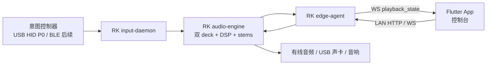
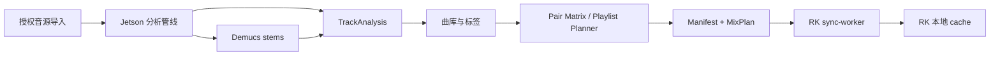
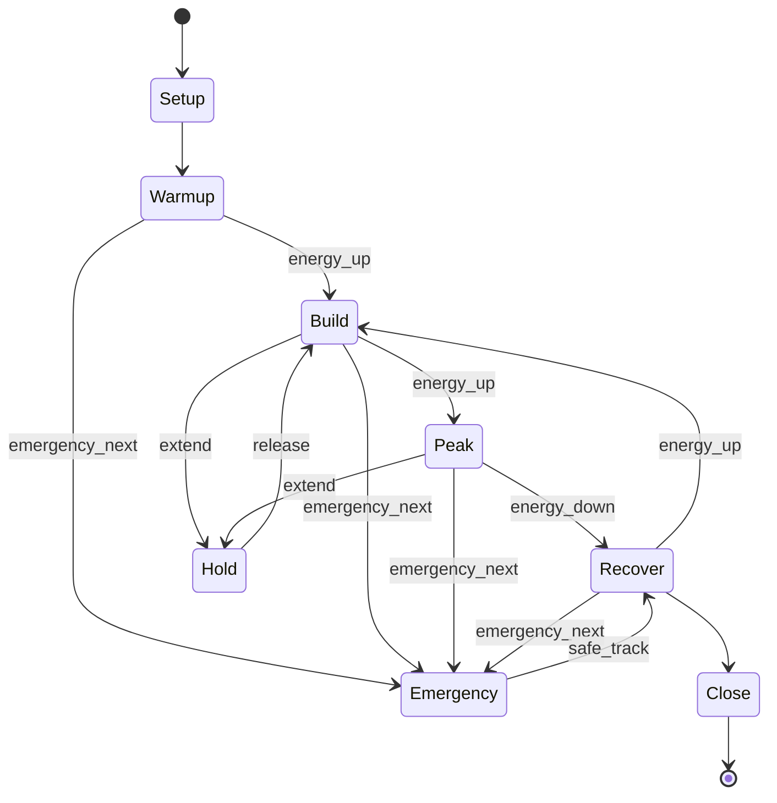

# HarBeat 全流程产品与工程开发规格

版本：V2.0
日期：2026-05-31
读者：产品经理、DJ 顾问、App 工程师、Jetson / RK 工程师、硬件与固件工程师、测试人员、后续 AI Agent

---

## 0. 文档用途

这不是一份算法清单，也不是一份 App 需求列表。它描述 HarBeat 从歌曲导入、离线分析、街舞标签、排歌、转场规划、现场播放、实体控制、反馈采集到设备运维的完整系统。

本规格合并并升级以下材料：

- `/Users/jihaobi/Documents/New project 2/output/功能类别架构拆解文档.md`
- `/Users/jihaobi/Documents/New project 2/output/产品语言到产品功能落地实现版.md`
- `docs/AI_HANDOFF.md`
- 当前仓库已经落地的 Jetson、RK3588、Flutter 和算法代码

原始文档里有一个需要纠正的假设：现场实时播放不再由手机承担。手机直出可以保留为降级能力，但 P0 主路径固定为：

> Jetson 提前理解歌曲，RK3588 在现场稳定发声，App 负责控制和解释，实体控制器让用户不看屏幕也能表达意图。

---

## 1. 产品定义

### 1.1 目标用户

HarBeat 面向没有专业 DJ 的街舞 cypher、练习局、小型 party 和 battle warm-up。使用者通常是 MC、组织者或舞者。他们能判断现场氛围，但不应该被要求理解 EQ、gain、pitch、stem mixer 或 deck 管理。

### 1.2 核心工作

用户只做现场判断：

- 这首不对，换一首。
- 现在可以更炸一点。
- 大家累了，稳一下。
- 这段不错，再放一轮。
- 我要讲话。
- 刚才按错了，撤销。

系统负责把这些判断翻译成 DJ 技术动作：

- 从曲库里选下一首。
- 找到可混入和可混出位置。
- 对齐 BPM、beat、bar 和 phrase。
- 选择普通 crossfade、filter、echo、bass swap、vocal handoff 或安全 cut。
- 有 stems 时避免双人声和双 bass；没有 stems 时自动降级。
- 量化 loop、平滑 ducking、控制响度。
- 网络断开时继续播放本地缓存。

### 1.3 不做什么

HarBeat 第一阶段不是专业 DJ 控制台，也不试图替代 battle DJ。

以下能力不出现在 P0 控制器表面：

- Deck A / Deck B
- Crossfader
- Pitch fader / BPM 数字调速
- 高频、中频、低频 EQ
- Gain / trim
- Filter、echo、reverb 参数
- Stem 独奏、人声移除、鼓轨推拉
- Hot Cue 编号
- 精确 loop 长度
- 转场模板选择

这些能力仍然存在，但由算法和 RK 音频引擎处理。高级调试入口可以藏在 App 的工程模式里，不能成为普通用户的操作负担。

---

## 2. 竞品拆解：HarBeat 应该学什么

竞品不是照抄对象。HarBeat 要提取它们已经验证过的 DJ 方法，再用更低门槛的交互重新包装。

| 产品 | 已验证的能力 | HarBeat 借鉴什么 | HarBeat 不照搬什么 |
|------|--------------|------------------|--------------------|
| djay Automix | 自动找混入点、调整 BPM、选择 transition；支持手动调整 transition start / end；Neural Mix 可按 vocals、drums、bass、harmonics 控制 | 自动选点、转场模板、stems 交接、`Mix Now` 思路 | 不把完整 DJ 波形和参数暴露给 MC |
| rekordbox | Beatgrid 分析、动态分析模式、Phrase Analysis、Vocal Position Detection、Track Separation；专业 DJ 可人工修正 | 离线分析后允许复核；弱证据必须标记 `needs_review` | 不要求用户手调 grid |
| Serato DJ Pro | Beatgrid、Beat Sync、Simple Sync、Stems、Performance Pads；专业用户在表演前修正 grid | beatgrid 是自动混音的基础资产；硬件动作需要量化和低延迟 | 不复制专业控制器的按钮密度 |
| VirtualDJ | Automix、Automix Editor、预计算 stems、实时 stems 控制 | 批量预分析、pair 级别转场计划、编辑和复盘能力 | 不把所有 deck 和 stem 面板塞进首版 App |
| LiberLive | 用有限实体动作表达音乐意图，复杂伴奏和音色处理藏在系统内部 | 控制器应有手感、即时反馈和低学习成本 | 不追求参数数量，不做缩小版 DJ 台 |

### 2.1 官方参考

- [djay Automix overview](https://help.algoriddim.com/hc/en-us/articles/360014702832-How-do-I-use-Automix-AI-on-djay-for-iOS)
- [djay Automix settings](https://help.algoriddim.com/hc/en-us/articles/360014702852-What-are-the-Automix-settings-on-djay-for-iOS)
- [djay Neural Mix controls](https://help.algoriddim.com/hc/en-us/articles/360014911831-How-do-I-use-Neural-Mix)
- [rekordbox manual](https://cdn.rekordbox.com/files/20250320175552/rekordbox7.1.0_manual_EN.pdf)
- [Serato Beatgrids](https://support.serato.com/hc/en-us/articles/224968008-Beatgrids)
- [Serato Sync](https://support.serato.com/hc/en-us/articles/223458227-Syncing-tracks)
- [Serato Stems](https://support.serato.com/hc/en-us/articles/5700969287183-Serato-Stems)
- [VirtualDJ Automix](https://www.virtualdj.com/manuals/virtualdj/interface/browser/sideview/automix.html)
- [VirtualDJ Automix Editor](https://www.virtualdj.com/manuals/virtualdj/editors/automixeditor.html)
- [VirtualDJ Stems](https://www.virtualdj.com/manuals/virtualdj/interface/decks/decksadvanced/stems.html)
- [LiberLive C1](https://liberlive.com/products/liberlive-c1-stringless-smart-guitar-green)

文档中关于竞品内部算法的描述只写公开可观察能力。未公开的 DSP 参数和模型结构不做事实陈述。

---

## 3. 目标系统架构

### 3.1 四端分工

| 端 | 产品角色 | 负责什么 | 不负责什么 |
|----|----------|----------|------------|
| Jetson | 音乐分析师和素材工厂 | 音频导入、BPM、beatgrid、段落、stems、stem 活跃度、manifest、mix plan、批量评测 | 不承担现场低延迟播放 |
| RK3588 | 现场音频主机 | 本地缓存、双 deck、实时混音、stems 自动化、loop、ducking、九键 / 控制器输入、离线兜底 | 不跑 Demucs 级重分析 |
| Flutter App | 控制台和解释层 | 活动配置、曲库浏览、现场意图、状态显示、候选解释、复盘、设备管理 | 不作为 P0 主播放引擎 |
| 云端网关 | 远程入口和数据同步 | 登录、远程代理、曲库元数据同步、SessionEvent、固件与日志 | 不进入现场实时音频闭环 |

手机直出音频只作为无 RK 场景的降级模式。降级模式可以少一些 stems 和硬件能力，但必须明确显示当前 `playback_tier`。

### 3.2 现场链路



现场 P0 链路不依赖公网。App 断网、云端不可达或 Jetson 暂时离线时，RK 应继续播放已经同步的歌曲。

### 3.3 赛前链路



### 3.4 核心运行原则

1. Jetson 做重计算，RK 做实时执行。
2. C1 分析层只产出结构化事实和风险，不直接决定用户体验。
3. C3 推荐层选择歌曲，C4 播放层决定怎么接。
4. C6 Session 层是唯一现场调度中心。
5. stems 是增强能力，不是播放前置条件。
6. 低置信度分析必须允许降级和人工复核。
7. 控制器传递语义意图，不传递 EQ、gain 或 pitch 参数。

---

## 4. 当前实现快照

| 模块 | 已有能力 | 下一步 |
|------|----------|--------|
| C1 音乐分析 | BPM、BPM 曲线、beatgrid 质量、downbeat、弱证据拍号回退、key / Camelot、LUFS、energy、groove、真实 stems 活跃度、stem 质量、vocal events、bass risk、clean intro / outro、danceability、mood、genre、hot cues、transition windows | 多引擎交叉验证、人工校准集、模型版本化 |
| C3 推荐 | `CandidateSelector` 规则引擎、best / safe / diverse 候选、安全池门槛 | DB adapter、30-60 分钟场景 playlist、多人偏好 |
| C4 RK 播放 | 双 deck、crossfade、stem-aware / non-stem 降级、`playback_tier`、EQ、预加载、基础 FX | time-stretch 分级、真实 loop、talkover、RK 四首试听 |
| C6 Session | 状态机、QueueManager、SafetyPool、UndoStack、Coordinator 原型 | 注册到 edge-agent、接真实播放器、断电恢复 |
| RK 同步 | `sync-worker` manifest 下载、size / sha256 校验、original + stems | 真 manifest 压测、失败恢复、Range |
| RK 事件 | SessionEvent flush、失败落盘、启动恢复 | Jetson 查库联调 |
| Flutter | 曲库播放、RK 控制、部分 Live Deck 草稿 | 现场控制台、设备状态、意图 API |
| 控制器 | USB 九键输入原型 | 六控件意图控制器、固件协议、工业设计样机 |

---

## 5. C1 音乐资产与预处理

C1 的工作是把歌曲变成可执行资产。它不决定下一首是谁，也不直接播放声音。

### 5.1 单曲分析能力

| 能力 | DJ 现在怎么做 | 竞品参照 | Jetson 技术路径 | 输出 | 状态 |
|------|---------------|----------|-----------------|------|------|
| 时长与格式 | 看曲库信息，提前确认版本 | 所有 DJ 软件导入时读取 | `ffprobe` / 解码器读取时长、采样率、声道、codec | `duration`, `audio_format` | 已有 |
| BPM | 听鼓点、tap tempo、修正 half-time | rekordbox、Serato、djay 都会分析 tempo | `librosa.beat_track` + onset strength；输出全曲值和置信度 | `bpm`, `bpm_confidence` | 已有 |
| BPM 曲线 | 真人鼓或变速歌手动修 grid | rekordbox 动态分析模式 | 滑动窗口 tempogram；记录局部 BPM、漂移和稳定度 | `bpm_curve[]`, `tempo_stability` | 已有规则版 |
| Beatgrid | 手动校第一拍，再检查后半首是否漂 | Serato Beatgrids、rekordbox grid 编辑 | beat tracker + phase consistency + review flag | `beat_points[]`, `beat_grid_offset`, `beat_needs_review` | 已有 |
| Downbeat | 数小节第一拍 | rekordbox Phrase Analysis | 对 onset accent、低频、段落变化做相位推断 | `downbeats[]` | 已有规则版 |
| 拍号 | 听 3/4、4/4、复合拍 | 专业软件允许人工修正 | 周期候选评分；证据弱时回退 4/4 并标复核 | `time_signature` | 已有安全回退 |
| Phrase map | 数 8 / 16 / 32 bars，记 cue | rekordbox Phrase Analysis | downbeat 分组 + novelty + energy slope | `phrase_map[]` | 已有规则版 |
| Key / Camelot | 依赖听感或 Mixed In Key | rekordbox、Mixed In Key | CQT + CENS chroma + K-S 模板；保留 top 3 | `key`, `camelot_key`, `key_profile` | 已有 |
| LUFS 与峰值 | 看 mixer 电平、调 trim | DJ 软件自动 gain、ReplayGain 思路 | `pyloudnorm` 可用时算 integrated LUFS；否则 RMS 近似；保留 peak | `loudness_profile` | 已有 |
| Energy 曲线 | 听 build、drop、break | Mixed In Key Energy Level | 2 秒窗口 RMS、低频、鼓密度、高频亮度 | `energy`, `energy_curve[]` | 已有 |
| Groove | 听 swing、bounce、鼓点稳定性 | 竞品通常不完整公开 | beat salience、syncopation、downbeat clarity、tempo lock | `groove_profile` | 已有规则版 |
| Danceability | 判断是否容易进圈 | Spotify 曾公开 audio features；HarBeat 需街舞化 | groove、鼓密度、低频驱动、结构稳定度、人工标签 | `danceability_score` | 已有规则版 |
| Mood / 舞池画像 | 判断偏松、偏硬、偏亮、偏累 | streaming 推荐和 DJ crate 常用 | physical energy、tension、peakness、fatigue risk | `dancefloor_profile` | 已有规则版 |
| 流派 | 按 crate 整理 | Beatport、Spotify、DJ 软件标签 | 人工标签优先；外部 metadata 次之；音频规则兜底 | `genre_profile` | 已有规则版 |

### 5.2 Stems 与结构安全能力

| 能力 | DJ 现在怎么做 | 竞品参照 | Jetson 技术路径 | 输出 | 状态 |
|------|---------------|----------|-----------------|------|------|
| Stems 分离 | 原本靠 EQ 和选段规避冲突 | djay Neural Mix、Serato Stems、VirtualDJ Stems | Demucs `htdemucs` 离线分离 vocals、drums、bass、other | 四 stem 文件 | 已有 |
| Stem 完整性 | 靠耳朵判断残留和失真 | 竞品内部实现未公开 | 重建误差、文件完整度、异常静音、峰值与泄漏近似 | `stem_quality_score`, `stem_quality_profile` | 已有原型 |
| Stem 活跃窗口 | 听人声何时进出、bass 何时落下 | Neural Mix 依赖类似信息 | 每约 2 秒计算 stem RMS 与相对活跃度 | `stem_activity_windows[]` | 已有 |
| Vocal events | 记住 vocal 进入和退出点 | vocal-aware mix | vocals stem 活跃度边沿 + 持续时间过滤 | `vocal_events[]` | 已有 |
| Bass 风险 | 混音时切 EQ low | Neural / EQ transition | bass stem 活跃度 + 低频功率 | `bass_risk_windows[]` | 已有 |
| Intro / Outro 干净度 | 预听有没有人声、鼓和低频 | Automix 选点 | stems + beat density + energy slope | `intro_clean_score`, `outro_clean_score` | 已有原型 |
| Transition-safe windows | 手动找适合接歌的位置 | djay Automix、VirtualDJ Automix Editor | phrase、downbeat、clean score、stem 风险、能量稳定性联合评分 | `transition_windows[]` | 已有规则版 |
| Hot cues | 手动打 intro end、drop、loop、outro | 所有专业 DJ 软件 | 从 phrase、drop、transition windows 生成并允许人工修正 | `dj_hot_cues[]` | 已有 |

### 5.3 C1 下一阶段

| 优先级 | 任务 | 完成证据 |
|--------|------|----------|
| P0 | 建立 100-300 首人工校准集，覆盖 hip-hop、house、pop、真人鼓、强变速和非 4/4 边缘曲目 | 每个字段有人工基准、误差分布和 review 阈值 |
| P0 | 给 BPM / beatgrid 加第二分析引擎或可插拔 adapter | 规则引擎与第二引擎结果可并列记录；冲突自动 `needs_review` |
| P0 | 把 intro / outro、vocal、bass 安全窗口纳入 pair planner | mix plan 能解释为什么选择某个进出点 |
| P1 | 建立模型版本、分析版本和重算策略 | 数据库记录 `analysis_version`、`model_version`、`review_status` |
| P1 | 加入人工修正工具 | DJ 可修 BPM、第一拍、hot cue、标签；修正会进入训练集 |

---

## 6. C2 街舞语义曲库与内容运营

C1 告诉系统歌曲结构，C2 告诉系统这首歌在街舞场景里意味着什么。

### 6.1 标签体系

| 标签层 | 示例 | 生成方式 | 用途 |
|--------|------|----------|------|
| 舞种 | hiphop、house、breaking、popping、locking、krump | 人工审核为主，算法辅助 | 场景筛选 |
| Groove | boom_bap、bouncy、funky、clubby、heavy、loose | DJ / 舞者标注 + 音频特征建议 | 选歌和换风格 |
| 场景 | cypher_safe、practice、party、battle_warmup、showcase | 人工审核 | 场景 playlist |
| 能量 | warm、groovy、build、peak、recover | C1 建议 + 人工校正 | Session 曲线 |
| 文化角色 | classic、underground、battle_beat、party_crossover | 专业运营 | 推荐解释 |
| 风险 | too_clubby_for_cypher、long_intro_risk、vocal_heavy、needs_review | C1 + 人工 | 降级和复核 |
| 可执行资产 | loopable_groove、clean_intro、clean_outro、drop_ready | C1 + 人工 | C4 转场与 loop |

每个标签必须保存：

```json
{
  "name": "cypher_safe",
  "confidence": 0.92,
  "source": "dj_review|dancer_review|audio_rule|external_metadata",
  "reviewed_by": "user_or_model_id",
  "reviewed_at": "ISO-8601",
  "version": 1
}
```

### 6.2 内容运营后台

| 页面 | P0 功能 | P1 功能 |
|------|---------|---------|
| 曲目列表 | 搜索、筛选、待复核队列、批量打标签 | 审核人工作量、标签分歧 |
| 单曲审核 | 播放、波形、BPM、hot cue、片段试听、标签编辑 | stems solo、pair 对比 |
| Pair 审核 | A→B 转场试听、策略解释、评分、驳回 | 多 preset A/B |
| 标签词典 | taxonomy、定义、互斥关系、地区版本 | 审核权限和版本迁移 |
| 质量看板 | `needs_review`、失败分析、低置信度、用户跳过率 | 模型漂移 |

### 6.3 C2 验收

- P0 测试曲库每首歌都有舞种、groove、场景、能量和风险标签。
- 每个标签都有来源和置信度。
- 专业 DJ 能在 2 分钟内完成一首歌的复核。
- 算法不会把 Spotify / 外部流派直接当成街舞文化结论。

---

## 7. C3 推荐与排歌决策

C3 决定播什么，不决定声音怎么混。

### 7.1 场景 playlist

| 输入 | 说明 |
|------|------|
| `scene` | cypher、practice、party、battle_warmup |
| `dance_styles[]` | 本场优先舞种 |
| `vibe_cards[]` | old_school、funky、chill、high_energy 等 |
| `duration_min` | 30-60 分钟 |
| `energy_curve` | warmup → build → peak → recover |
| `avoid_tags[]` | 不要太商业、不要太夜店、不要太慢 |
| `cached_only` | 离线时只从 RK 缓存选 |

输出：

```json
{
  "playlist_id": "session_...",
  "tracks": ["track_a", "track_b"],
  "pair_matrix_summary": {},
  "transitions": [],
  "fallback_tracks": [],
  "explanations": []
}
```

### 7.2 下一首候选

每次保持三类候选：

| 候选 | 目的 |
|------|------|
| `best` | 当前规则下综合分最高 |
| `safe` | BPM、beatgrid、intro、缓存最可靠 |
| `diverse` | 能量不突变，但 groove 或舞种不同 |

建议评分：

```text
score =
  0.22 * scene_fit
+ 0.18 * danceability
+ 0.15 * target_energy_fit
+ 0.13 * transition_compatibility
+ 0.10 * groove_fit
+ 0.08 * group_preference
+ 0.06 * diversity_bonus
+ 0.05 * cache_readiness
- 0.08 * repetition_penalty
- 0.08 * cold_start_risk
- 0.07 * analysis_uncertainty
```

### 7.3 现场意图对推荐的影响

| 意图 | C3 动作 | C4 默认动作 |
|------|---------|-------------|
| `next` | 选 `best` 或 `safe` | phrase 边界平滑切歌 |
| `emergency_next` | 只选本地缓存的 `safe` | 1-2 秒内 echo / cut |
| `energy_up` | 目标能量 +1，优先更强 drop 和 drum drive | Energy Lift、bass swap |
| `energy_down` | 目标能量 -1，保留稳定 groove | Recovery Blend、filter |
| `hold` | 暂停队列推进 | phrase extend / loop |
| `style_change` | 选能量接近但 groove 不同的候选 | echo、break 或短转场 |

`style_change` 保留在 App。它需要用户看到候选方向，不属于 P0 盲操按钮。

### 7.4 重复和公平性

| 规则 | 默认值 |
|------|--------|
| 同一歌曲重复 | 30 分钟内禁止 |
| 同一 artist | 连续播放强降权 |
| 同一 remix / version | 视为同一 family |
| 同一 groove | 连续最多 3 首，除非用户选择 `hold` |
| 多人偏好 | 每 15 分钟至少覆盖 2-3 个本场偏好 |
| 安全池 | 每个场景至少 10-20 首已缓存歌曲 |

### 7.5 C3 验收

- 6-10 首测试曲库可生成 all-pairs matrix 和一条可播放 playlist。
- 30 分钟队列中没有重复歌曲和明显能量断层。
- 每个相邻 pair 有 `selected_style`、`fallback_style`、`confidence`、`risks`、`tags` 和解释。
- 缺 stems、低置信度、缓存不完整时自动降低风险。

---

## 8. C4 DJ-like 播放与音乐控制

C4 在 RK3588 上真正发声。它消费 C1 和 C3 的结果，不替用户做文化判断。

### 8.1 Playback tier

| Tier | 条件 | 能力 |
|------|------|------|
| `stem_aware` | original + 4 stems 完整，质量达标 | 分轨 vocal、drums、bass、other 自动化 |
| `non_stem` | 只有 original，或 stems 不完整 | master gain、EQ、filter、echo、beatmatch |
| `basic` | 分析信息不足或异常 | 保守 crossfade、bar-end cut、安全歌 |

App、WS、SessionEvent 和离线报告都要显示实际 tier。

### 8.2 转场模板

| 模板 | 适用条件 | DJ 方法 | RK 实现 | 无 stems 降级 |
|------|----------|---------|---------|--------------|
| `blend` / `fade` | BPM 接近、段落干净 | 长 crossfade | equal-power gain | 原生支持 |
| `filter` | 同 groove、希望有 DJ 感 | A 逐步滤掉，B 进入 | HPF / LPF sweep | 原生支持 |
| `echo_freeze` | BPM 或风格差较大 | A 尾音 echo out，B 快速接管 | delay send + decay | 原生支持 |
| `bass_swap` | 鼓稳定、低频需接力 | 先退 A bass，再进 B bass | stem bass gain 或 low EQ | low EQ 模拟 |
| `drum_swap` | groove 接力 | 保持一侧鼓，再切换 | drums stem 自动化 | 短 blend |
| `vocal_handoff` | 两首都有人声 | 避免双人声，句尾交棒 | vocals stem 交叉和 bed 保持 | echo / duck |
| `vocal_ducking` | B 人声需要清晰进入 | 压低 A vocal | vocal stem gain | master duck |
| `instrumental_only` | 人声冲突高 | 只保留伴奏桥 | mute vocals | filter / echo |
| `vocal_solo_intro` | mashup 风格 intro | B vocal 先出，再接节奏 | vocal stem 提前进入 | 不启用 |
| `rise` / `riser` | 目标能量上升 | buildup 后 drop | filter + gain + impact | 原生支持 |
| `melt` / `dissolve` / `wave` | 低风险创意过渡 | 空间和节奏效果 | master DSP | 原生支持 |
| `cut` / `slam` | 明确断点、紧急救场 | bar-end clean cut | 极短 envelope | 原生支持 |

### 8.3 Time-stretch 分级

| BPM 差异 | 默认策略 |
|----------|----------|
| 0-3% | 自然 beatmatch blend |
| 3-6% | 转场期间 time-stretch；转场后平滑回原速 |
| 6-12% | 避免长 blend，优先 echo、break、drop cut |
| 12%+ | 不强行 beatmatch，使用安全 cut 或桥接歌 |

Stem-aware 默认使用原始 stems 并按 cue / beat 对齐。Non-stem 才使用 beatmatched full-track render。不能把 time-stretch 过的整曲与原始 stems 混在一起。

### 8.4 Loop / 延长

| 用户动作 | 行为 |
|----------|------|
| 单击 `延长` | 当前 phrase 多走一轮，或者延后到下一个安全切出窗口 |
| 按住 `延长` | 保持当前 groove；优先 loop 8 / 16 bars |
| 松开 | 在下一个 phrase 结束 loop，回到正常队列 |

实现要求：

- 起止点落在 beatgrid 上。
- 优先完整 phrase。
- loop 回跳附近做短 crossfade，避免 click。
- loop 区间必须通过 energy consistency 和 vocal risk 检查。
- beatgrid `needs_review=true` 时默认只延后切歌，不启用硬 loop。

### 8.5 Talkover

`Talk` 是 MC 的按住说话模式，不是复杂麦克风 mixer。

| 阶段 | 动作 |
|------|------|
| 按下 | 200-400ms 平滑降低 master 到约 -10 至 -14 dB |
| 按住 | 保持音乐存在，避免现场突然空掉 |
| 松开 | 500-900ms 平滑恢复 |
| 紧急播报 | App 可配置更深 duck，但不默认静音 |

P0 可以只做音乐 duck，不要求把麦克风接入 RK。外接麦克风混音属于 P1。

### 8.6 音质验收

- 非 `cut` / `slam` 模板不能产生硬切。
- 转场期间不能出现长静音。
- 双 bass 峰值不能长期叠满。
- vocal handoff 不能切掉 instrumental bed。
- 输出不得 clipping。
- RK 四首连续播放时每次转场都有 `crossfade_start/end` 事件。

---

## 9. C5 现场交互与意图控制器

### 9.1 设计原则

控制器不是缩小版 DJ 台。它是一件“现场意图乐器”。

参考 LiberLive 的设计思路：前台只保留用户能够直接理解的动作，复杂伴奏、音色和节奏处理藏在系统内部。HarBeat 控制器只让用户表达氛围和时机，RK 与算法负责专业操作。

### 9.2 P0 桌面小控台

| 控件 | 交互 | 用户理解 | 系统动作 | 为什么保留 |
|------|------|----------|----------|------------|
| `下一首` | 中央大按钮；单击智能切歌；长按紧急切歌 | 这首不对，换掉 | 选候选、找 phrase、选模板、执行转场 | 最高频、最直接的救场动作 |
| `现场能量` | 五档有阻尼旋钮 + LED 环 | 更稳或更炸 | 改 Session 目标能量，重排候选，选择 lift / recovery 策略 | 用户控制方向，不控制音频参数 |
| `延长` | 单击多一轮；按住保持；松开退出 | 这段不错，再跳一轮 | phrase extend 或安全 loop | 让舞者有时间进入状态 |
| `Talk` | 按住说话，松开恢复 | MC 要讲话 | master ducking | 高频 MC 场景刚需 |
| `撤销` | 内缩小按钮 | 刚才操作不对 | 取消待执行动作；必要时走安全恢复 | 让用户敢按按钮 |
| `总音量` | 独立小旋钮 | 整体太响或太小 | 平滑 master volume ramp，带上限 | 普通用户能理解的环境控制 |

### 9.3 为什么不在硬件上放“换风格”

“换风格”有价值，但不是盲操动作。用户需要看到当前 groove、可选方向和候选歌曲。P0 把它放在 App；P1 可以给控制器增加一个可配置快捷键，但不能默认占据核心位置。

### 9.4 硬件表面布局

```text
┌──────────────────────────────────────┐
│  现场能量                  总音量     │
│  ◉ 五档 LED 环               ◉        │
│                                      │
│              ┌────────┐              │
│              │ 下一首 │              │
│              │ SMART  │              │
│              └────────┘              │
│                                      │
│   [ 延长 ]       [ TALK ]   [ 撤销 ] │
└──────────────────────────────────────┘
侧边：电源 / 配对 / 防误触锁 / USB-C
```

### 9.5 触感和误触设计

| 项 | 要求 |
|----|------|
| `下一首` | 最大、居中、明显段落感；长按阈值约 900ms，避免误触紧急切 |
| `现场能量` | 大旋钮、五档阻尼、LED 环；与总音量在尺寸和位置上区分 |
| `总音量` | 小旋钮、阻尼更细；避免用户把响度误认为能量 |
| `延长` | 适合按住，表面略凹 |
| `Talk` | 适合长按，离 `下一首` 有足够距离 |
| `撤销` | 内缩或加边框，防止连续操作时误按 |
| 状态灯 | 能量、连接、待执行动作、低电量使用不同节奏，不依赖复杂颜色识别 |
| 震动 | 收到动作、已排队、紧急动作、撤销成功有不同反馈 |

### 9.6 控制器硬件建议

| 模块 | P0 选择 | 说明 |
|------|---------|------|
| MCU | nRF52840 或同级 MCU | USB HID 稳定，预留 BLE HID；功耗和生态适合小控制器 |
| 主连接 | USB-C 有线 HID | 第一版先保证现场稳定性和低延迟 |
| 无线 | BLE HID 预留 | P1 再开放，需完成断连恢复和电量测试 |
| 输入 | 4 个按键、2 个旋钮、侧边锁 | 旋钮使用增量编码器，避免状态漂移 |
| 输出 | LED 环、状态灯、震动马达 | 不依赖屏幕也能确认 |
| 供电 | USB-C；电池作为 P1 | 桌面 P0 优先减少电量风险 |
| 外壳 | 桌面小控台，可单手操作 | 防滑、抗摔、按钮触感可区分 |

### 9.7 固件事件协议

控制器发送语义事件，不发送音频参数：

```json
{
  "device_id": "controller-001",
  "seq": 1024,
  "ts_ms": 1780200000000,
  "event": "next|emergency_next|energy_delta|extend_toggle|talk_press|talk_release|undo|master_volume_delta",
  "value": 1,
  "source": "usb_hid|ble_hid"
}
```

RK 返回反馈状态：

```json
{
  "ack_seq": 1024,
  "status": "accepted|queued|executing|completed|rejected",
  "energy_level": 3,
  "playback_tier": "stem_aware",
  "next_action_in_sec": 6.2,
  "device_alert": null
}
```

### 9.8 控制器验收

- 新用户 30 秒内能理解六个控件。
- 不看屏幕可以完成下一首、能量调整、延长、Talk 和撤销。
- USB 输入到 RK 接收 P95 小于 30ms。
- 普通下一首不会误触发紧急切歌。
- App 断开时控制器仍可操作 RK。
- RK 不可达时控制器给出明确反馈，不让用户误以为动作已执行。

---

## 10. C6 Session 编排与安全兜底

C6 是现场大脑。它接收 App 和控制器意图，决定什么时候执行，并调用 C3 与 C4。

### 10.1 状态机



### 10.2 Queue Buffer

- 当前曲播放时始终准备 `best`、`safe`、`diverse` 三个候选。
- 剩余 30-60 秒进入预加载。
- 队列为空时从安全歌池补充。
- RK 缓存不完整时，候选排序必须降低该曲优先级。
- 正在执行延长或 Talk 时，不立即触发自动切歌。

### 10.3 Button Quantization

| 动作 | 默认执行时机 |
|------|--------------|
| `next` | 下一个 bar 或 phrase 边界 |
| `energy_delta` | 先重排，下一次转场生效 |
| `extend_toggle` | 当前 phrase 结束前量化进入 |
| `talk_press/release` | 立即平滑执行，不等 phrase |
| `undo` | 立即取消未执行动作；已执行动作走安全恢复 |
| `emergency_next` | 1-2 秒内执行 |
| `master_volume_delta` | 立即做短 ramp |

### 10.4 断网和恢复

| 故障 | 现场行为 |
|------|----------|
| App 断开 | RK 与控制器继续工作；App 重连后读取 `/state` |
| Jetson 断开 | 只使用 RK 已缓存曲目；暂停新同步 |
| 云端断开 | 不影响现场 LAN 链路；事件写本地 buffer |
| 控制器断开 | App 控制仍可用；状态提示 |
| audio-engine 重启 | edge-agent 恢复 current plan；播放恢复策略进入安全模式 |
| 分析置信度低 | 退到 `basic` 或 `non_stem`，不强行炫技 |

---

## 11. C7 数据反馈与学习闭环

### 11.1 事件

| 事件 | 来源 | 用途 |
|------|------|------|
| `load` | App / RK | 记录 session |
| `play_started` | RK | 播放事实 |
| `crossfade_start/end` | RK | 评估转场 |
| `key_press` / `controller_intent` | 控制器 | 判断按钮价值和误触 |
| `skip` | Session | 找不适合曲目 |
| `undo` | Session | 找策略失败 |
| `extend` | 控制器 | 反推好跳段落 |
| `talk_press/release` | 控制器 | 校准 MC 场景 |
| `like/dislike` | App | 显式偏好 |
| `cold_moment` | App | 标注冷场 |
| `sync_error` | RK | 运维 |
| `audio_xrun` | RK | 音频性能 |

### 11.2 学习顺序

1. 先做可靠事件记录。
2. 再做 Session 复盘。
3. 用 extend、skip、undo 和冷场标记修正标签和 safe pool。
4. 最后才训练个性化模型。

P0 不做黑箱自动学习。每次权重变化要有版本，可以回滚。

---

## 12. C8 设备连接、音频输出与工业设计

### 12.1 音频输出

P0 推荐顺序：

1. RK → USB 声卡或板载有线输出 → 音响。
2. RK → 稳定蓝牙音响，仅适用于不需要实时麦克风监听的场景。
3. 手机直出，仅作为无 RK 降级。

蓝牙延迟对单纯播放影响有限，但会影响实时麦克风监听、节拍交互和用户主观控制感。正式现场优先有线。

### 12.2 设备状态

App 至少显示：

- RK 在线状态
- Jetson 可达性
- 当前 `playback_tier`
- 当前歌曲和下一首
- 缓存与同步进度
- 音频 xrun
- 控制器连接状态
- 输出设备
- RK 温度、内存、磁盘
- 控制器电量（BLE 版本）

### 12.3 设备运维

| 能力 | 实现 |
|------|------|
| 配对 | App 读取 RK pair code，保存设备 token |
| 局域网发现 | P0 手工 IP + 最近连接；P1 mDNS |
| 固件升级 | P1 App 下发签名固件，控制器双分区或安全回滚 |
| RK 更新 | 部署前备份 `/home/cat/cypher`，SFTP 覆盖，重启 `cypher.target` |
| 日志 | RK 本地滚动日志 + SessionEvent；敏感 token 不写日志 |
| 安全 | `cypher.env`、JWT、RK token 不进 Git |

---

## 13. App 信息架构

### 13.1 活动前

| 页面 | 功能 |
|------|------|
| 设备检查 | RK、Jetson、控制器、音频输出、缓存 |
| 场景设置 | cypher、practice、party、battle warm-up |
| 偏好卡片 | 舞种、vibe、禁忌、能量起点 |
| 歌单预览 | 预计 30-60 分钟走势、安全歌池、待同步资源 |
| 同步 | 把 original + stems + MixPlan 发到 RK |

### 13.2 现场 Live Deck

第一屏只显示：

- 当前歌
- 下一步动作和倒计时
- 当前能量
- 下一首候选
- `下一首`
- `炸一点`
- `稳一下`
- `延长`
- `Talk`
- `撤销`
- `换风格`

BPM、key、preset、stem tier 和风险标签放在可展开详情里。

### 13.3 活动后

- 播放时间线
- 哪些歌被跳过
- 哪些段落被延长
- 哪些转场被撤销
- 冷场和好跳标记
- 同步失败和音频错误

---

## 14. 接口与数据契约

### 14.1 TrackAnalysis

```json
{
  "track_id": "str",
  "analysis_version": "str",
  "bpm": 94.0,
  "bpm_curve": [],
  "tempo_stability": 0.91,
  "beat_points": [],
  "downbeats": [],
  "beat_confidence": 0.84,
  "beat_needs_review": false,
  "time_signature": {},
  "key": "C major",
  "camelot_key": "8B",
  "key_profile": {},
  "energy": 0.66,
  "energy_curve": [],
  "loudness_profile": {},
  "phrase_map": [],
  "transition_windows": [],
  "transition_recommendations": [],
  "dj_hot_cues": [],
  "groove_profile": {},
  "dancefloor_profile": {},
  "genre_profile": {},
  "stem_activity_windows": [],
  "stem_quality_profile": {},
  "vocal_events": [],
  "bass_risk_windows": [],
  "intro_clean_score": 0.75,
  "outro_clean_score": 0.83
}
```

### 14.2 MixPlan transition

```json
{
  "from_song_id": "a",
  "to_song_id": "b",
  "style": "vocal_handoff",
  "fallback_style": "echo_freeze",
  "playback_tier": "stem_aware",
  "confidence": 0.82,
  "tags": ["clean_outro", "double_vocal_guard"],
  "from_at_sec": 168.0,
  "from_out_sec": 180.0,
  "to_at_sec": 24.0,
  "to_in_sec": 24.0,
  "fade_sec": 12.0,
  "from_beat_interval_sec": 0.49,
  "to_beat_interval_sec": 0.50,
  "phase_anchor_sec": 168.0,
  "vocal_handoff_ratio": 0.52
}
```

### 14.3 Manifest

```json
{
  "tracks": [{
    "song_id": "a",
    "files": {
      "original": {"url": "...", "size": 1, "sha256": "...", "format": "mp3"},
      "stems": {
        "vocals": {"url": "...", "size": 1, "sha256": "...", "format": "wav"},
        "drums": {"url": "...", "size": 1, "sha256": "...", "format": "wav"},
        "bass": {"url": "...", "size": 1, "sha256": "...", "format": "wav"},
        "other": {"url": "...", "size": 1, "sha256": "...", "format": "wav"}
      }
    }
  }]
}
```

### 14.4 RK API

| 方法 | 路径 | 用途 |
|------|------|------|
| GET | `/health` | RK、audio、sync 状态 |
| GET | `/state` | 真实播放状态和 `playback_tier` |
| GET | `/api/edge/status` | App 兼容 alias |
| POST | `/load_plan` | 保存 MixPlan，触发同步 |
| POST | `/play` `/pause` `/resume` `/seek` | 播放 |
| POST | `/xfade` | 主动转场 |
| POST | `/prefetch` | 预解码候选 |
| POST | `/trigger` | 九键兼容 |
| POST | `/stem_solo` `/eq` | 工程与高级入口，不放在普通 UI |
| POST | `/transition/plan` | 批量歌曲规划 |
| WS | `:9001/ws` | `playback_state`、`device_info`、`key_event` |

### 14.5 待新增意图 API

| 方法 | 路径 | 用途 |
|------|------|------|
| POST | `/live/intent` | `next`、`energy_up/down`、`hold`、`talk`、`undo` |
| GET | `/live/session` | Session 快照 |
| POST | `/live/session/start` | 启动现场 session |
| POST | `/live/session/stop` | 结束并 flush 事件 |
| POST | `/controller/event` | 控制器语义事件 |

---

## 15. 部署拓扑

### 15.1 Jetson

- 运行曲库 API、分析后台、Demucs stems、manifest、MixPlan。
- GPU 做赛前批处理。
- 分析数据保存版本。
- API 返回失败诊断，不能用空字段伪装成功。

### 15.2 RK3588

四个 systemd 服务：

| 服务 | 作用 |
|------|------|
| `cypher-audio-engine` | 实时音频 |
| `cypher-edge-agent` | REST、WS、事件 flush |
| `cypher-input-daemon` | USB HID / 控制器输入 |
| `cypher-sync-worker` | 下载和校验 |

部署要求：

1. 备份 `/home/cat/cypher` 相关文件，保留 `.bak.<timestamp>`。
2. 不覆盖真实 `cypher.env`。
3. 上传确认过的代码。
4. 重启 `cypher.target`。
5. 验证 `/health`、`/state`、`/load_plan`、`/play`、`/xfade`。
6. 连续试听四首歌曲。

### 15.3 云端

- 登录与设备登记。
- 远程网关代理。
- SessionEvent 汇总。
- 标签、模型、固件版本分发。
- 不进入现场音频关键路径。

---

## 16. 测试体系

### 16.1 单元测试

| 层 | 测试 |
|----|------|
| C1 | BPM、key、LUFS、beatgrid、meter、stems、windows、序列化 |
| C3 | 有 stems、无 stems、双人声、双 bass、BPM risky、key tense、缓存缺失 |
| C4 | envelope 无 clipping、无长静音、无双 bass 叠满、bed 连续 |
| C6 | 状态机、队列、安全池、undo、量化、断线恢复 |
| 控制器 | 去抖、长按、encoder 增量、seq 去重、断连 |

### 16.2 离线质量评测

每个 playlist 相邻 pair 至少渲染：

- 最佳 stem-aware 转场
- non-stem fallback
- baseline crossfade

报告输出：

- peak / RMS / LUFS
- 分段 loudness
- 静音时长
- clipping 风险
- 低频冲突
- vocal overlap
- bass overlap
- 前中后三段能量曲线
- preset、tier、风险标签、verdict

### 16.3 真机验收

| 场景 | 验收 |
|------|------|
| RK 健康 | `/health`、`/state`、四服务 active |
| 同步 | original + 4 stems 下载、size / sha256 100% |
| 播放 | 四首连续播放，无戛然而止 |
| 降级 | 缺 stems 时走 `non_stem`，不崩溃 |
| Stem FX | 完整 stems 曲目验证键 7/8/9 |
| 控制器 | 六控件盲操、长按、反馈、断连 |
| 事件 | Jetson 可查 load、play、xfade、key、intent |
| 断网 | Jetson 和云端断开后 RK 继续播放缓存 |

### 16.4 现场测试

- 30 分钟 cypher 无非人为静音断档。
- 新 MC 30 秒内学会控制器。
- 至少两种按钮被现场主动使用。
- 舞者主观评价比普通歌单更像“有人在控”。
- DJ 顾问指出的问题可定位到歌曲、窗口、preset 和 tier。

---

## 17. 研发阶段

### Phase 0：音频闭环

目标：四首歌在 RK 上连续播放，衔接不断气。

- 收敛 C1 分析字段。
- 输出 pair matrix 和 MixPlan。
- RK 同步 original + stems。
- 验收 stem-aware 和 non-stem。
- 用离线报告和真机试听校准 envelope。

### Phase 1：意图控制

目标：App 和桌面控制器能让普通组织者完成基础控乐。

- 把 C6 Coordinator 注册到 RK API。
- 新增 `/live/intent`。
- 实现 Next、Energy、Extend、Talk、Undo、Master Volume。
- 完成 Button Quantization。
- 做 USB HID 控制器样机。

### Phase 2：街舞曲库

目标：推荐不只是“音乐相似”，而是“适合跳”。

- 建 taxonomy。
- 做审核后台。
- 建 300-800 首人工审核测试曲库。
- 实现场景 playlist、多人偏好和安全歌池版本。

### Phase 3：反馈学习

目标：系统能用真实活动数据修正错误。

- Session 复盘。
- skip、undo、extend、cold moment 分析。
- 标签建议和 safe pool 更新。
- 权重版本化。

### Phase 4：硬件产品化

目标：控制器从样机进入可重复使用的小批量版本。

- BLE、续航、OTA。
- 外壳、按键、旋钮、灯效、震动。
- 抗摔、误触、断连恢复测试。
- 现场小批量测试。

---

## 18. 功能覆盖矩阵

| 产品语言 | 主要落点 | P0 交付 |
|----------|----------|---------|
| P01 无 DJ 控乐 | C6、C4 | 状态机、队列、安全池、不断播 |
| P02 街舞曲库 | C2、C3 | 场景标签、可跳性、playlist |
| P03 能量曲线 | C3、C6、C5 | 能量旋钮、Energy Lift / Recovery |
| P04 DJ-like 转场 | C1、C4 | beatgrid、phrase、preset、降级 |
| P05 可跳段落延长 | C1、C4、C5 | hot cue、延长、loop |
| P06 多人偏好 | C3、C7 | 本场偏好卡片、diversity |
| P07 街舞文化 | C2 | taxonomy、来源、审核 |
| P08 便携 DJ 能力 | C4、C8 | RK 小主机、普通音响、离线 cache |
| P09 一键控乐 | C5、C6 | 六控件意图控制器 |
| P10 人判断系统执行 | 全部 | 不暴露专业参数，所有动作可解释、可撤销 |

---

## 19. 给后续 AI Agent 的执行顺序

1. 先读本文件，再读 `docs/AI_HANDOFF.md`。
2. 不要把 App 改成 P0 音频主机。
3. 不要在普通 UI 或控制器上增加 EQ、gain、pitch、stem mixer。
4. 优先完成 RK 四首连续试听和 C6 `/live/intent`。
5. 每次新增分析字段，都要补数据库、manifest、API、消费者和测试。
6. 每个转场 preset 必须有 non-stem fallback。
7. 每个硬件动作都要有 ack、状态反馈、误触策略和断线行为。
8. 达成“明显更好听”或“真机端到端通过”后再提交推送。

---

## 20. 完成定义

HarBeat 的第一阶段不是“代码很多”，而是下面这条链真正成立：

```text
授权音源导入
→ Jetson 分析并生成 stems
→ 曲库标签和 pair planner 生成 MixPlan
→ RK 同步并缓存
→ App 或桌面控制器表达现场意图
→ RK 在正确 phrase 上执行 DJ-like 转场
→ 有 stems 时精细混，无 stems 时安全降级
→ 断网仍能继续
→ 事件回传并可复盘
```

第一阶段验收通过后，用户不需要懂 DJ 参数，也能让一个无 DJ 的小型街舞活动比普通歌单更稳定、更有方向、更容易救场。
