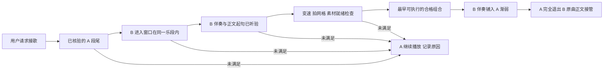

# V3 实时混音：乐段与人声保护模式

独立入口：`/analysis-lab-static/v3-protected-20260923/index.html`。冻结 V3 与已有对照页面不变。本轮关闭能量、风格目标。

## 操作

1. 选择 A、B，选择 A 段尾与 B 进入窗口。
2. 完整试听 A 段尾、实际变速后的 B 伴奏、B 原曲接管点附近。页面显示播放位置及核验点。
3. 仅在听感满足提示时确认。若不满足，换候选；不确认也可以播放 A，接歌会被阻止并说明原因。
4. 可先准备素材再播放 A。请求接歌时在剩余素材内寻找最早合格组合，准备耗时后再次规划；错过窗口不会回退到任意小节退出。
5. 查看每次请求的排除理由、选中计划、音频线程时点，导出 JSON 或决策说明。

初始没有人工核验。确认仅保存在同一浏览器，绑定目录 SHA、原文件 SHA、进入素材 SHA、具体切点；更换目录会失效。人工确认不是自动声学真值。播放停止后可撤销全部确认。

## 数据与算法

- 原始 SongFormer 相邻同标签块连续时合并为一个候选乐段；未重新训练结构模型。
- 前奏使用原有完整 beat 时间列表，以首个既有 downbeat 的四拍相位反推前奏候选小节线。保留真实 beat 时间，不用均匀时间外推。相位与拍点仍需听验；当前按四拍小节处理。
- 段尾只取不早于候选乐段结束且相差不超过 0.5 秒的小节线。精确退出点必须听验“乐段已完整且没有截断人声尾音”。若没有候选，不扩松条件。
- 进入窗口取前四个合并乐段的首个小节线起 2/4 小节，必须完全落在同一乐段，且保留至少 12 秒后续正文。
- 伴奏为既有 Demucs drums + bass + other 的线性和，排除 vocals。浮点中间文件防止求和截幅；测量峰值，只在必要时衰减到 -0.5 dBFS。所用增益和来源哈希写入目录。它不保证没有分离残留人声，实际变速素材必须听验。
- 预先制作目标速度素材，变速范围 0.8–1.2，B 进入长度映射到 A 的 2/4 小节；B 接管后恢复原曲原速。A 反推混入点必须离既有小节线不超过 65 ms。
- 现有人声区间不是歌词乐句。保留原始检测，并按共同时间轴计算原曲人声重叠秒数。人工核验可覆盖准确切点的检测误判，但日志同时记录检测是否活跃、人工确认及作用范围。
- 所有硬约束通过后按最早退出、速度偏差、稳定 ID 排序。没有合格窗口就保留 A，无 18 秒强制转场，无普通规划器兜底。

## 播放与边界

EQ 频率、增益与渐变沿用 V3；保护模式不再用 B 全曲中频衰减代替人声避让。伴奏头与正文的边沿仍用 4 ms 渐变。接管时恢复 B 原速可能存在听感速度变化，本轮未改这项既有机制。

沿用原演示曲的裁切原曲素材（最多 150 秒），不是整曲播放器；到素材尾部自然结束，不自动破例接歌。真实歌词语义、人声尾音和段落完整性仍需听验；没有宣称自动准确识别。若合格候选过少，应补边界与入口材料，不降低保护条件。

音频线程日志记录渲染块观察时间，不能当作声卡或蓝牙实际出声测量。确认与日志保存在本浏览器，未上传跨设备共享。

## 实现范围

- `web/src/guarded/`：严格规划器、试听确认页面、测试。
- `scripts/build_protected_assets.py`：仅从经过来源哈希核验的既有分轨生成独立伴奏素材。
- `LiveTransport` 通过可选参数注入规划器，关闭保护页自动换歌与普通预加载。默认参数保留原行为。
- 构建：`npm --prefix web run build:guarded`。部署仅复制新页面到独立目录，`guarded.html` 同时作为 `index.html`。

验证记录与适用限制见同目录交付验证文档。代码测试不是主观试听结论。
