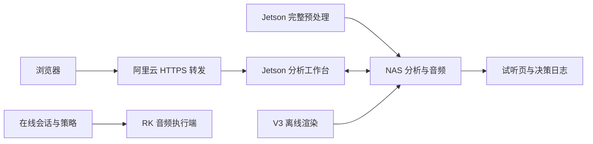

# 部署关系与版本来源

2026-09-20 核对到：完整预处理链接指向 `same-style-preprocess-a268a5c-vocal-20260913`；分析服务使用独立解释器启动 `analysis_platform.server`；主 API 链接指向 `core-v0.5.0`。这三者原先就是不同发布单元。本次源码归档没有替换任一服务。

- 完整预处理源码及文件校验位于 `services/preprocessing/SOURCE_INVENTORY.json`。
- 分析平台当前工作区源码、模型依赖和 UI 一并纳入此分支。
- 在线策略/播放代码沿用既有仓库及相关工作区修改；设备端当前安装版本尚未逐文件核对，不能以本次归档声称已重新部署。
- 线上 V3/Hip-Hop 是预生成试听产物，音频与详细运行日志继续保留在 NAS。

## 环境分别配置

1. 预处理：按 `services/preprocessing` 的模型环境说明准备 Jetson CUDA 环境与 NAS 路径。
2. 分析工作台：按 `analysis_platform/README.md` 建立独立 Python 环境，构建 `web`。模型进程使用各自解释器配置。
3. 转发：`deploy/analysis-platform/aliyun-analysis-public-read.conf` 保留公开 GET/HEAD 查看及写操作认证策略；密钥配置文件留在服务器。
4. 在线播放：按 RK `audio-engine` 与 `edge-agent` 的说明配置声卡、缓存和服务。
5. V3：从 NAS 取得有哈希的音频及分析快照，按 `mixing/README.md` 显式传入数据路径。

生产地址和历史部署记录见原部署文档。配置模板中的路径和占位值需要按目标机器修改。不要复制本机 SSH 私钥、登录文件或服务器环境文件到仓库。模型加载成功、完整曲库分析和硬件播放需在对应机器验证，普通 CI 不代替这些验收。
