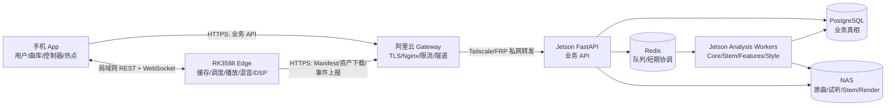

# 01 系统架构与职责边界

状态：`v1.0-draft`
主负责人：架构师 / 后端
必须评审：算法、前端、RK

## 1. 一句话架构

HarBeat 是“Jetson 业务与分析中心 + NAS 资产存储 + 阿里云公网入口 + 手机控制器 + RK3588 现场执行器”的边云端系统；现场音频闭环必须留在 RK，本地事实最终异步汇入 Jetson。

## 2. 目标拓扑



### 核心约束

1. PostgreSQL 是业务和任务状态真相；Redis 不是持久化真相。
2. NAS 是大文件真相，数据库只保存资产元数据、相对对象键和校验值。
3. 阿里云不保存业务库和音乐文件，只做安全入口和私网转发。
4. 手机不得代理 RK 下载大文件，也不得替 RK 生成“已执行”事实。
5. 现场操作不经过 Jetson 决策。Jetson 只在演出前准备分析、预设、Manifest 和资源。
6. API 不返回 `/mnt/nas/...` 等本地路径；只返回短期签名 HTTPS URL 或受控资产接口。

## 3. 各节点身份和职责

### 3.1 Jetson + NAS：中央业务与分析节点

Jetson 负责：

- FastAPI 业务接口：认证、用户、公共曲库、个人曲库、歌单、上传、设备、预设、推荐、会话；
- PostgreSQL：业务实体、权限、状态、幂等、审计、事件、任务；
- Redis：RQ/Celery 风格的任务投递、短锁、速率计数和 WebSocket 协调；
- 分析 Worker：Core、Stem Separation、Feature、Style、Preview/Render；
- Manifest 生成、资产授权和下载接口；
- 设备事件接收、去重、持久化和统计。

NAS 负责：

- 原始上传、标准化母带、试听片段、波形；
- Demucs Stem；
- 过渡 Render、Pad 音效和离线包；
- 按内容/版本保存不可变对象。

Jetson 不负责：现场毫秒级控制、声卡管理、实体键扫描、底层 DSP。

### 3.2 阿里云：公网 Gateway

阿里云负责：

- 公网域名和 TLS 终止；
- Nginx 反向代理到 Jetson 私网地址；
- 上传大小、请求超时、限流、基础 WAF 和访问日志；
- 对外暴露 `/api/v1/*`、受控资产下载和健康状态；
- 隧道故障时快速失败，不能静默写入另一套数据库。

阿里云不运行 PostgreSQL、Redis、HarBeat 分析 Worker，也不是资源最终存储。当前服务器上存在轻量 `HarBeat Gateway` FastAPI 健康/注册服务，可以保留为网关控制面，但不得演变成第二套业务后端。

### 3.3 手机 App：用户控制器

手机负责：

- 登录、用户资料、公开曲库、个人曲库、歌单和上传；
- 连接 RK、展示 RK 能力和设备状态；
- 编辑准备草稿、Pad 预设并下发到 RK；
- 发送现场意图，展示 RK 回传的权威状态；
- 开启热点，为 RK 提供局域网和互联网链路。

手机未连接并验证 RK 时：允许登录、浏览、整理、上传和试听；不允许完整歌曲播放、资源同步、设备控制或现场功能。

手机不负责：保存 RK 执行事实、音频大文件中转、生成算法分析结果、实现 DSP。

### 3.4 RK3588：现场边缘执行器

RK 负责：

- 局域网发现、配对、控制授权和能力上报；
- 接收预设、Manifest、SyncJob 和操作；
- 直接经阿里云 HTTPS 下载、校验、缓存资源；
- 本地音频播放、混音、Pad、固定控制、实体键和 DSP；
- 通过 WebSocket 向手机广播实时快照；
- 使用本地 SQLite outbox 保存事件，联网后批量上传 Jetson；
- 重启后恢复同步状态、操作账本和缓存索引。

RK 不负责：用户登录、公共曲库审核、全局资产生命周期、中央分析。

### 3.5 音乐分析算法

算法模块负责：

- 读取已标准化或明确格式的音频；
- 输出版本化、可验证、包含置信度和质量标记的 JSON；
- 生成 Stem、Feature、Style 等技术产物；
- 对未验证能力显式输出 `provisional/unavailable`，不伪装成可靠结论。

算法模块不直接更新用户、曲库、设备和订单式业务表；由 Worker 适配层校验并原子提交产物。

## 4. 代码位置和当前状态

仓库根目录：`harbeat-client/`

| 路径 | 当前内容 | 本轮使用方式 |
|---|---|---|
| `app/` | Jetson FastAPI、SQLAlchemy 模型、路由、算法入口和后台任务 | 中央后端主要开发位置；先拆清 API、domain、worker adapter |
| `app/modules/library/background_tasks.py` | 当前串行分析流水线和内存 BackgroundTasks 调度 | 算法顺序参考；替换为持久任务 + Redis Worker |
| `app/modules/library/analysis.py` 及分析子模块 | BPM、Beat、Key、Cue、Energy 等 Core 分析 | 由 Core Worker 调用，输出遵循 04 |
| `app/modules/library/stem_analysis.py` 等 | Stem、鼓、低频、预风格特征 | 由 Stem/Feature Worker 调用 |
| `app/modules/library/high_frequency_style_classifier.py` | 21 类高频风格分析 | 由 Style Worker 调用，必须保留验证状态；当前 confirmed 发布仍受验证阻塞 |
| `app/modules/library/feature_registry.py` | 特征状态、语义等级和 fail-closed 规则 | 作为算法合同来源之一 |
| `mobile/` | Flutter 手机 App | 根据 06 生成 API 客户端；根据 07 做页面映射 |
| `web/` | React Web 管理/演示前端 | 管理审核和运维面可复用，但不是手机现场控制主端 |
| `cypher-integration/rk3588-edge/` | edge-agent、sync-worker、audio-engine 接口、input-daemon | RK 目标开发位置；合并配对实现和状态源 |
| `modules/` | 可抽取的功能模块和契约草案 | 参考功能边界，不能默认等同当前线上运行版本 |
| `tests/` | 当前算法和服务测试 | 保留并补齐合同、集成、恢复和设备模拟测试 |
| `scripts/` | 验证、运维和算法实验脚本 | 不应被 API 请求直接调用；由 Worker adapter 封装 |

### 4.1 当前模块到目标领域的落点

| 当前代码 | 继续复用 | 目标改造/新增位置建议 |
|---|---|---|
| `app/modules/auth`, `users` | 登录 JWT/用户 schema 中可验证逻辑 | `app/domains/identity`；替换密码/refresh/鉴权，路由统一 `/api/v1` |
| `app/modules/library`, `music` | 上传、媒体分析和算法调用能力 | 拆为 `catalog`, `user_library`, `media`, `analysis`；不再按用户复制分析 |
| `app/modules/assets`, `stream` | Range/媒体响应逻辑 | `media` 统一授权；只按 asset_id，禁止本地路径公开 |
| `app/modules/playlists` | 歌单服务 | 改为全局 track_id、乐观锁和个人权限 |
| `app/modules/manifest` | 当前 Manifest 构造思路 | 按 09 重写版本化投影、强 hash、签名和 scoped grant |
| `app/modules/recommendations`, `profiles` | 推荐/画像现有计算 | 先接新 Track/曝光反馈；未验证特征 fail-closed |
| `app/modules/session`, `sessions` | 会话概念和部分表 | 收敛为 `live_sessions/operations/device_events` 单一领域 |
| `app/modules/dj_control`, `dj_set`, `dev_mix` | 内部 DJ/规划能力 | 作为 Worker/计划生成内部服务，不直接暴露复杂 P0 手机控制 |
| `app/modules/fangpi`, `voice` | 旧产品/实验能力 | 不进入本轮核心合同；需独立安全/版权评审后再启用 |
| `mobile/lib/src/library`, `mobile/lib/src/import` | 当前 Flutter 曲库/导入页面骨架 | 按 06/07 接生成客户端并补设备、准备、现场领域 |
| `cypher-integration/rk3588-edge/edge-agent` | 状态/音频转发入口 | 实现 08 单一 API、持久 pairing/operation/outbox |
| `cypher-integration/rk3588-edge/sync-worker` | 下载和 sha256 校验 | 仅 loopback；SQLite job/item、Range、恢复和取消 |
| `cypher-integration/rk3588-edge/audio-engine` | 音频播放/DSP | 保持 RK 内部；发布稳定 Unix socket 命令/回执合同 |
| `cypher-integration/rk3588-edge/input-daemon` | 实体键输入 | 本地硬件 profile 映射 logical intent，不把 keycode 发云端 |

### 4.2 版本源说明

当前仓库存在三种版本源：工作分支源码、`modules/` 中的模块合同、Jetson `/opt/harbeat/current` 运行发布。三者存在漂移。开发前必须把以下值写入 `/api/v1/system/build`：

```json
{
  "api_version": "1.0.0",
  "git_sha": "<commit>",
  "release_id": "<immutable-release-id>",
  "db_revision": "<alembic-revision>",
  "analysis_contract": "music-analysis-v1",
  "manifest_contract": "resource-manifest-v1"
}
```

## 5. 关键业务数据流

### 5.1 上传、分析与公开

1. App 创建上传会话，后端返回 `submission_id` 和上传目标。
2. 文件写入 NAS 临时区，完成后后端验证大小、MIME、hash 和媒体可读性。
3. 后端创建全局 `track`、原始 `media_asset`、上传者 `user_library_item` 和 `analysis_run`。
4. Worker 按 Core → Stem → Feature → Style 执行；每阶段单独持久化状态和产物。
5. 成功后生成 preview、waveform、Manifest 所需派生资产。
6. 上传者立即可在个人曲库看到；默认进入 `pending_review`，审核后公开。
7. 失败不删除原文件；用户看到可理解的失败状态，后端可重试或人工处理。

### 5.2 演出前准备与同步

1. App 在 Jetson 保存 `prepare_draft`、歌单和 PadPreset。
2. Jetson 根据 RK 实际能力生成版本化 Manifest；不按固定 8 Pad 假设生成。
3. App 连接 RK 后只下发 Manifest/SyncJob 引用和授权信息。
4. RK 直接从阿里云 Gateway 下载必要资源，按 `sha256 + size` 校验并原子入缓存。
5. RK 报告 `cache_ready` 和资源缺失；App 用 RK 状态决定能否开始现场会话。

### 5.3 现场控制

1. App 或实体键向 RK 产生 `operation`，携带唯一 `operation_id`。
2. RK 验证授权、能力和当前状态，在本地排程并执行。
3. RK 先记录操作账本，再回传 `accepted/scheduled/executed`；超时不得由 App 猜测成功。
4. RK WebSocket 广播当前播放、能量、Talk、Pad、缓存和会话快照。
5. RK 把事实事件写入本地 outbox，联网后批量上传 Jetson；Jetson按 `device_id + event_id` 去重。

## 6. 数据真相矩阵

| 数据 | 权威源 | 缓存/镜像 | 冲突处理 |
|---|---|---|---|
| 用户、登录会话、权限 | Jetson PostgreSQL | App 安全存储 | 服务端版本覆盖；refresh rotation |
| 公共曲目和发布状态 | Jetson PostgreSQL | App/RK 缓存 | 服务端 `version`/ETag |
| 原曲、Stem、Render | NAS + `media_assets` 元数据 | RK 文件缓存 | hash 不符即废弃重下 |
| 分析任务和产物 | PostgreSQL | Redis 任务消息 | 数据库状态优先 |
| 个人曲库/歌单/准备草稿 | PostgreSQL | App 本地缓存 | If-Match 乐观锁 |
| 设备 Owner/授权 | PostgreSQL | RK 短期授权缓存 | 过期或撤销后拒绝新操作 |
| RK 能力 | RK 运行时 | Jetson 最近上报/App 当前快照 | 在线时以 RK 当前上报为准 |
| 现场播放与操作状态 | RK | App WS 快照/Jetson 事件副本 | 以 RK `sequence` 最大值为准 |
| 同步进度 | RK | Jetson 云端镜像/App 展示 | RK 可重建；云端不反向宣称完成 |

## 7. 后端模块边界

| 模块 | 负责 | 不负责 | P0 交付 |
|---|---|---|---|
| Identity | 注册登录、access/refresh、注销、权限 | 设备局域网配对 | Argon2id、refresh rotation、审计 |
| Catalog | 全局曲目、搜索、发布审核、资产可见性 | 用户自己的排序/收藏语义 | Track/Publication/Preview API |
| User Library | 用户曲目关联、收藏、用户元数据 | 删除全局文件 | 幂等 add/remove、分页 |
| Playlist/Prepare | 歌单、准备草稿、版本 | RK 本地排程 | 乐观锁、快照版本 |
| Upload | 会话、校验、提交、去重 | 算法实际运行 | 上传状态机、hash 去重 |
| Analysis Orchestrator | 任务、阶段、投递、重试、结果校验 | 算法定义 | 05 全部内容 |
| Media | 资产登记、签名下载、范围请求 | NAS 文件系统外泄 | preview、asset token、校验 |
| Device | 设备、Owner、授权、能力镜像 | DSP | 配对票据、授权、心跳 |
| Preset | Pad/固定控制配置版本 | 硬件键位映射 | 动态 capability 校验 |
| Sync/Manifest | Manifest、云端 SyncJob 镜像 | 声称 RK 已缓存 | 09 合同 |
| Session/Event | 现场会话、事件接收、去重 | 代替 RK 事实 | 批量入库、序号缺口检测 |
| Recommendation | 推荐结果、曝光、反馈 | 未验证风格当事实 | 可解释标签、降级逻辑 |
| Admin/Ops | 审核、重试、隔离、审计 | 绕过审计直接改库 | 最小管理 API 和日志 |

## 8. 当前代码与目标之间的 P0 差距

1. 当前分析通过 FastAPI `BackgroundTasks` 在单 Uvicorn 进程执行；进程重启会丢任务，必须迁移到持久状态 + Redis Worker。
2. 当前 `Song` 与每用户 `LibrarySong` 重复保存曲目和分析数据；必须迁移为全局 Track + 用户关联。
3. 当前多个路由信任请求中的 `user_id`；必须从 access token 解析用户并做对象级授权。
4. 当前密码方案为简单 SHA256 组合，refresh token 缺少轮换/撤销；必须按 11 改造。
5. 当前无 Alembic 正式迁移基线；不能以 `create_all` 管理生产库。
6. RK 配对存在互不一致的 mock/store 实现；必须形成单一持久状态机。
7. 当前 RK sync 状态主要在内存中；必须落 SQLite WAL，支持重启/取消/恢复。
8. 手机直接访问 `sync-worker:9100` 的路径需要收敛为 `edge-agent` 单一局域网 API；sync-worker 仅绑定 loopback。
9. 手机使用的 `/live/intent`、`/live/override` 与当前 RK edge-agent 路由不一致；按 08 统一。
10. RK 当前事件上报中央接口只接受/记录但未形成稳定持久合同；必须实现去重、顺序缺口和批次回执。
11. 当前 Manifest 含重复身份字段和大块原始分析 JSON，且 hash 可关闭；必须按 09 变为有界、版本化、强校验资源清单。
12. 当前对外资产基地址是私网地址的风险配置；普通 RK 不加入 Tailscale 时必须使用阿里云公网 HTTPS 域名。

## 9. 非功能指标

| 项目 | P0 指标 |
|---|---|
| 中央 API | 除上传/下载外 p95 < 500 ms；错误率 < 1% |
| RK 局域网控制 | 接收确认 p95 < 80 ms；本地执行不依赖公网 |
| 事件持久化 | RK 重启不丢；中央重复批次不重复入库 |
| Manifest | 同输入版本生成确定性内容；每资产必有 size 和 sha256 |
| 分析任务 | Worker/Jetson 重启后可恢复；同一输入和版本幂等 |
| 安全 | TLS、对象级授权、密钥不入库、敏感日志脱敏 |
| 可观测性 | 每请求/任务/操作均有 correlation ID；状态转换可追踪 |

## 10. 评审必须形成的决定记录

以下内容不得只留在聊天中，评审后写入 ADR 或合并请求：

- 是否 `CATALOG_AUTO_PUBLISH`；默认 `false`；
- 手机试听时长和码率；建议 30 秒 AAC/Opus，不返回原曲 URL；
- RK 当前硬件能力 JSON、固定控制集合、Pad 槽数量；
- 生产公网域名、TLS 和隧道方案；
- Worker 框架选择（RQ、Celery 或等价实现），但不得改变数据库真相原则；
- 算法合同版本和哪些字段允许进入用户界面；
- 数据保留、版权投诉和管理员物理删除流程。
