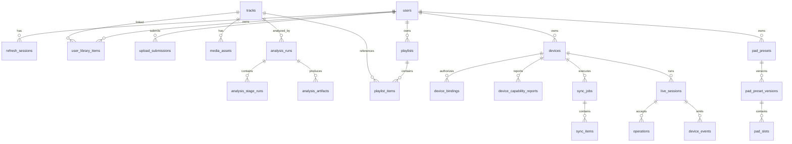

# 03 领域模型与数据库设计

状态：`v1.0-draft`
主负责人：后端
必须评审：算法、前端

## 1. 设计目标

数据库必须同时解决四类一致性问题：

1. 同一首歌全局只维护一份目录、资产和分析结果，用户只维护关联；
2. 分析任务可重试、可恢复、可审计，不依赖 Redis 是否还保留消息；
3. RK 的 Owner、临时授权、同步和现场事件可以离线补传且不会重复；
4. 删除、审核和资源生命周期分离，普通用户操作不能物理删除公共资产。

目标数据库为 PostgreSQL 14+，通过 Alembic 管理。所有时间字段使用 `timestamptz` 和 UTC，所有新主键使用 UUID。API 中 UUID 以小写带连字符字符串表示。

## 2. 统一字段和约束

除纯关联表外，业务表至少包含：

| 字段 | 类型 | 说明 |
|---|---|---|
| `id` | `uuid` | 服务端生成 UUIDv7；不把自增序号暴露为公共 ID |
| `created_at` | `timestamptz not null` | 创建时间 |
| `updated_at` | `timestamptz not null` | 更新时由数据库或 ORM 统一维护 |
| `version` | `integer not null default 1` | 乐观锁；每次可见修改加 1 |
| `deleted_at` | `timestamptz null` | 仅需要软删除的实体使用 |

统一规范：

- 用户输入的展示文本保存 UTF-8，搜索另建标准化列或全文索引；
- 金额、时长、BPM 等不得使用不可控字符串；时长使用毫秒整数，BPM 使用 `numeric(7,3)`；
- 文件系统绝对路径不得通过 API 返回；数据库用 `storage_key` 表示 NAS 相对对象键；
- 任意 JSONB 必须有 schema 名称和版本，不能把未知业务结构永久塞进无版本 JSON；
- 枚举优先使用 `varchar + check constraint`，便于安全扩展；
- PII 和令牌不得写普通日志；令牌表仅保存 hash。

## 3. 聚合关系

## 4. 身份与权限

### 4.1 `users`

| 字段 | 类型/约束 | 说明 |
|---|---|---|
| `id` | uuid PK | 用户 ID |
| `email` | `citext unique not null` | 登录邮箱；如支持手机号则增加独立规范化列 |
| `password_hash` | text not null | Argon2id hash |
| `display_name` | varchar(80) not null | 展示名 |
| `avatar_asset_id` | uuid null FK media_assets | 头像 |
| `status` | check active/disabled/deleted | 账号状态 |
| `role` | check user/reviewer/admin | 后台权限；默认 user |
| `email_verified_at` | timestamptz null | 邮箱验证 |
| `last_login_at` | timestamptz null | 最近登录 |
| `created_at/updated_at/version` | 统一字段 |  |

索引：`unique(lower(email))`；`status`。删除账号时先撤销令牌和设备授权，内容归属按版权/隐私策略异步处理。

### 4.2 `refresh_sessions`

| 字段 | 类型/约束 | 说明 |
|---|---|---|
| `id` | uuid PK | 登录会话 |
| `user_id` | uuid FK users | 所属用户 |
| `token_hash` | char(64) unique | refresh token SHA-256 hash，不存明文 |
| `family_id` | uuid | rotation 家族；检测重放时整族撤销 |
| `client_id` | varchar(100) | App 安装实例标识 |
| `expires_at` | timestamptz | 过期时间 |
| `rotated_from_id` | uuid null | 上一个会话 |
| `revoked_at/revoke_reason` | nullable | 撤销审计 |
| `created_ip/user_agent` | 可空 | 风险审计，按隐私策略保留 |

索引：`(user_id, revoked_at)`、`expires_at`。Access token 只含 `sub/session_id/role/iat/exp/jti`。

## 5. 公共曲目、上传和个人曲库

### 5.1 `tracks`：全局曲目

| 字段 | 类型/约束 | 说明 |
|---|---|---|
| `id` | uuid PK | 对外 `track_id` |
| `title` | varchar(300) not null | 曲名 |
| `artist_name` | varchar(300) | 主艺人展示文本 |
| `album_name` | varchar(300) | 专辑 |
| `duration_ms` | integer check > 0 | 以媒体探测为准 |
| `isrc` | varchar(20) null | 有则建部分唯一索引 |
| `audio_fingerprint` | text null | 内容去重辅助，不直接展示 |
| `content_sha256` | char(64) not null | 标准化原始音频内容 hash |
| `publication_status` | draft/processing/pending_review/published/rejected/blocked/archived | 对其他用户的可见性 |
| `analysis_status` | pending/running/completed/partial/failed | 聚合展示状态，真相在 analysis_runs |
| `current_analysis_run_id` | uuid null | 当前可用分析版本 |
| `submitted_by_user_id` | uuid null | 首次提交者；不等于独占所有权 |
| `published_at/reviewed_at` | timestamptz null | 审核记录快捷字段 |
| `reviewed_by_user_id` | uuid null | reviewer/admin |
| `rejection_code` | varchar(64) null | 稳定机器码 |
| `metadata_source` | upload/import/admin | 来源 |
| `created_at/updated_at/version/deleted_at` | 统一字段 | `deleted_at` 仅管理员隔离流程 |

约束与索引：

- `unique(content_sha256)`；相同内容上传命中已有 Track，不重复分析；
- `publication_status='published'` 才出现在公共目录；提交者和管理员可按权限看到其他状态；
- `gin(to_tsvector(...title, artist_name, album_name))` 供搜索；
- `publication_status, published_at desc` 供目录分页；
- 任何用户删除个人曲库都不得更新 `tracks.deleted_at`。

### 5.2 `upload_submissions`

| 字段 | 类型/约束 | 说明 |
|---|---|---|
| `id` | uuid PK | `submission_id` |
| `user_id` | uuid FK users | 提交者 |
| `status` | created/uploading/uploaded/validating/accepted/duplicate/rejected/expired | 上传状态 |
| `original_filename` | varchar(500) | 仅展示，不能拼路径 |
| `declared_size_bytes` | bigint | 客户端声明 |
| `received_size_bytes` | bigint | 服务端确认 |
| `declared_sha256` | char(64) null | 可选预声明 |
| `verified_sha256` | char(64) null | 服务端计算 |
| `mime_type` | varchar(100) | 探测结果优先 |
| `temporary_storage_key` | text | NAS 临时区键 |
| `track_id` | uuid null | 接受或去重后关联 |
| `expires_at` | timestamptz | 未完成会话回收时间 |
| `error_code/error_detail` | nullable | 可诊断但不含敏感路径 |
| `idempotency_key/request_hash` | text | 创建请求幂等 |

唯一约束：`(user_id, idempotency_key)`。后台清理只删除已过期的临时对象，不碰已注册资产。

### 5.3 `user_library_items`

| 字段 | 类型/约束 | 说明 |
|---|---|---|
| `id` | uuid PK | 用户曲库条目 ID |
| `user_id` | uuid FK users | 用户 |
| `track_id` | uuid FK tracks | 全局曲目 |
| `source` | upload/catalog/playlist/admin | 加入来源 |
| `favorite` | boolean default false | 收藏标志 |
| `user_note` | text null | 私有备注 |
| `added_at` | timestamptz | 加入时间 |
| `removed_at` | timestamptz null | 软移除；可恢复 |
| `version` | integer | 乐观锁 |

唯一索引：同一用户/曲目只有一个活动关联 `unique(user_id, track_id) where removed_at is null`。`DELETE /me/library/{track_id}` 只设置 `removed_at`。

### 5.4 `catalog_reviews`

保存每次审核动作：`track_id`、`reviewer_id`、`from_status`、`to_status`、`reason_code`、`note`、`created_at`。禁止覆盖历史。版权投诉可使 Track 进入 `blocked`，同时撤销新资产签名 URL，但不立即物理删除证据。

## 6. 媒体资产

### 6.1 `media_assets`

| 字段 | 类型/约束 | 说明 |
|---|---|---|
| `id` | uuid PK | `asset_id` |
| `track_id` | uuid null FK | 曲目资产；Pad 公共音效可为空并由关联表引用 |
| `analysis_run_id` | uuid null FK | 由哪次算法运行生成 |
| `kind` | original/normalized/preview/waveform/stem/render/pad_sound/metadata | 资产类型 |
| `variant` | varchar(100) null | 如 `vocals`、`drums`、`bass`、`other` |
| `storage_backend` | nas | P0 固定 nas，预留对象存储 |
| `storage_key` | text unique | 例 `tracks/{track_id}/analysis/{run_id}/stems/drums.wav` |
| `content_type` | varchar(100) | MIME |
| `codec/container` | varchar(50) | 媒体格式 |
| `size_bytes` | bigint check >= 0 | 文件大小 |
| `sha256` | char(64) | Manifest 强校验值 |
| `duration_ms/sample_rate_hz/channels` | integer null | 音频探测信息 |
| `status` | staging/ready/quarantined/deleted | 生命周期 |
| `schema_name/schema_version` | varchar null | JSON 资产需要 |
| `created_at/deleted_at` | 时间 | 物理删除为受控后台作业 |

约束：`status='ready'` 才能进入 Manifest；同一 `storage_key` 不可覆盖。派生资产更新应生成新对象和新 asset_id。

### 6.2 资产引用与回收

物理文件可删除的必要条件：

1. Track 已被管理员/法务标记为可清理；
2. 不被已发布 Track、有效 Manifest、PadPresetVersion、审计保留或正在运行的 SyncJob 引用；
3. 超过配置的宽限期；
4. 后台清理任务写入审计记录并验证删除结果。

用户个人库移除、歌单移除都不满足上述条件。

## 7. 分析任务和产物

### 7.1 `analysis_runs`

| 字段 | 类型/约束 | 说明 |
|---|---|---|
| `id` | uuid PK | `analysis_run_id` |
| `track_id/input_asset_id` | uuid FK | 输入曲目和资产 |
| `contract_version` | varchar(50) | `music-analysis-v1` |
| `pipeline_version` | varchar(100) | 代码/模型组合版本 |
| `input_sha256` | char(64) | 幂等输入 |
| `status` | created/queued/running/retry_wait/succeeded/partial/failed/canceled | 总状态 |
| `priority` | smallint | 0–9，默认 5 |
| `requested_by_user_id` | uuid null | 发起者/管理员 |
| `attempt_count/max_attempts` | integer | 总体统计；阶段另记 |
| `progress_percent` | numeric(5,2) | 展示用途，不作状态真相 |
| `queued_at/started_at/finished_at` | timestamptz null | 计时 |
| `heartbeat_at/lease_expires_at` | timestamptz null | Worker 租约 |
| `cancel_requested_at` | timestamptz null | 协作取消 |
| `error_code/error_message` | nullable | 稳定码 + 脱敏摘要 |
| `created_at/updated_at/version` | 统一字段 |  |

幂等唯一键建议：`(track_id, input_sha256, pipeline_version, contract_version)`，只要已有 `succeeded/partial` 且产物仍 ready 就复用。

### 7.2 `analysis_stage_runs`

每个 Run 固定阶段：`core`、`stem_separation`、`feature_analysis`、`style_analysis`、`media_derivatives`。

字段：`id, analysis_run_id, stage_key, queue_name, status, attempt_count, max_attempts, progress_percent, worker_id, heartbeat_at, lease_expires_at, started_at, finished_at, next_retry_at, input_contract, output_contract, error_code, error_message, metrics jsonb, created_at, updated_at`。

唯一约束：`(analysis_run_id, stage_key)`。阶段依赖、重试和状态语义见 05。

### 7.3 `analysis_artifacts`

保存结构化 JSON 产物：

| 字段 | 说明 |
|---|---|
| `analysis_run_id/stage_key` | 来源 |
| `artifact_type` | `core_analysis`、`stem_analysis`、`pre_style_evidence`、`style_analysis`、`dj_fingerprint` |
| `schema_name/schema_version` | 例 `pre_style_evidence_v5` |
| `payload` | JSONB；写入前必须通过 schema 校验 |
| `payload_sha256` | 规范 JSON hash |
| `validation_status` | valid/degraded/invalid |
| `quality_summary` | 有界 JSONB，仅保存统一质量摘要 |
| `created_at` | 生成时间 |

唯一约束：`(analysis_run_id, artifact_type, schema_version)`。大文件放 `media_assets`，不要放 JSONB。

## 8. 歌单和准备草稿

### 8.1 `playlists` / `playlist_items`

`playlists`：`id, owner_user_id, name, description, visibility(private/unlisted), cover_asset_id, version, created_at, updated_at, deleted_at`。

`playlist_items`：`id, playlist_id, track_id, position numeric(20,10), note, added_by_user_id, created_at`。

- P0 歌单默认私有；公共目录不等于公共歌单；
- 更新使用 `If-Match` 或请求体 `expected_version`；
- 排序采用稀疏 position，必要时事务内重排；
- 不能引用当前用户无权查看的 blocked Track。

### 8.2 `prepare_drafts` / `prepare_items`

准备草稿是演出前编辑态，不是 RK 执行事实。

`prepare_drafts`：`id, user_id, name, target_device_id nullable, status(draft/frozen/archived), pad_preset_version_id nullable, version, created_at, updated_at`。

`prepare_items`：`id, draft_id, track_id, position, transition_preferences jsonb, selected_analysis_run_id, created_at`。

冻结时生成不可变 `prepare_snapshot` 和 Manifest；草稿后续修改不会改变已同步的现场包，需显式生成新版本。

## 9. 设备、绑定和能力

### 9.1 `devices`

字段：

- `id`：中央 `device_id`；
- `hardware_id`：出厂或安全生成的不可变 ID，唯一；
- `display_name`；
- `owner_user_id`：唯一 Owner；
- `status`：unpaired/active/suspended/retired；
- `device_token_hash`：仅保存长期凭证 hash；
- `firmware_version/edge_version/audio_engine_version`；
- `last_seen_at/last_ip`；
- `last_capability_report_id`；
- 统一审计字段。

索引：`owner_user_id`、`last_seen_at`。Owner 转移必须撤销全部临时绑定和 device token，并要求重新配对。

### 9.2 `device_bindings`

用于 Owner 之外的临时控制：`id, device_id, user_id, role(owner/controller/viewer), status(active/revoked/expired), permissions jsonb, issued_by_user_id, starts_at, expires_at, revoked_at, version`。

约束：Owner 通过 `devices.owner_user_id` 唯一表示；临时 binding 必须有 `expires_at`；`unique(device_id,user_id) where status='active'`。

### 9.3 `pairing_tickets`

`id, device_hardware_id, code_hash, status(created/claimed/confirmed/expired/locked), claimed_by_user_id, expires_at, attempt_count, max_attempts, nonce, created_at, confirmed_at`。配对码 6–8 位仅展示一次，服务器只存 hash，TTL 建议 5 分钟，最多 5 次尝试。

### 9.4 `device_capability_reports`

保存设备上报的不可变快照：`id, device_id, report_version, protocol_versions jsonb, capabilities jsonb, storage jsonb, reported_at`。完整 schema 见 08。后端不得从设备型号推断 Pad 数量取代最新有效报告。

## 10. PadPreset

### 10.1 `pad_presets`

`id, owner_user_id, name, current_version_id, created_at, updated_at, deleted_at`。

### 10.2 `pad_preset_versions`

不可变版本：`id, preset_id, version_number, schema_version, target_capability_hash nullable, status(draft/published/archived), created_by_user_id, created_at`。发布后不能原地修改。

### 10.3 `pad_slots`

`id, preset_version_id, slot_id varchar(64), label, color, sound_asset_id, mode(one_shot/toggle/hold/loop), gain_db numeric, quantize_mode, choke_group, config jsonb, position integer`。

约束：`unique(preset_version_id, slot_id)`。`slot_id` 是逻辑槽，例如 `pad-01`；不是 Linux keycode，也不是实体 GPIO。后端根据目标设备能力校验 mode/格式/数量。

## 11. Manifest、同步和现场事实

### 11.1 `resource_manifests`

字段：`id, schema_version, owner_user_id, target_device_id nullable, prepare_snapshot_id nullable, manifest_version integer, content_hash, body jsonb, status(active/superseded/revoked), expires_at, created_at`。

Manifest body 必须通过 09 schema。已签发 URL 不直接固化到长期 body；下载时可由 asset_id 换取短期 URL，或签发短期派生响应。

### 11.2 `sync_jobs` / `sync_items`

`sync_jobs` 是中央镜像，不是 RK 缓存完成事实：`id, device_id, manifest_id, requested_by_user_id, status(created/dispatched/accepted/syncing/cache_ready/partial/failed/canceled/expired), rk_sequence, progress_bytes, total_bytes, error_code, created_at, updated_at, finished_at`。

`sync_items`：`id, sync_job_id, asset_id, required, status(pending/downloading/verifying/ready/failed/skipped), bytes_downloaded, attempt_count, error_code, updated_at`。

唯一约束：`(device_id, manifest_id)` 对活动任务唯一。每次 RK 报告必须带单调 `rk_sequence`，旧报告不能覆盖新状态。

### 11.3 `live_sessions`

`id, device_id, owner_user_id, prepare_snapshot_id nullable, status(created/ready/live/ended/aborted), started_at, ended_at, last_device_sequence, created_at`。

### 11.4 `operations`

`operation_id` 可由 App 生成并在 RK/Jetson 全链路复用。字段：`id, live_session_id, device_id, source(app/physical/system), source_user_id nullable, intent_type, request_payload jsonb, request_hash, status(accepted/syncing/cache_ready/prepared/scheduled/executed/rejected/failed/canceled/expired/timeout_unknown), device_sequence, accepted_at, scheduled_at, executed_at, result_payload jsonb, error_code, created_at, updated_at`。

唯一：`(device_id, id)`；如中央批量接收首次创建，重复 payload 返回原结果，不同 request_hash 返回幂等冲突。

### 11.5 `device_events`

| 字段 | 说明 |
|---|---|
| `event_id` | RK 生成 UUID，和 device_id 组成唯一键 |
| `device_id/live_session_id` | 设备与会话 |
| `device_sequence` | 会话内严格单调整数 |
| `event_type/schema_version` | 版本化事件类型 |
| `occurred_at` | RK 发生时间 |
| `received_at` | Jetson 接收时间 |
| `operation_id` | 可空关联 |
| `payload` | 有界 JSONB |
| `device_boot_id` | 区分重启时钟/序列上下文 |

唯一约束：`(device_id,event_id)`、`(live_session_id,device_sequence)`。中央对重复事件返回成功，对序号缺口返回 `missing_ranges` 但仍接受后续事件。

## 12. 推荐、反馈和审计

- `recommendation_impressions`：用户、候选 Track、算法/规则版本、原因码、展示位置、时间；
- `recommendation_feedback`：impression、动作(play_preview/add/skip/hide)、时间；
- `audit_logs`：actor_type/user/device/system、actor_id、action、resource_type/id、request_id、before/after 摘要、IP、时间；
- `outbox_events`：aggregate_type/id、event_type、payload、created_at、published_at、attempts。业务事务与 outbox 同提交，再异步投 Redis。

算法置信度不足时，推荐只能使用通用元数据和已验证字段，不能把 `candidate_only` 风格当成事实。

## 13. 删除和保留策略

| 操作 | 数据行为 |
|---|---|
| 用户从个人曲库删除 | `user_library_items.removed_at=now()`；Track/Asset 不变 |
| 用户从歌单移除 | 删除/软删 playlist_item；个人曲库不变 |
| 用户取消未完成上传 | 过宽限期清理 temporary storage；不影响已去重 Track |
| 管理员拒绝公开 | Track `rejected`；提交者仍可见失败原因，资产暂存待策略清理 |
| 版权/安全封禁 | Track `blocked`，停止发签名 URL，保留审计证据 |
| 分析重跑 | 新建 analysis_run 和资产；原版本在宽限期内可回滚 |
| 设备解绑 | 撤销 token/binding，保留历史事件和审计 |

建议默认：上传临时文件 24 小时；失败分析中间文件 7 天；旧分析产物 30 天；设备事件至少 180 天；审计按合规策略长期保存。最终数值由产品/法务/运维定稿。

## 14. 从当前模型迁移

当前代码主要使用全局整数 `Song` 与按用户重复的 UUID `LibrarySong`。迁移必须可重复、可回滚：

1. 新增上述新表，不立即删除旧表；
2. 以内容 hash/已有 song 关系合并生成 Track，建立 `legacy_id_map(entity_type, legacy_id, new_uuid)`；
3. 把每个 LibrarySong 转为 user_library_item；分析 JSON 只选一个可追溯版本迁入 analysis_artifact，保留原始快照；
4. 将现有文件登记为 media_asset，后台补算 size/sha256；未校验文件不得进入 RK Manifest；
5. 双读比对并生成数量、孤儿、hash 冲突报告；
6. API 切换新模型，观察期内旧表只读；
7. 完成备份和回滚演练后，再通过独立 migration 归档旧表。

禁止在迁移过程中直接把相同歌名/艺人视为同一音频。去重至少以验证后的内容 hash 为准。

## 15. Migration 与事务规范

- 所有 schema 修改必须有 Alembic `upgrade/downgrade` 或清楚标注不可逆及备份恢复方案；
- 大表加非空列采用“可空列 → 回填 → 约束”三步；
- 状态转换使用 `UPDATE ... WHERE version=? AND status IN (...)`；受影响行数为 0 即冲突；
- 业务写入与 outbox 在同一 PostgreSQL 事务；
- 资产文件先写 staging 临时名并 fsync/校验，再原子 rename，最后事务登记 ready；
- Worker 不持有跨长时间算法调用的数据库事务；领取租约和提交结果分别短事务；
- 测试库必须运行从空库到 HEAD 和生产快照副本升级测试。

## 16. 数据库验收清单

- 同一用户重复加入曲库不会产生两个活动条目；
- 用户移除曲库不会减少 media_assets 数量；
- 同 hash 重复上传只生成一个 Track，可生成新的用户关联；
- 重复 RK event batch 不会产生重复事件；
- 旧 `rk_sequence` 不覆盖新同步状态；
- Worker 崩溃后过期 lease 可被重新领取；
- 无权用户不能通过猜 UUID 读取 private playlist、未公开 Track 或他人设备；
- 所有 Manifest 资产均能追溯到 ready media_asset 和 sha256；
- 每个生产 schema 变更都能定位到 Alembic revision 和 release ID。
