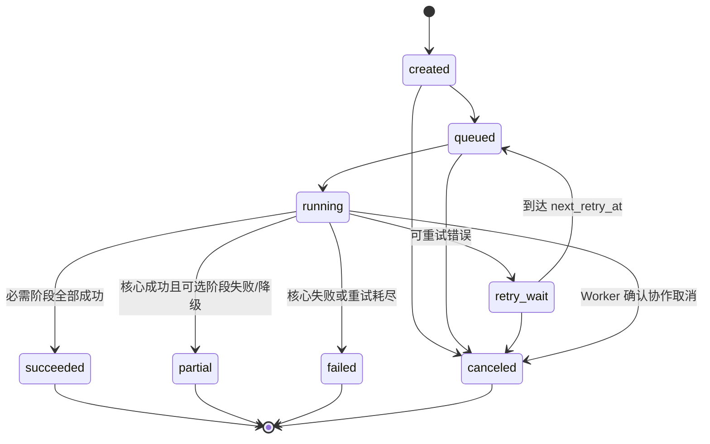

# 05 分析任务状态机与 Worker 规范

状态：`v1.0-draft`
主负责人：后端
必须评审：算法、运维

## 1. 改造目标

当前分析由 FastAPI `BackgroundTasks` 在 Uvicorn 进程内执行，重启会丢失执行上下文，长任务也会与 API 资源争抢。本轮必须改成：

- PostgreSQL 保存任务、阶段、租约、尝试和结果，是唯一持久真相；
- Redis 只传递“某个 stage 可以执行”的消息；消息丢失可由数据库扫描重建；
- 独立 Worker 进程执行算法，FastAPI 只创建任务、查询状态和请求取消；
- 每个阶段有幂等键、超时、心跳、重试和原子提交；
- 失败不会留下半 ready 资产，进程/设备重启后能自动恢复。

可以选择 RQ、Celery 或等价框架。本文定义行为，不绑定库 API。

## 2. Run 状态机



状态定义：

| 状态 | 含义 | 是否终态 |
|---|---|---|
| `created` | Run 和阶段记录已在事务中创建，尚未投递 | 否 |
| `queued` | 至少一个可运行阶段已登记 outbox/队列 | 否 |
| `running` | Worker 已领取有效租约 | 否 |
| `retry_wait` | 发生可重试失败，等待 `next_retry_at` | 否 |
| `succeeded` | 必需阶段成功，所有目标产物通过校验 | 是 |
| `partial` | Core 成功，可选阶段失败或 quality degraded；产品仍可使用有限功能 | 是 |
| `failed` | Core 失败、输出非法或必需资产最终失败 | 是 |
| `canceled` | 已确认停止且不会再提交结果 | 是 |

`progress_percent` 仅用于展示，不能用 `100` 判断成功。

## 3. Stage 状态机

阶段状态：`pending -> queued -> running -> succeeded | failed | canceled | blocked`，运行失败可经 `retry_wait -> queued`。

- `blocked` 表示上游阶段终态失败或取消，不能运行；
- `failed` 表示本阶段重试耗尽或不可重试；
- `succeeded` 可以附带 artifact `status=degraded`；
- 阶段不得从终态回退。管理员“重试”创建新的 attempt 或新的 Run，而不是擦除历史；
- 同一 `analysis_run_id + stage_key` 同时只能有一个有效租约。

依赖图：

```text
core ───────────────┬──────────────> media_derivatives(preview/waveform)
                    └─> stem_separation ─> feature_analysis ─> style_analysis
```

如果产品要求 preview 尽快可用，可独立队列并与 Stem 并行。只有已校验的 ready 资产可发布。

## 4. 队列与并发

| 队列 | 任务 | 建议并发 | 资源/超时初值 |
|---|---|---:|---|
| `analysis.core` | BPM/Beat/Key/Cue/Energy | 1–2 | CPU/GPU 自动；900 秒 |
| `analysis.stem` | Demucs htdemucs | 1 | Jetson GPU；1,800 秒 |
| `analysis.features` | Stem/鼓/Bass/预风格 | 1 | CPU/GPU；1,200 秒 |
| `analysis.style` | 高频风格/外部 adapter | 1 | 900 秒；外部子命令独立超时 |
| `media.derivatives` | preview/waveform/规范化 | 1–2 | ffmpeg；600 秒 |
| `media.render` | 过渡 Render（若启用） | 1 | P1；按长度限制 |

容量测试前，Jetson GPU 任务总并发为 1，避免 Demucs 与其他模型同时 OOM。Worker 要设置显式并发、进程内存上限和磁盘水位检查，不能依赖框架默认值。

## 5. 创建任务事务

API `POST /api/v1/tracks/{track_id}/analysis-runs`：

1. 鉴权：普通用户只能为自己已上传且允许重试的 Track 发起；管理员可强制；
2. 锁定 Track，读取 ready input asset、sha256、pipeline/contract version；
3. 按幂等唯一键查找已有 Run；若已有可复用成功结果，返回 200；若运行中，返回 202 和原 Run；
4. 在一个事务中创建 analysis_run、所有 stage rows 和 outbox event；
5. 事务提交后 dispatcher 把 Core/可并行的 media 任务发 Redis；
6. 返回 202、Location 和状态资源。

请求必须支持 `Idempotency-Key`。同键同请求返回原响应；同键不同请求 hash 返回 `409 IDEMPOTENCY_KEY_REUSED`。

## 6. Worker 领取租约

推荐数据库语义：

```sql
UPDATE analysis_stage_runs
SET status = 'running',
    worker_id = :worker_id,
    attempt_count = attempt_count + 1,
    started_at = COALESCE(started_at, now()),
    heartbeat_at = now(),
    lease_expires_at = now() + interval '90 seconds'
WHERE id = :stage_id
  AND status IN ('queued', 'retry_wait')
  AND (lease_expires_at IS NULL OR lease_expires_at < now())
RETURNING *;
```

实际实现可先 `SELECT ... FOR UPDATE SKIP LOCKED`，但必须保证条件更新只有一个 Worker 成功。Redis 消息携带的只有 `stage_run_id`、trace 元数据和版本，不携带可被篡改的文件路径。

Worker 领取后：

1. 从数据库重新读取 Run、输入 asset、上游 artifact；
2. 验证状态、取消标记、输入 hash 和算法版本；
3. 创建 run/stage/attempt 专用临时目录；
4. 启动算法子进程并周期心跳；
5. 解析输出，通过 04 的 JSON Schema、文件探测、大小/hash 校验；
6. 原子发布文件并短事务提交 artifact/asset/stage；
7. 计算后继阶段，把新的 outbox event 与状态事务同提交。

## 7. 心跳、租约和失联恢复

- 心跳建议每 20 秒，租约 90 秒；具体数值要大于最坏数据库抖动；
- 算法在子进程执行，父 Worker 仍可发心跳、处理取消和收集资源；
- Reaper 每 30–60 秒扫描 `running AND lease_expires_at < now()`；
- 失联阶段不直接宣告失败：先标记 attempt `worker_lost`，若还有次数则进入 `retry_wait`；
- 原 Worker 晚到的结果提交必须检查 lease owner/attempt token；已失去租约时拒绝提交并清理 staging；
- Redis 清空后，dispatcher 扫描 `queued` 但无近期 dispatch 的 stage 重新投递；重复消息由数据库租约去重。

每次领取生成随机 `attempt_token`，结果提交条件必须包含 `worker_id + attempt_token + status=running`。

## 8. 重试策略

| 错误 | 默认重试 | 延迟 | 特别处理 |
|---|---:|---|---|
| Redis/数据库临时不可用 | 直到服务恢复，不消耗算法次数 | 指数 + jitter，上限 5 分钟 | 保持任务可恢复 |
| `ANALYSIS_GPU_OOM` | 2 | 1、5 分钟 | 降低并发/清 GPU；仍失败告警 |
| `ANALYSIS_STAGE_TIMEOUT` | 1 | 5 分钟 | 第二次失败终止该阶段 |
| Worker lost/主机重启 | 2 | 30 秒、2 分钟 | 校验并清 staging |
| 外部 adapter 失败 | 1 或降级 | 30 秒 | 非必需 adapter 形成 degraded |
| 输入缺失/hash 不符/格式不支持 | 0 | 无 | 直接失败，需人工修复 |
| 输出 Schema 非法 | 0 | 无 | 代码缺陷，告警并隔离输出 |
| 用户取消 | 0 | 无 | 进入 canceled |

退避公式：`min(base * 2^(attempt-1) + random(0,jitter), max_delay)`。重试时间写 `next_retry_at`，不得通过 Worker 进程 sleep 等待。

## 9. 取消

API 只设置 `analysis_runs.cancel_requested_at` 并发布取消通知：

- `created/queued/retry_wait`：事务内取消未运行阶段，Run 可立即 canceled；
- `running`：Worker 下次心跳发现后向算法子进程发 SIGTERM，等待宽限期后 SIGKILL；
- 若算法已完成但结果尚未提交，取消优先，staging 产物不发布；
- 若 Run 已终态，取消返回原状态，不改历史；
- 已有其他 Track/Run 引用的 ready 资产不因取消删除。

取消最大确认时间建议 30 秒；Demucs 等库若不能协作取消，必须在子进程隔离以便终止。

## 10. 结果原子提交

文件和数据库无法单事务，使用 staging + 原子 rename + 补偿：

1. 算法输出到 `staging/{run_id}/{stage}/{attempt_token}/`；
2. Worker 计算 hash、探测媒体、验证 JSON；
3. 将文件原子移动到不可变最终 `storage_key`；
4. 开数据库事务，校验当前租约；插入 media_assets/artifacts，更新 stage，写 outbox；
5. 若数据库提交失败，保留已发布但未登记对象到 orphan log，清理器按宽限期处理；
6. 数据库提交成功后不能覆盖文件；任何更新生成新 asset。

结构化 artifact 写入时计算 canonical JSON SHA-256。Track 的 `current_analysis_run_id` 仅在满足发布门时通过 compare-and-swap 切换。

## 11. Run 聚合规则

P0 发布门：

- `core=succeeded`；
- preview/waveform ready，允许 App 展示和试听；
- 如果 Track 要进入 RK 完整同步，Manifest 中标为 required 的 Stem/Render 必须 ready；
- Style 失败可 `partial`，不能阻止普通曲库使用；
- `core` 失败一定 `failed`；
- stage 产物 degraded 不等于 stage failed，但 Run 可根据产品能力标为 partial。

建议进度权重：Core 25%、Stem 40%、Feature 20%、Style 10%、Media 5%。只有正在执行或已完成阶段参与精确计算，进度单调不下降，最终状态独立判断。

## 12. Outbox 与 Dispatcher

`outbox_events` 与任务状态同事务写入：

```json
{
  "event_type": "analysis.stage.ready",
  "aggregate_id": "<stage-run-id>",
  "payload": {
    "stage_run_id": "<uuid>",
    "queue": "analysis.stem",
    "contract_version": "music-analysis-v1"
  }
}
```

Dispatcher：

- 用 `FOR UPDATE SKIP LOCKED` 批量领取未发布 outbox；
- 发布 Redis 成功后写 `published_at`；
- 发布成功但写回失败会重复发布，消费者必须幂等；
- 超过阈值进入告警，不删除 outbox；
- 定期对账“数据库 queued vs Redis/最近 dispatch”，自动补发。

## 13. API 查询和事件通知

`GET /api/v1/analysis-runs/{id}` 返回：

```json
{
  "id": "<uuid>",
  "track_id": "<uuid>",
  "status": "running",
  "progress_percent": 52.0,
  "current_stage": "stem_separation",
  "stages": [
    {"key": "core", "status": "succeeded", "progress_percent": 100, "attempt_count": 1},
    {"key": "stem_separation", "status": "running", "progress_percent": 68, "attempt_count": 1}
  ],
  "quality": null,
  "error": null,
  "created_at": "2026-08-28T10:00:00Z",
  "updated_at": "2026-08-28T10:10:00Z"
}
```

App P0 可用 2–5 秒带退避轮询；如中央 WebSocket/SSE 已稳定，可发送 `analysis.run.updated`，但客户端仍应在重连后 GET 快照，不依赖事件完整历史。

API 不返回 worker_id、模型路径、traceback 或 NAS 绝对路径。

## 14. 进程和服务拆分

目标 systemd/容器进程：

- `harbeat-api`：FastAPI/Uvicorn，多 Worker 仅在代码并发安全后启用；
- `harbeat-dispatcher`：PostgreSQL outbox → Redis；
- `harbeat-worker-core`；
- `harbeat-worker-stem`；
- `harbeat-worker-feature-style`（容量不足时可共进程但队列隔离）；
- `harbeat-worker-media`；
- `harbeat-reaper`：租约/超时/孤儿/过期上传清理；
- PostgreSQL、Redis；NAS mount 必须在上述服务前 ready。

API 和 Worker 可以共用 Python 包，但必须有独立启动入口。Worker 不能导入 FastAPI 全局 app 来获得依赖。

## 15. 配置项

| 配置 | 示例/默认 | 说明 |
|---|---|---|
| `ANALYSIS_CONTRACT_VERSION` | `music-analysis-v1` | 合同版本 |
| `ANALYSIS_PIPELINE_VERSION` | release/model-set | 幂等版本 |
| `ANALYSIS_CORE_TIMEOUT_SECONDS` | 900 | Core timeout |
| `ANALYSIS_STEM_TIMEOUT_SECONDS` | 1800 | Demucs timeout |
| `ANALYSIS_HEARTBEAT_SECONDS` | 20 | 心跳 |
| `ANALYSIS_LEASE_SECONDS` | 90 | 租约 |
| `ANALYSIS_MAX_ATTEMPTS` | 3 | 默认上限，错误类型可覆盖 |
| `ANALYSIS_TEMP_DIR` | 独立本地 SSD 路径 | 不用 NAS 跑所有临时 IO |
| `ANALYSIS_KEEP_FAILED_HOURS` | 24 | 失败 staging 诊断保留 |
| `STEM_WORKER_CONCURRENCY` | 1 | Jetson 初值 |
| `ENABLE_STARTUP_ANALYSIS` | `0` | 保持禁用；启动不扫描执行重任务 |

具体模型配置见 11。密钥和模型私有地址不得写入数据库 artifact。

## 16. 可观测性

日志公共字段：`request_id, correlation_id, analysis_run_id, stage_run_id, attempt, worker_id, track_id, pipeline_version, duration_ms, outcome, error_code`。

指标至少包括：

- 各队列深度、最老排队年龄；
- 各阶段 started/succeeded/failed/retried/canceled 总数；
- 各阶段耗时直方图；
- Worker 心跳、租约过期、OOM、timeout；
- GPU 显存/利用率、CPU、内存、临时盘/NAS 水位；
- Schema 校验失败和 orphan 文件数；
- Run partial/failed 比例和按 pipeline_version 分布。

告警建议：队列最老年龄超 SLA、连续 schema invalid、GPU OOM 连续发生、NAS 不可写、Redis/PostgreSQL 不可用、磁盘 > 85%、租约过期突增。

## 17. 管理操作

最小管理 API/CLI：

- 查看 Run/Stage/attempt 和脱敏错误；
- 对可重试失败创建新 attempt；
- 从新 pipeline 版本创建新 Run；
- 请求取消；
- 把成功 Run 设为 Track 当前版本或回滚旧成功版本；
- 重新投递 outbox；
- 对账数据库资产与 NAS；
- 禁止“直接把状态 SQL 改成 completed”作为运维手段。

所有管理动作写 audit_logs。

## 18. Worker 验收测试

1. API 创建任务后立即杀 Uvicorn，任务仍由 Worker 完成；
2. Core 运行中 kill -9 Worker，租约过期后另一 Worker 接管且只提交一份 artifact；
3. 清空 Redis 后 dispatcher 能从数据库补发；
4. 重复投递同一 stage 消息只有一个 Worker 领取；
5. Stem 输出一个文件 hash 错误，整个 Stage 不得 succeeded；
6. 输出包含 NaN/缺字段时为 `ANALYSIS_OUTPUT_INVALID`，不更新 Track 当前 Run；
7. 运行中取消能在上限时间终止子进程并清 staging；
8. optional style adapter 超时形成 partial/degraded，Core DTO 仍可读；
9. GPU OOM 按策略重试且并发不会自动扩大；
10. 数据库提交后的事件能被 dispatcher 重复安全发布；
11. 老 Worker 丢失租约后晚到结果不能覆盖新 attempt；
12. release/model 版本更新不会覆盖旧产物，可原子切换和回滚。
