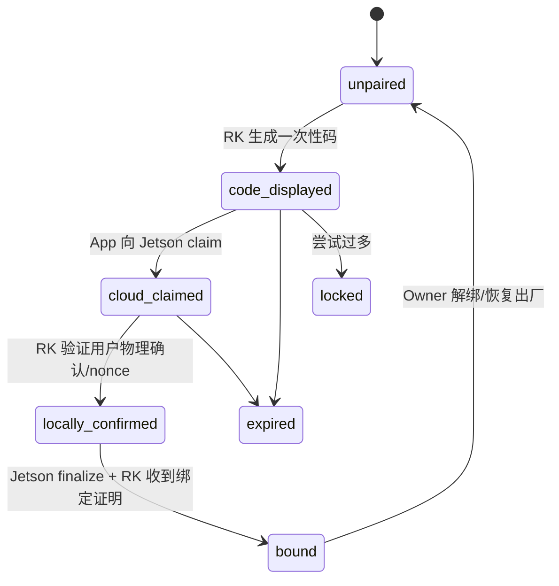
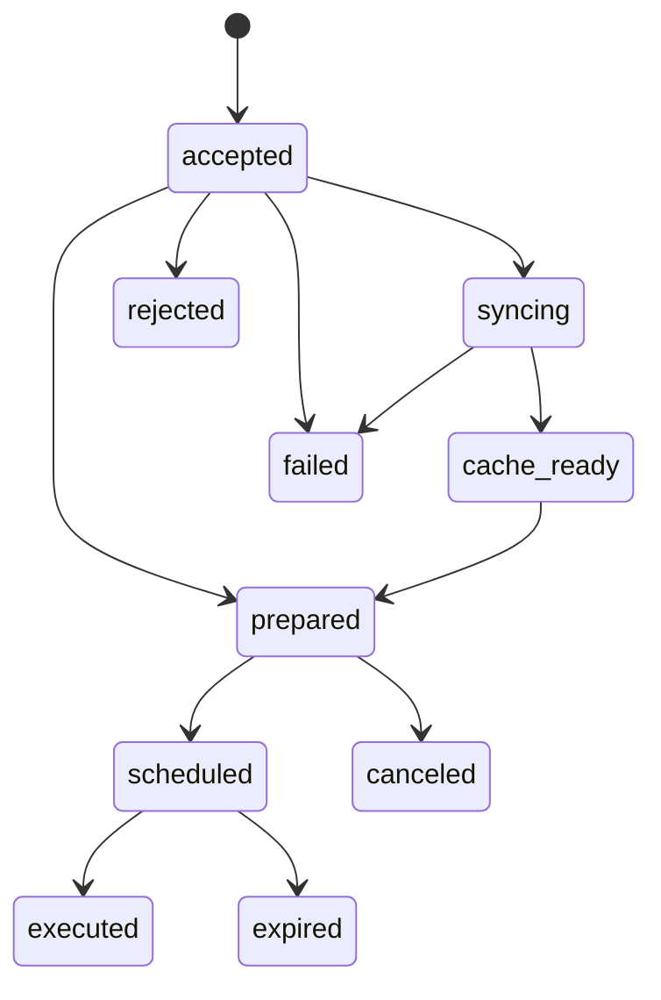

# 08 RK 设备能力与控制协议

状态：`v1.0-draft`
协议版本：`rk-control-v1` / `rk-event-v1`
主负责人：RK / 后端
必须评审：前端

## 1. 边界

本协议用于手机与同一热点局域网内的 RK3588 通信，以及 RK 向 Jetson 补传事实。手机是控制器，RK 是现场执行真相。所有播放、混音、实体键、Pad 和底层 DSP 在 RK 完成；Jetson 不在现场命令关键路径中。

当前代码位置：`cypher-integration/rk3588-edge/`：

- `edge-agent`：对手机唯一公开入口，目标 HTTP 9000、WebSocket 9001；
- `sync-worker`：资源下载/缓存，只绑定 `127.0.0.1:9100`，由 edge-agent 调用；
- `audio-engine`：经 Unix socket 接收执行命令；
- `input-daemon`：读取实体键，映射为同一套 logical intent；
- 本地 SQLite：设备状态、同步、操作、outbox、缓存索引。

手机不得长期直连 sync-worker 或 audio-engine。

## 2. 网络发现

手机开启热点，RK 加入热点并获得互联网。局域网发现建议：

- mDNS service：`_harbeat-rk._tcp.local`；
- TXT：`hardware_id`, `edge_version`, `control_protocols=rk-control-v1`, `port=9000`, `ws_port=9001`, `pairing_state`；
- App 对发现结果调用 `GET /api/v1/identity`；
- IP 只用于当前连接，绝不是设备身份；
- mDNS 不可用时允许用户输入一次性设备地址或扫描 RK 显示的 QR，内容仍包含 hardware_id 和公钥指纹。

推荐局域网使用 HTTPS/WSS 与设备证书/公钥 pin；若 P0 暂时只能 HTTP，则必须有短期 session token、消息 nonce、热点局域网限制，并把 TLS pinning 列为上线门而不是长期豁免。

## 3. 身份、配对和授权

### 3.1 未配对可访问接口

- `GET /api/v1/identity`
- `GET /health/live`
- `POST /api/v1/pairing/proof`：需正确一次性 code/claim，严格限流

其他接口必须带 `Authorization: Bearer <rk_session_token>`。

### 3.2 配对状态机



规则：

- 配对码 6–8 位，TTL 5 分钟，最多 5 次错误；RK/Jetson 均只存 hash；
- `device_nonce`、`cloud_claim_id`、设备公钥证明绑定在同一次配对，防止转发旧 proof；
- 建立 Owner 后，不允许第二个用户靠新配对码抢占；必须走 Owner 授权或受审计的转移/恢复流程；
- Jetson 长期 device token 只存 hash，RK 保存在 root-only 安全文件/硬件密钥能力；
- 手机拿到的是短期 RK session token，不拿 Jetson device token；
- 临时 controller/viewer 权限含过期时间。RK 离线时只接受仍在本地授权缓存有效期内的 token。

### 3.3 `GET /api/v1/identity`

```json
{
  "hardware_id": "rk-serial-<opaque>",
  "device_id": "018f0000-0000-7000-8000-000000000010",
  "display_name": "HarBeat Stage 01",
  "pairing_state": "bound",
  "edge_version": "1.0.0",
  "public_key_fingerprint": "sha256:<base64url>",
  "control_protocols": ["rk-control-v1"],
  "event_protocols": ["rk-event-v1"],
  "server_time": "2026-08-28T10:00:00Z"
}
```

未绑定时 `device_id=null`。

## 4. 能力上报

### 4.1 设计原则

- 后端和前端不能写死 8 Pad；当前 8 Pad 是产品设计默认值，不是协议限制；
- 固定控制（播放/暂停、下一首、能量提高/降低、延长、Talk、Undo）不占 Pad slot；
- 实体键保留，由 RK 的 hardware mapping 映射 logical intent；Jetson 只知道 capability/intents，不知道 GPIO/keycode；
- Firmware/音频引擎升级可能改变能力，App 每次连接读取当前报告；
- Manifest 在生成时绑定 capability hash，RK 接收时再次校验。

### 4.2 `GET /api/v1/capabilities`

```json
{
  "schema_version": "rk-capability-v1",
  "report_version": "018f0000-0000-7000-8000-000000000011",
  "generated_at": "2026-08-28T10:00:00Z",
  "device": {
    "device_id": "018f0000-0000-7000-8000-000000000010",
    "firmware_version": "1.0.0",
    "edge_version": "1.0.0",
    "audio_engine_version": "1.0.0"
  },
  "protocols": {
    "control": ["rk-control-v1"],
    "events": ["rk-event-v1"],
    "manifest": ["resource-manifest-v1"],
    "pad_preset": ["pad-preset-v1"]
  },
  "pad": {
    "slot_count": 8,
    "slot_ids": ["pad-01", "pad-02", "pad-03", "pad-04", "pad-05", "pad-06", "pad-07", "pad-08"],
    "supported_modes": ["one_shot", "toggle", "hold", "loop"],
    "supported_quantize_modes": ["off", "beat", "bar"],
    "max_sound_duration_ms": 120000,
    "max_sound_size_bytes": 104857600,
    "supported_codecs": ["wav_pcm_s16le", "flac"]
  },
  "fixed_controls": [
    "transport.play_pause",
    "transport.next",
    "energy.increase",
    "energy.decrease",
    "transition.extend",
    "talk.set",
    "history.undo"
  ],
  "live_intents": [
    "transport.play",
    "transport.pause",
    "transport.play_pause",
    "transport.next",
    "energy.adjust",
    "transition.extend",
    "talk.set",
    "history.undo",
    "pad.trigger",
    "pad.release"
  ],
  "audio": {
    "sample_rates_hz": [44100, 48000],
    "channels": [2],
    "stem_playback": true,
    "max_simultaneous_stems": 4,
    "supports_pre_rendered_transition": true
  },
  "storage": {
    "total_bytes": 256000000000,
    "free_bytes": 128000000000,
    "cache_budget_bytes": 180000000000,
    "low_watermark_bytes": 20000000000
  },
  "limits": {
    "max_manifest_assets": 2000,
    "max_manifest_bytes": 2097152,
    "max_event_batch": 500
  },
  "capability_hash": "<canonical-json-sha256>"
}
```

如实体硬件尚未定稿，只修改报告内容，不改 API 形状。

## 5. 局域网 API

Base：`https://<rk-address>:9000/api/v1`；所有响应带 `X-Request-Id`。

| 方法/路径 | 用途 | 认证/幂等 |
|---|---|---|
| `GET /identity` | 设备身份/配对状态 | 未配对可读，限频 |
| `GET /capabilities` | 当前能力 | session token |
| `POST /pairing/proof` | 本地物理确认并生成 proof | 一次性 code/claim，限频 |
| `POST /sessions/exchange` | 用中央授权证明换短期 RK session token | proof 单次使用 |
| `GET /state` | 当前完整状态快照 | session token |
| `GET /events` Upgrade WS | 增量事件 + 快照 | session token；见第 10 节 |
| `POST /pad-presets/activate` | 校验/激活已同步预设版本 | Idempotency-Key |
| `POST /sync-jobs` | 接受同步任务并调用本地 sync-worker | Idempotency-Key |
| `GET /sync-jobs/{id}` | RK 权威同步状态 | token |
| `POST /sync-jobs/{id}/cancel` | 请求停止下载/验证 | Idempotency-Key |
| `POST /live-sessions` | 使用 ready Manifest 开始会话 | Idempotency-Key |
| `POST /live-sessions/{id}/operations` | 发送现场意图 | `operation_id` 幂等 |
| `GET /operations/{operation_id}` | 查询未知结果 | token |
| `POST /live-sessions/{id}/end` | 结束并快照 | Idempotency-Key |
| `GET /health/ready` | 音频/数据库/缓存是否可用 | token |

edge-agent 内部调用：

- sync-worker loopback API；
- audio-engine Unix socket；
- input-daemon IPC；
- 本地 SQLite；
- Jetson 公网 Gateway（事件/心跳/Manifest/资产）。

## 6. 同步任务下发

App 向 RK：

```json
{
  "sync_job_id": "018f0000-0000-7000-8000-000000000020",
  "manifest_id": "018f0000-0000-7000-8000-000000000021",
  "manifest_url": "https://api.example.com/api/v1/manifests/018f...",
  "manifest_access_token": "<short-lived-scoped-token>",
  "expected_manifest_hash": "<64-hex>",
  "requested_at": "2026-08-28T10:00:00Z"
}
```

RK 返回 202：

```json
{
  "sync_job_id": "018f0000-0000-7000-8000-000000000020",
  "status": "accepted",
  "rk_sequence": 1,
  "accepted_at": "2026-08-28T10:00:01Z"
}
```

Manifest/资产格式和同步恢复见 09。短期 token 只允许读取这一 Manifest 及其资产，不允许用户 API。

## 7. 激活 PadPreset

请求：

```json
{
  "operation_id": "018f0000-0000-7000-8000-000000000030",
  "preset_id": "018f0000-0000-7000-8000-000000000031",
  "preset_version_id": "018f0000-0000-7000-8000-000000000032",
  "schema_version": "pad-preset-v1",
  "expected_capability_hash": "<64-hex>",
  "slots": [
    {
      "slot_id": "pad-01",
      "label": "Air Horn",
      "sound_asset_id": "018f0000-0000-7000-8000-000000000033",
      "mode": "one_shot",
      "gain_db": -3.0,
      "quantize_mode": "off",
      "choke_group": null
    }
  ]
}
```

RK 校验：slot_id 在 capability、slot 数量、mode/codec、资源 hash ready、音频引擎能加载。部分槽非法时不得静默忽略；返回 `422 DEVICE_CAPABILITY_MISMATCH` 和字段详情。成功后生成本地不可变快照，再原子切换 active preset。

## 8. Live Session

### 8.1 创建

```json
{
  "live_session_id": "018f0000-0000-7000-8000-000000000040",
  "manifest_id": "018f0000-0000-7000-8000-000000000021",
  "manifest_hash": "<64-hex>",
  "pad_preset_version_id": "018f0000-0000-7000-8000-000000000032",
  "requested_at": "2026-08-28T10:30:00Z"
}
```

只有 required assets `ready`、音频引擎 ready、session token 有 control 权限时接受。重复 live_session_id 同 payload 返回原 Session；不同 payload 为幂等冲突。

### 8.2 状态快照

```json
{
  "schema_version": "rk-state-v1",
  "device_id": "018f0000-0000-7000-8000-000000000010",
  "device_boot_id": "018f0000-0000-7000-8000-000000000041",
  "sequence": 1024,
  "captured_at": "2026-08-28T10:31:00Z",
  "connection": {"central_online": false, "outbox_pending": 21},
  "live_session": {"id": "018f0000-0000-7000-8000-000000000040", "status": "live"},
  "transport": {
    "state": "playing",
    "track_id": "018f0000-0000-7000-8000-000000000050",
    "position_ms": 42130,
    "duration_ms": 243120,
    "track_index": 0
  },
  "mix": {"energy_level": 0.73, "talk_enabled": false, "active_transition": null},
  "pad": {"active_preset_version_id": "018f0000-0000-7000-8000-000000000032", "active_slots": []},
  "sync": {"status": "cache_ready", "manifest_id": "018f0000-0000-7000-8000-000000000021"},
  "audio": {"ready": true, "xrun_count": 0, "output_device": "<logical-name>"}
}
```

`position_ms` 高频更新可在 WS 中节流 4–10 Hz；每个状态更新仍需 sequence。App 动画可本地插值，但新快照覆盖插值。

## 9. 现场操作合同

### 9.1 公共请求

```json
{
  "schema_version": "rk-operation-v1",
  "operation_id": "018f0000-0000-7000-8000-000000000060",
  "source": "app",
  "intent": "energy.adjust",
  "parameters": {"delta_steps": 1},
  "client_sequence": 88,
  "requested_at": "2026-08-28T10:31:02.123Z",
  "expires_at": "2026-08-28T10:31:07.123Z",
  "expected_state_sequence": 1024
}
```

RK 先持久化 operation，再向 audio-engine 排程。HTTP 202 只表示 accepted，不表示 executed。

### 9.2 P0 意图与参数

| intent | parameters | 行为 |
|---|---|---|
| `transport.play` | `{}` | 播放当前/首曲 |
| `transport.pause` | `{}` | 暂停 |
| `transport.play_pause` | `{}` | 基于 RK 当前态切换；重复必须靠 operation_id 去重 |
| `transport.next` | `{"quantize":"bar|immediate"}` | 下一首；默认由 RK 能力/计划决定 |
| `energy.adjust` | `{"delta_steps":-1|1}` | 能量降低/提高，实际 DSP 参数由 RK 解释 |
| `transition.extend` | `{"bars":1..16}` | 延长当前段/过渡；不支持时拒绝 |
| `talk.set` | `{"enabled":true|false}` | 明确设值，避免 toggle 丢包歧义 |
| `history.undo` | `{}` | 撤销 RK 可撤销的最近操作 |
| `pad.trigger` | `{"slot_id":"pad-01","velocity":0..1}` | 触发逻辑槽 |
| `pad.release` | `{"slot_id":"pad-01"}` | hold 类释放 |

复杂 EQ、Stem Solo、Filter、专业 DJ 参数可保留为 RK 内部能力，P0 不对普通 App 开放；未来新增 intent 时必须 capability 协商和协议兼容。

### 9.3 操作状态



标准状态：`accepted, syncing, cache_ready, prepared, scheduled, executed, rejected, failed, canceled, expired`。手机侧请求超时且无法确认时使用本地展示态 `timeout_unknown`，它不是 RK 伪造的终态；App 必须 `GET /operations/{id}` 或拉 state snapshot 后再决定。

操作响应：

```json
{
  "operation_id": "018f0000-0000-7000-8000-000000000060",
  "status": "accepted",
  "device_sequence": 1025,
  "accepted_at": "2026-08-28T10:31:02.140Z",
  "scheduled_at": null,
  "executed_at": null,
  "result": null,
  "error": null
}
```

## 10. WebSocket

URL：`wss://<rk-address>:9001/api/v1/events?since_sequence=<n>`，Authorization 放 header；若平台不支持 WS header，使用一次性 `ws_ticket`，不能把长期 token 放 URL。

消息外壳：

```json
{
  "schema_version": "rk-event-v1",
  "event_id": "018f0000-0000-7000-8000-000000000070",
  "event_type": "operation.executed",
  "device_id": "018f0000-0000-7000-8000-000000000010",
  "device_boot_id": "018f0000-0000-7000-8000-000000000041",
  "live_session_id": "018f0000-0000-7000-8000-000000000040",
  "sequence": 1028,
  "occurred_at": "2026-08-28T10:31:02.300Z",
  "operation_id": "018f0000-0000-7000-8000-000000000060",
  "payload": {}
}
```

P0 event types：

- `state.snapshot`；
- `operation.accepted/prepared/scheduled/executed/rejected/failed`；
- `transport.changed`、`mix.changed`、`pad.changed`；
- `sync.updated`、`cache.changed`；
- `session.started/ended`；
- `device.health`、`central.connection.changed`。

重连：

1. App 提供最后 sequence；
2. RK 若仍有环形事件历史，补发缺口；
3. 历史不足或 boot_id 变化，先发 `state.snapshot` 并以其 sequence 为新基线；
4. App 丢弃 `sequence <= last_applied` 的增量；
5. 检测 gap 时暂停乐观 UI、请求快照。

## 11. 实体键处理

input-daemon 的映射示例只存在 RK 本地配置：

```yaml
hardware_profile: rk-board-rev-a
bindings:
  KEY_PLAYPAUSE: transport.play_pause
  KEY_NEXTSONG: transport.next
  KEY_F13:
    intent: pad.trigger
    parameters: {slot_id: pad-01}
```

实体按键生成和 App 相同的 operation/event，只是 `source=physical`、`source_user_id=null`。这样 Jetson 事件分析能知道来源，但不参与执行。硬件最终定义变化只替换 RK hardware profile。

## 12. RK 本地持久化

SQLite 开 WAL，至少包含：

| 表 | 关键内容 |
|---|---|
| `device_state` | device_id、绑定、协议/配置版本 |
| `authorization_cache` | 短期授权 hash、权限、expires_at、revoked version |
| `manifests` | body/hash/status/过期/激活版本 |
| `sync_jobs/sync_items` | 下载、验证、重试、字节和状态 |
| `cache_entries` | asset_id、path、size、sha256、last_access、pin/refcount |
| `pad_presets` | 不可变版本和 active 指针 |
| `live_sessions` | 会话、Manifest、状态、序列 |
| `operations` | operation_id、request_hash、状态、结果 |
| `event_outbox` | event_id、sequence、payload、上传确认 |
| `runtime_snapshots` | 可恢复的安全播放/控制摘要 |

状态先落 SQLite 再对 App/Jetson宣告接受或执行；SQLite 中只存元数据，音频文件放受控缓存目录。数据库和文件提交使用临时文件 + rename + 状态事务。

## 13. RK 向 Jetson 事件补传

RK 调中央 `POST /api/v1/device/events:batch`，device token 鉴权，批次最多 500。事件入 outbox 后不因中央断网丢失；只有中央 ack 的 accepted/duplicate IDs 才可标记已送达。

中央返回 `highest_contiguous_sequence + missing_ranges`。RK 优先补缺，不能只因高序号已被接收就删除中间未确认事件。上传退避见 10。

事件 payload 最大建议 32 KiB；波形、日志和音频绝不放事件 JSON。

## 14. 安全和限流

- Pairing proof：每来源 IP/硬件 ID 严格限频，失败统一错误，防枚举；
- Session token 包含 device_id/user_id/role/permissions/exp/jti/audience，TTL 建议 15–60 分钟；
- 控制操作按 session/user 限频，Pad 可使用更高专用限额；
- 所有 mutable 请求检查 Content-Type、body size、schema、token audience；
- edge-agent/sync-worker/audio-engine 使用最小 Unix 权限；sync-worker 不绑定热点网卡；
- 音频资产下载只接受 Gateway 域名或 allowlist，不允许 Manifest 指向任意内网 URL，防 SSRF；
- 日志不记录 code/proof/token/签名 URL；
- Owner 撤销在联网时立即下发/拉取。离线授权超过最长安全窗口必须拒绝新现场会话。

## 15. 当前代码必须收敛的差距

1. `main.py` 中随机配对码/不校验 confirm 的 mock 必须删除或仅测试环境启用；
2. `pairing.py`、`app_compat.py` 与 main 中的分叉配置合并为单一实现；
3. sync-worker 状态从内存迁 SQLite，支持 restart/cancel/resume；
4. `/live/intent`、`/live/override` 统一为 versioned operations；
5. transition-orchestrator 的 operation 状态方法接入 edge-agent 主路径；
6. 事件上传中央接口实现实际持久、去重和缺口回执；
7. edge-agent 成为唯一局域网入口，9100 仅 loopback；
8. 设备能力通过接口动态上报，清除固定按键/Pad 数的跨端假设。

## 16. RK 交付物和验收

- `rk-control-v1` OpenAPI/JSON Schema 与 `rk-event-v1` Schema；
- capability、state、每个 operation/event 的 fixtures；
- SQLite migration 和突然断电恢复测试；
- 假 Jetson Gateway/慢网/断网/重复包模拟器；
- 实体键到 logical intent 的硬件 profile 与测试记录；
- 音频引擎 IPC 命令/回执合同；
- 24 小时运行、网络抖动、磁盘水位和音频 xrun 报告；
- 配对重放、越权 controller、过期 token、恶意 Manifest URL 安全测试；
- App 断线重连后快照一致、operation 不重复执行、事件不丢的证明。
