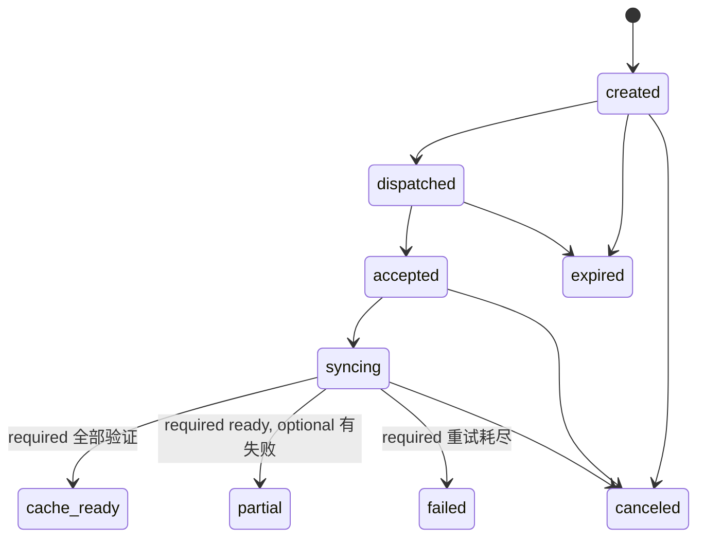

# 09 资源 Manifest 与同步协议

状态：`v1.0-draft`
协议版本：`resource-manifest-v1`
主负责人：后端 / RK
必须评审：算法、前端

## 1. 目的

Manifest 是 Jetson 对某个准备快照和目标 RK 能力生成的“不可变执行包清单”。手机只负责把 Manifest/SyncJob 告诉 RK；RK 直接通过阿里云 HTTPS Gateway 拉取 Jetson/NAS 资源并校验，音频文件不经过手机。

Manifest 不是：

- 用户曲库详情 API；
- 完整算法调试 JSON；
- NAS 目录列表；
- 永久下载 URL 集合；
- RK 已完成缓存的证明。

## 2. 生成前置条件

后端生成 Manifest 前必须读取：

1. 不可变 `prepare_snapshot`；
2. 目标 `device_id` 的最新 capability report；在线时可由 App/RK 提供更新报告并由中央确认；
3. Track 当前已发布/有权使用的 analysis_run；
4. 所需 ready media_assets；
5. 不可变 PadPresetVersion；
6. 用户、设备 binding 和资源授权；
7. Manifest/控制/事件协议版本交集；
8. 设备存储容量和格式限制。

任一 required 资产未 ready、hash 缺失、设备不支持 codec 或空间明显不足时返回 422，不生成“看起来可用”的 Manifest。

## 3. 顶层结构

```json
{
  "schema_version": "resource-manifest-v1",
  "manifest_id": "018f0000-0000-7000-8000-000000000101",
  "manifest_version": 1,
  "content_hash": "<canonical-body-sha256>",
  "created_at": "2026-08-28T10:00:00Z",
  "expires_at": "2026-08-29T10:00:00Z",
  "owner_user_id": "018f0000-0000-7000-8000-000000000102",
  "target": {
    "device_id": "018f0000-0000-7000-8000-000000000103",
    "capability_report_version": "018f0000-0000-7000-8000-000000000104",
    "capability_hash": "<64-hex>"
  },
  "source": {
    "prepare_snapshot_id": "018f0000-0000-7000-8000-000000000105",
    "pad_preset_version_id": "018f0000-0000-7000-8000-000000000106"
  },
  "protocol": {
    "rk_control": "rk-control-v1",
    "rk_event": "rk-event-v1",
    "pad_preset": "pad-preset-v1",
    "analysis_contract": "music-analysis-v1"
  },
  "requirements": {
    "minimum_free_bytes_after_sync": 20000000000,
    "audio_sample_rates_hz": [44100, 48000],
    "requires_stem_playback": true,
    "pad_slot_count_required": 8
  },
  "tracks": [],
  "pad_preset": null,
  "plans": [],
  "assets": [],
  "integrity": {
    "algorithm": "sha256",
    "signature_algorithm": "ed25519",
    "key_id": "manifest-signing-2026-01",
    "signature": "<base64url-signature-over-canonical-body>"
  }
}
```

`content_hash`/签名计算时不包含短期下载 token，避免每次刷新 URL 改变 Manifest 业务内容。具体 canonical JSON 使用 RFC 8785 或团队明确实现并提供跨语言 fixture。

## 4. Track 执行数据

Manifest 只下发 RK 执行需要的数据：

```json
{
  "track_id": "018f0000-0000-7000-8000-000000000110",
  "analysis_run_id": "018f0000-0000-7000-8000-000000000111",
  "title": "Example Track",
  "artist_name": "Example Artist",
  "duration_ms": 243120,
  "tempo": {
    "bpm": 128.02,
    "confidence": 0.94,
    "stability": 0.91
  },
  "key": {"camelot": "11A", "confidence": 0.82},
  "beat_grid": {
    "format": "inline-v1",
    "offset_ms": 117,
    "interval_ms": 468.68,
    "beats_ms": [117, 586, 1055],
    "downbeats_ms": [117],
    "time_signature": 4,
    "needs_review": false
  },
  "cues": [
    {"cue_id": "intro-start", "type": "intro", "at_ms": 0, "confidence": 0.9}
  ],
  "transition_windows": [
    {"window_id": "outro-01", "start_ms": 224000, "end_ms": 243120, "role": "out", "confidence": 0.81}
  ],
  "asset_refs": {
    "master": "018f0000-0000-7000-8000-000000000112",
    "stems": {
      "vocals": "018f0000-0000-7000-8000-000000000113",
      "drums": "018f0000-0000-7000-8000-000000000114",
      "bass": "018f0000-0000-7000-8000-000000000115",
      "other": "018f0000-0000-7000-8000-000000000116"
    }
  },
  "quality_flags": []
}
```

约束：

- Beat 点太多使 Manifest 超过 2 MiB 时，生成 `transition_metadata`/`analysis_runtime` JSON 或二进制资产，Manifest 仅引用；
- 低置信 Downbeat 置空并 `needs_review=true`，RK 不基于虚假 downbeat 强量化；
- 不下发 key engine 路线、模型证据、外部 metadata、完整风格计算；
- Title/Artist 只用于 RK/UI 展示，不参与资源身份；
- `analysis_run_id` 和资源 asset_id 一起确保算法/文件一致。

## 5. PadPreset 和计划

```json
{
  "pad_preset": {
    "preset_id": "018f0000-0000-7000-8000-000000000120",
    "preset_version_id": "018f0000-0000-7000-8000-000000000121",
    "schema_version": "pad-preset-v1",
    "slots": [
      {
        "slot_id": "pad-01",
        "label": "Air Horn",
        "sound_asset_id": "018f0000-0000-7000-8000-000000000122",
        "mode": "one_shot",
        "gain_db": -3.0,
        "quantize_mode": "off",
        "choke_group": null
      }
    ]
  },
  "plans": [
    {
      "plan_id": "018f0000-0000-7000-8000-000000000123",
      "schema_version": "transition-plan-v1",
      "from_track_id": "018f0000-0000-7000-8000-000000000110",
      "to_track_id": "018f0000-0000-7000-8000-000000000124",
      "mode": "pre_rendered",
      "render_asset_id": "018f0000-0000-7000-8000-000000000125",
      "metadata_asset_id": "018f0000-0000-7000-8000-000000000126"
    }
  ]
}
```

Transition plan 是预演/预计算建议；实际执行仍由 RK 根据当前状态验证和排程。固定控制不出现在 `pad_preset.slots`。

## 6. Asset 合同

```json
{
  "asset_id": "018f0000-0000-7000-8000-000000000113",
  "track_id": "018f0000-0000-7000-8000-000000000110",
  "kind": "stem",
  "variant": "vocals",
  "required": true,
  "content_type": "audio/flac",
  "container": "flac",
  "codec": "flac",
  "size_bytes": 48392123,
  "sha256": "0123456789abcdef0123456789abcdef0123456789abcdef0123456789abcdef",
  "duration_ms": 243120,
  "sample_rate_hz": 44100,
  "channels": 2,
  "download": {
    "grant_endpoint": "https://api.example.com/api/v1/device-assets/018f.../grant",
    "grant_scope": "manifest:018f0000-0000-7000-8000-000000000101",
    "supports_range": true
  },
  "cache": {
    "policy": "pinned",
    "priority": 90,
    "evict_after": null
  }
}
```

P0 kind：

| kind | variant | 使用方 | 默认 required |
|---|---|---|---|
| `original`/`normalized` | master | RK 完整播放 | 取决于执行模式 |
| `preview` | 30s/产品定稿 | 手机 | 不进入 RK 包或 optional |
| `waveform` | overview/detail | App/RK UI | optional |
| `stem` | vocals/drums/bass/other | RK 混音 | 使用 Stem 模式时 true |
| `transition_render` | plan_id | RK | 该 plan 为 pre_rendered 时 true |
| `transition_metadata` | plan_id/runtime | RK | 对应计划 true |
| `pad_sound` | slot_id | RK Pad | 已配置槽 true |

每个可下载资产必须有准确 `size_bytes` 和 `sha256`。当前代码中 `MANIFEST_COMPUTE_SHA256=0` 的兼容行为不能用于新协议，`resource-manifest-v1` 下 hash 缺失必须拒绝生成。

## 7. 下载授权

推荐两步：Manifest 长期保存 asset 元数据；RK 在下载前用 Manifest scoped token 换短期 grant：

```http
POST /api/v1/device-assets/{asset_id}/grant
Authorization: Bearer <manifest-scoped-token>
Content-Type: application/json

{"manifest_id":"<uuid>","device_id":"<uuid>"}
```

响应：

```json
{
  "url": "https://api.example.com/assets/v1/<opaque>?sig=<redacted>",
  "method": "GET",
  "expires_at": "2026-08-28T10:15:00Z",
  "headers": {},
  "supports_range": true
}
```

规则：

- URL 必须是阿里云公网 HTTPS 域名，不能是 Tailscale IP、Jetson LAN IP 或 NAS 路径；
- grant 校验 device/manifest/asset 关系、Manifest 未撤销、用户绑定有效；
- TTL 建议 5–15 分钟；下载中到期可重新 grant 并 Range resume；
- 签名 query/header 不写普通日志；
- Gateway 防路径穿越、强制 asset allowlist，支持 `Range`/`206` 和正确 `Content-Length`；
- 下载响应带 `ETag`（可用 sha256）、`Accept-Ranges: bytes`、`Cache-Control: private`；
- RK 只允许 Gateway allowlist，防恶意 Manifest 引发 SSRF。

## 8. SyncJob 状态机



状态语义：

- `created/dispatched`：中央/App 侧；RK 尚未确认；
- `accepted`：RK 已把任务和 Manifest 引用落 SQLite；
- `syncing`：至少一个 item 下载/校验；
- `cache_ready`：所有 required item 已 hash 验证并在 cache index ready；
- `partial`：required 全 ready，optional 最终失败；可由产品决定是否提示但可开场；
- `failed`：至少一个 required item 失败且重试耗尽/Manifest 不兼容；
- `canceled`：停止新下载，未被其他 Manifest 引用的临时片段可回收；
- `expired`：未在 Manifest/授权有效期内开始/完成，需重新签发。

中央状态只是 RK 报告的镜像。每次更新带 `rk_sequence`，中央只能接受更大 sequence。

## 9. SyncItem 状态机

`pending -> grant_pending -> downloading -> verifying -> ready`，错误可进入 `retry_wait -> grant_pending/downloading`，终态另有 `failed/skipped/canceled`。

Item 本地字段：

```json
{
  "asset_id": "<uuid>",
  "status": "downloading",
  "required": true,
  "bytes_downloaded": 10485760,
  "size_bytes": 48392123,
  "attempt_count": 2,
  "etag": "<sha256>",
  "temp_path_key": "<internal-only>",
  "last_error": null,
  "updated_at": "2026-08-28T10:05:00Z"
}
```

App/Jetson API 不返回 `temp_path_key`。

## 10. 下载、校验和原子入缓存

RK 必须按以下顺序：

1. 校验 Manifest 签名、版本、target device、capability hash、过期和 content_hash；
2. 按 asset_id 查本地 ready cache；若 `size+sha256` 一致，复用并增加引用；
3. 评估所需空间，按缓存策略淘汰无 pin/ref 的低优先级资产；空间仍不足则在下载前失败；
4. 获取短期 grant；
5. 下载到同文件系统临时 `.part`，记录 verified byte offset/ETag；
6. 断点续传时使用 `Range` 和 `If-Range/ETag`；服务端资源变化则清零重下；
7. 下载完成先检查 size，再流式计算完整 sha256；
8. 对音频/JSON 做格式/schema 验证；
9. fsync 临时文件，原子 rename 到内容寻址路径；
10. SQLite 事务把 cache entry/item 标为 ready，随后发 `sync.updated`；
11. 所有 required ready 才把 SyncJob 标为 cache_ready。

建议缓存物理路径：`cache/sha256/{first2}/{sha256}`；asset_id → content hash 在 SQLite 索引。不能把原始 filename 拼到安全关键路径。

## 11. 并发、优先级和带宽

- 初始下载并发 2，可由 capability/config 调整；
- required 高于 optional；当前首曲、Pad 音效、首个 transition 高于后续歌曲；
- 同 hash 只下载一次，多个 SyncJob 共享；
- 同步不能占满 RK 音频线程/磁盘 IO；Live 开始后降低或暂停低优先级下载；
- UI 进度使用去重后的 `total_bytes`，不能把共享资源重复相加；
- 单资产进度可抖动/重下，总体展示应明确“下载”与“校验”；
- Gateway 和 RK 均设置连接/读取/总时限，不能无限挂起。

## 12. 失败和恢复

| 场景 | RK 行为 | 中央/App 行为 |
|---|---|---|
| 手机离开 App | 不影响已 accepted 同步 | 重连读取 RK 状态 |
| 手机热点短断 | 下载进入 retry_wait；保留 `.part` | 展示暂停/重连，不创建重复任务 |
| Jetson/隧道不可达 | 指数退避，已缓存资源可现场用 | Gateway 返回 503 + Retry-After |
| grant 过期 | 重新获取 grant，继续 Range | 不视为资产失败 |
| 206 不支持/ETag 变化 | 清临时片，完整重下 | 记录原因 |
| hash 不匹配 | 删除/隔离临时片，有限重试；重复则安全告警 | 不将该资产 ready |
| RK 重启 | SQLite 恢复 job/item；清理无记录临时片；继续 | App 重连读快照 |
| App 重复下发同 job | request_hash 同则返回原状态 | 不新建第二个 job |
| Manifest 新版本 | 新 job；复用 hash 相同资产；旧 active 会话不被原地改变 | 明确让用户选择切换 |
| 磁盘不足 | 先 GC；仍不足 `RK_STORAGE_INSUFFICIENT` | 显示需清理容量，不无限重试 |
| required 失败 | job failed，不允许开始该 Manifest | 提供重试/重新生成 |
| optional 失败 | job partial，可按能力继续 | 提示有限能力 |

具体错误码和退避见 10。

## 13. 缓存策略

| policy | 语义 | 淘汰 |
|---|---|---|
| `session` | 仅当前/近期现场会话 | 会话结束且无引用后优先 |
| `pinned` | 用户明确准备并要求保留 | 用户取消 pin/Manifest 过期后才可 |
| `reusable` | 公共 Track/Pad 可跨 Manifest 复用 | 按 LRU/优先级/水位 |

每个 cache entry 维护 `ref_count`、活动 Manifest/session 引用、last_access、size、verified_at。禁止淘汰音频引擎当前打开或 active session required 的文件。

水位建议：下载前保留 `minimum_free_bytes_after_sync`；低于 low watermark 触发 GC；高于 high watermark 停止 GC。数值由硬件容量定稿。

## 14. Manifest 版本、撤销和兼容

- `schema_version` 破坏性变更用新 ID；RK 只接受 capability 声明支持的版本；
- `manifest_version` 是同一准备快照/逻辑包的修订号；每版有新 manifest_id 或明确不可变版本 ID；
- Manifest body 发布后不可修改；URL grant 不属于其持久内容；
- Track 被 blocked/权限撤销时中央把 Manifest 标 revoked，停止发新 grant；RK 在线收到撤销后不得开始新会话；
- 正在合法进行的现场会话是否立即停止是产品/版权安全策略，必须单独定稿，不由同步协议暗中决定；
- RK 离线时使用本地 Manifest 必须满足 `offline_valid_until`/授权最大离线窗口。

## 15. 服务器端生成算法

伪代码：

```text
load prepare snapshot + device capability
authorize user/device/snapshot
resolve each track's current usable analysis run
project runtime analysis fields (04 allowlist)
resolve required assets by device mode and plan
resolve pad preset slots and sound assets
validate every asset ready + size + sha256 + supported codec
deduplicate assets by asset_id/content hash
estimate bytes and device limits
canonicalize body, compute content hash, sign
insert immutable resource_manifest + audit/outbox in transaction
return summary; issue download grants only when requested
```

相同 snapshot、capability hash、analysis versions 和 preset version 应生成确定性相同 content body。`created_at/manifest_id` 等非内容字段的 hash 策略必须在 fixture 中固定。

## 16. 当前实现改造清单

当前 Manifest 生成存在重复 identity 字段、过大的 raw analysis JSON 和可关闭 checksum。目标改造：

1. 新建 `resource-manifest-v1` schema 与跨 Python/Dart/RK fixture；
2. 从数据库 ready media_assets 投影，不从目录临时扫描；
3. 每个资产强制 size/sha256，补算历史资产后才可同步；
4. 清除本地路径和 Tailscale 地址，对普通 RK 返回阿里云 HTTPS Gateway；
5. 使用短期 scoped grant，不长期固化完整签名 URL；
6. 只投影 04 中 RK 运行字段，不下发完整 `music_features`；
7. 按 device capability 生成，不写死 Pad 和 codec；
8. RK sync 状态落 SQLite，支持 cancel/restart/resume；
9. 中央持久化 SyncJob 镜像并按 sequence 防旧状态覆盖；
10. 上线前完成大文件 Range、hash 错误、断网和隧道中断测试。

## 17. 验收

- Manifest 中任意 asset 均能反查 ready media_asset、analysis_run 和授权来源；
- 对相同输入生成结果确定，Python/RK 计算 content_hash 一致；
- 篡改一个字节/asset URL/target device 会导致签名或校验失败；
- RK 已缓存同 hash 时不重复下载；
- 下载 60% 断网、RK 重启后能继续或安全重下，最终 hash 正确；
- 手机退出不影响 RK 继续同步；
- 普通 RK 不加入 Tailscale 也能从公网 HTTPS Gateway 下载；
- 下载完成但校验未完成时 UI 不能显示 cache_ready；
- 过期 grant 可刷新，不用重建整个 Manifest；
- Manifest revoked 后不能获得新 grant；
- required 资产缺失、codec 不支持、容量不足在开场前得到明确错误；
- sync 重复下发、事件重复回传不会产生重复 job/状态回退。
