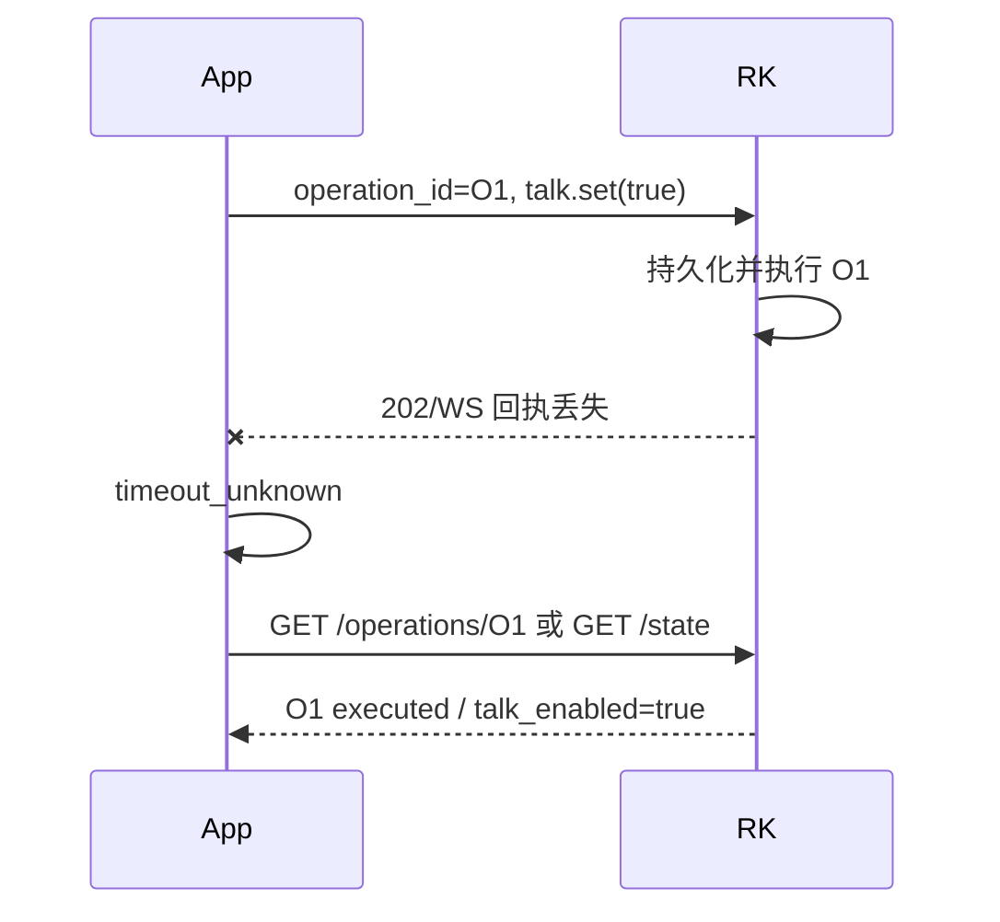

# 10 错误码、幂等与离线恢复

状态：`v1.0-draft`
主负责人：后端
必须评审：前端、RK

## 1. 目标

分布式系统无法通过“客户端超时”判断请求是否执行。HarBeat 必须让手机、Jetson、Worker 和 RK 对同一次意图使用稳定 ID，并能回答：

- 请求有没有被接收；
- 是否可能已经执行；
- 能不能自动重试；
- 离线数据由谁保存；
- 重复上传是否安全；
- 冲突时哪个状态更可信。

## 2. 统一错误外壳

中央和 RK HTTP API 都返回：

```json
{
  "error": {
    "code": "DEVICE_CAPABILITY_MISMATCH",
    "message": "当前设备不支持预设中的 loop 模式",
    "retryable": false,
    "retry_after_seconds": null,
    "details": {
      "field": "slots[2].mode",
      "supported": ["one_shot", "hold"]
    }
  },
  "request_id": "req_01K...",
  "timestamp": "2026-08-28T10:00:00Z"
}
```

规则：

- `code` 是跨端逻辑依据；`message` 是可替换/本地化的人类摘要，客户端不能解析它做分支；
- `details` 只能放可公开字段错误、当前 version、缺失资源 ID 等，不放 traceback、SQL、模型/NAS 路径、token；
- 所有响应带 `X-Request-Id`，调用方可传 `X-Correlation-Id` 串联上传/分析/同步/现场；
- 生产 5xx 的 message 使用安全摘要，完整异常只进受控日志；
- 批量接口允许 200 + item 级结果，整体 transport 失败才用 4xx/5xx。

## 3. HTTP 状态语义

| HTTP | 使用场景 | 客户端默认行为 |
|---:|---|---|
| 400 | 语法合法但协议级请求无效 | 不重试，修正客户端 |
| 401 | token 缺失/过期/失效 | 中央单次 refresh；RK 重新 exchange/配对 |
| 403 | 已认证但无对象/动作权限 | 不自动重试 |
| 404 | 不存在或为防枚举而隐藏 | 刷新列表/快照 |
| 409 | 版本、幂等键、当前状态冲突 | 按 code 拉最新状态/人工合并 |
| 410 | Manifest/grant/绑定已撤销或永久过期 | 获取新版本/重新授权 |
| 413 | 上传/Manifest/事件过大 | 缩小/分批，不原样重试 |
| 415 | 媒体/Content-Type 不支持 | 转换或提示 |
| 422 | 字段或领域校验不通过 | 映射字段错误/能力不足 |
| 429 | 限流 | 遵循 Retry-After + jitter |
| 500 | 未分类内部错误 | 幂等安全请求有限重试并上报 request_id |
| 502/503/504 | Gateway、Jetson、依赖临时不可用 | 退避；不能把超时当未执行 |

## 4. 错误码目录

### 4.1 身份与权限

| code | HTTP | 可重试 | 说明 |
|---|---:|---:|---|
| `AUTH_CREDENTIALS_INVALID` | 401 | 否 | 登录凭据错误 |
| `AUTH_ACCESS_TOKEN_EXPIRED` | 401 | 刷新后 | access 过期 |
| `AUTH_REFRESH_TOKEN_INVALID` | 401 | 否 | refresh 失效/撤销 |
| `AUTH_REFRESH_REUSE_DETECTED` | 401 | 否 | 旧 refresh 被重放，撤销 token family |
| `AUTH_ACCOUNT_DISABLED` | 403 | 否 | 账号停用 |
| `AUTH_PERMISSION_DENIED` | 403 | 否 | 对象级权限不足 |
| `AUTH_RATE_LIMITED` | 429 | 是 | 登录/验证码限流 |

### 4.2 幂等与并发

| code | HTTP | 行为 |
|---|---:|---|
| `IDEMPOTENCY_KEY_REQUIRED` | 400 | 写操作缺键 |
| `IDEMPOTENCY_KEY_REUSED` | 409 | 同键 request_hash 不同，绝不执行第二次 |
| `RESOURCE_VERSION_CONFLICT` | 409 | 返回 `current_version`/ETag；客户端拉新状态 |
| `RESOURCE_STATE_CONFLICT` | 409 | 当前状态不允许动作，例如已 live 再 freeze |
| `OPERATION_RESULT_UNKNOWN` | 409/客户端态 | 必须查询 operation/snapshot，不盲重试 |
| `SEQUENCE_OUT_OF_ORDER` | 409 | 旧序列不能覆盖新状态 |

### 4.3 曲库、上传和媒体

| code | HTTP | 可重试 | 说明 |
|---|---:|---:|---|
| `TRACK_NOT_FOUND` | 404 | 否 | 不存在/不可见 |
| `TRACK_BLOCKED` | 410/403 | 否 | 资源已封禁 |
| `TRACK_NOT_READY` | 409 | 稍后 | 分析/资产未 ready |
| `UPLOAD_EXPIRED` | 410 | 新建会话 | 上传会话过期 |
| `UPLOAD_SIZE_MISMATCH` | 422 | 重新上传 | 声明/收到不一致 |
| `UPLOAD_HASH_MISMATCH` | 422 | 重新上传 | 内容 hash 不符 |
| `UPLOAD_MEDIA_UNSUPPORTED` | 415 | 否 | 不支持/损坏 |
| `UPLOAD_TOO_LARGE` | 413 | 否 | 超限 |
| `ASSET_NOT_READY` | 409 | 稍后 | 资产未发布 |
| `ASSET_GRANT_EXPIRED` | 401/410 | 获取新 grant | 短期 URL 过期 |
| `ASSET_RANGE_INVALID` | 416 | 修正 Range | 断点范围非法 |
| `ASSET_INTEGRITY_FAILED` | 422 | 有限重试/告警 | size/hash/格式失败 |

### 4.4 分析

| code | HTTP/API | 可重试 | 说明 |
|---|---:|---:|---|
| `ANALYSIS_ALREADY_RUNNING` | 202/409 | 查原 Run | 相同输入已有活跃任务 |
| `ANALYSIS_INPUT_MISSING` | 任务错误 | 运维修复后 | NAS 输入丢失 |
| `ANALYSIS_INPUT_HASH_MISMATCH` | 任务错误 | 否 | 输入被改写 |
| `ANALYSIS_UNSUPPORTED_MEDIA` | 422/任务错误 | 否 | 媒体不支持 |
| `ANALYSIS_MODEL_UNAVAILABLE` | 任务错误 | 是 | 模型/adapter 未部署 |
| `ANALYSIS_GPU_OOM` | 任务错误 | 有限 | 显存不足 |
| `ANALYSIS_STAGE_TIMEOUT` | 任务错误 | 有限 | 阶段超时 |
| `ANALYSIS_OUTPUT_INVALID` | 任务错误 | 否 | 输出 schema/数值非法 |
| `ANALYSIS_CANCELED` | 任务终态 | 否 | 已确认取消 |
| `ANALYSIS_INTERNAL_ERROR` | 任务错误 | 有限 | 未分类错误 |

### 4.5 设备、Manifest 和同步

| code | HTTP | 可重试 | 说明 |
|---|---:|---:|---|
| `DEVICE_NOT_CONNECTED` | 客户端门/409 | 连接后 | 手机未连接 RK |
| `DEVICE_NOT_PAIRED` | 401/409 | 配对后 | 未绑定 |
| `DEVICE_ALREADY_OWNED` | 409 | 否 | 已有 Owner |
| `DEVICE_BINDING_EXPIRED` | 401/403 | 重新授权 | 临时授权过期 |
| `PAIRING_CODE_INVALID` | 401 | 有限 | 统一提示，防枚举 |
| `PAIRING_CODE_EXPIRED` | 410 | 新码 | 配对码过期 |
| `PAIRING_LOCKED` | 429 | 等待/恢复 | 尝试过多 |
| `DEVICE_CAPABILITY_MISMATCH` | 422 | 改预设/Manifest | 能力不支持 |
| `MANIFEST_VERSION_UNSUPPORTED` | 422 | 生成兼容版/升级 RK | 协议不兼容 |
| `MANIFEST_SIGNATURE_INVALID` | 422 | 否/安全告警 | 内容被篡改 |
| `MANIFEST_EXPIRED` | 410 | 重新生成/授权 | 过期 |
| `MANIFEST_REVOKED` | 410 | 否 | 已撤销 |
| `RK_STORAGE_INSUFFICIENT` | 422 | 清缓存后 | 空间不足 |
| `SYNC_REQUIRED_ASSET_FAILED` | 409 | 按 item 原因 | 必需资源失败 |
| `SYNC_CANCELED` | 409/终态 | 新 job | 已取消 |
| `RK_AUDIO_ENGINE_NOT_READY` | 503 | 是 | 本地音频引擎未就绪 |

### 4.6 现场操作

| code | HTTP/event | 可重试 | 说明 |
|---|---:|---:|---|
| `LIVE_SESSION_NOT_READY` | 409 | 准备后 | Required cache/audio 未 ready |
| `LIVE_SESSION_CONFLICT` | 409 | 拉快照 | 已有互斥会话 |
| `OPERATION_EXPIRED` | event | 否 | 到达 RK 时已过 expires_at |
| `OPERATION_UNSUPPORTED` | 422/event | 否 | capability 不支持 intent |
| `OPERATION_STATE_CONFLICT` | 409/event | 拉快照 | 当前播放态不允许 |
| `OPERATION_REJECTED` | event | 依原因 | RK 明确拒绝 |
| `OPERATION_FAILED` | event | 依原因 | 接受后执行失败 |
| `OPERATION_CANCELED` | event | 否 | 明确取消 |
| `OPERATION_TIMEOUT_UNKNOWN` | 客户端态 | 不能直接重试 | 未能确认是否执行 |

## 5. Idempotency-Key 规范

### 5.1 使用范围

所有可能创建资源、触发任务、改变设备或产生现场动作的请求必须有幂等身份：

- 中央 HTTP：header `Idempotency-Key`；
- RK operation：body `operation_id` 同时作为幂等主键，可附同值 header；
- 设备事件：`device_id + event_id`；
- Worker 阶段：`analysis_run_id + stage_key + attempt_token`；
- Manifest：snapshot/capability/analysis/preset 版本组合 + content hash；
- SyncJob：`device_id + sync_job_id/manifest_id`。

纯 GET、登录和 token refresh 不用通用 Idempotency-Key；refresh 自身通过单次 token rotation 保护。

### 5.2 request hash

服务端计算：

```text
sha256(method + normalized_path + canonical_query + canonical_json_body + authenticated_subject)
```

Multipart/binary 上传的 hash 使用会话、声明元数据和内容 SHA-256，不把完整文件放幂等记录。Authorization、时间性签名、trace header 不进 request hash。

### 5.3 服务端幂等记录

`idempotency_records` 建议字段：`scope, subject_id, key, request_hash, state(processing/completed/failed), status_code, response_headers jsonb, response_body jsonb, resource_type/id, locked_until, created_at, expires_at`。

唯一约束：`(scope,subject_id,key)`。

行为：

1. 首次请求事务内插入 processing；
2. 同键同 hash 且 completed：返回原 status/body 和 `Idempotency-Replayed: true`；
3. 同键同 hash 且 processing：返回 409/202 并给资源 Location，不并发执行；
4. 同键不同 hash：`IDEMPOTENCY_KEY_REUSED`；
5. 业务提交与幂等响应落库尽量同事务；外部文件动作采用状态机补偿；
6. 保留期：普通 API ≥ 24 小时；上传/分析/同步 ≥ 7 天；operation 贯穿会话并按事件保留策略。

客户端生成 UUIDv7/随机 128 bit，不使用时间戳、按钮名或用户 ID 等可预测短键。

## 6. 为什么 timeout 不等于失败

请求可能已经到达 RK/Jetson并执行，只是响应丢失：



因此：

- App 超时后保留同一 operation_id；
- 优先查询 operation；若 RK 重启只剩快照，则根据明确 state 对账；
- 如果需要重发，只能重发完全相同 operation_id + request payload；
- 对 toggle 类意图优先改成 set（如 `talk.set`），减少状态歧义；
- 直到确认 rejected/failed/expired，不能生成新的同语义操作进行自动补偿。

## 7. 版本冲突

需要用户编辑的 Profile、Playlist、PrepareDraft、PadPreset 使用 `If-Match: "version"`。

服务端更新：

```sql
UPDATE playlists
SET name=:name, version=version+1, updated_at=now()
WHERE id=:id AND owner_user_id=:user_id AND version=:expected;
```

0 行时返回：

```json
{
  "error": {
    "code": "RESOURCE_VERSION_CONFLICT",
    "message": "内容已在其他位置更新",
    "retryable": false,
    "details": {"expected_version": 3, "current_version": 4}
  },
  "request_id": "req_...",
  "timestamp": "2026-08-28T10:00:00Z"
}
```

简单集合动作（加入个人曲库、删除关联）应设计为天然幂等，不需要把 version 冲突暴露给用户。复杂排序/覆盖草稿要显式合并。

## 8. 手机离线和恢复

P0 原则：手机离线时不假装中央写入成功。

### 8.1 中央离线、RK 未连接

- 登录后已有缓存可只读展示，清楚标注缓存时间；
- 禁用上传、曲库/歌单/草稿写入、设备功能；
- 不提供完整播放；preview P0 可直接禁用；
- 不把本地编辑显示为已经同步。离线编辑队列属于 P1，实施前需每实体冲突策略。

### 8.2 中央离线、RK 已连接

- 使用 RK 已缓存资源和仍有效的授权继续现场；
- App 命令/状态仅和 RK 通信；
- RK 把 execution events 放本地 outbox；
- 不能获取新 Manifest/asset grant，不能承诺未缓存内容；
- App 恢复中央后不自己上报执行事件，等 RK 上传。

### 8.3 App 进程被杀/重启

本地持久化：活动 `device_id,live_session_id,last_rk_sequence,pending_operation_ids,sync_job_id`，不存敏感 proof。重启后：

1. 尝试局域网重新发现同 device_id；
2. 重新 exchange token（如需要）；
3. 拉 state snapshot 和每个 pending operation；
4. 用 sequence/operation_id 合并，不重放按钮动作；
5. 再恢复中央数据。

## 9. RK 离线 outbox

写事实顺序：

1. RK SQLite 事务写 operation 状态/event/outbox；
2. 再对手机 WS 广播相同 event；
3. 后台 uploader 批量发送中央；
4. 收到中央 accepted/duplicate ack 后标记 delivered；
5. 只有连续 ack 且超过本地保留窗才清理。

重试：网络/DNS/5xx/429 指数退避 + jitter；401 暂停并刷新 device credential；422 schema 错误隔离并告警，不能无限重试卡住后续批次。中央可接受后续并报告 `missing_ranges`，RK 补缺。

Outbox 磁盘水位高时：先告警和停止非必要高频快照事件，绝不能静默丢 `session/operation` 事实。可把连续 playback position 合并为低频 checkpoint，但需保留操作终态。

## 10. 同步离线恢复

- SyncJob/item 每次状态/字节 checkpoint 落 SQLite；
- `.part` 文件记录 asset_id、expected size/hash、ETag；
- 网络恢复获取新 grant 后用 Range + If-Range；
- hash 失败删除/隔离 partial，有限重试；
- RK 重启扫描数据库与文件，孤儿 partial 过宽限期清理；
- Manifest 已过期但内容已完整且离线授权仍有效时，是否允许新会话由安全策略明确；默认不开始新会话，已有会话可继续；
- 手机重复发送同 sync_job_id 只返回原状态。

## 11. Worker 恢复

分析 Worker 的真相在 PostgreSQL：

- Worker lost：lease 过期后新 Worker 接管；
- Redis 丢消息：dispatcher 扫 queued/outbox 补发；
- Jetson 重启：systemd 先挂载 NAS/启动 DB/Redis，再 dispatcher/Worker/API；
- 旧 Worker 晚到结果：attempt_token/lease 检查拒绝；
- 结果文件已 rename、DB 未提交：orphan scanner 对账；
- 不通过启动 FastAPI 自动扫描执行重任务；`ENABLE_STARTUP_ANALYSIS=0` 保持。

完整规范见 05。

## 12. 时钟、顺序和 ID

- 状态排序靠 sequence/version，不靠不同机器的 wall clock；
- RK 每次进程/设备启动生成 `device_boot_id`；会话内 sequence 单调递增并持久化；
- 时间戳用于审计/展示，RK 应通过 NTP/手机辅助同步并上报 clock offset/quality；
- 中央记录 `occurred_at` 和 `received_at`；异常未来/过去时间加 quality flag，不改变 event ID 去重；
- UUID/operation_id/event_id 不因重试变化。

## 13. 重试决策矩阵

| 请求类型 | 网络超时 | 429 | 5xx/503 | 4xx 业务错 |
|---|---|---|---|---|
| GET/HEAD | 指数退避重试 | Retry-After | 有限重试 | 不重试，401 单次刷新例外 |
| 幂等中央 PUT/DELETE | 同 key 重试 | Retry-After | 同 key 有限重试 | 按 code |
| 中央 POST + Idempotency-Key | 查询 Location/同 key 重试 | Retry-After | 同 key重试 | 按 code |
| RK operation | 先查 O1/快照；只可同 O1 重发 | 节流 | 同 O1 查询/重发 | rejected 不自动换新 ID |
| 资产下载 | Range resume/新 grant | Retry-After | 退避 resume | hash/416 按 09 |
| RK event batch | 同 event IDs 重发 | Retry-After | 退避 | item 级隔离 |
| Worker stage | 租约/错误策略 | 不适用 | DB/Redis 恢复后继续 | 不可重试错误终止 |

## 14. 日志关联

跨链路 ID：

- 上传：`request_id -> submission_id -> track_id -> analysis_run_id -> stage_run_id`；
- 同步：`request_id -> prepare_snapshot_id -> manifest_id -> sync_job_id -> asset_id`；
- 现场：`request_id -> live_session_id -> operation_id -> event_id/device_sequence`。

所有节点日志至少含相关 ID、版本、状态转换和 error code。不得含：密码/token/配对码/device proof、签名 URL query、完整用户音频路径、完整算法输入内容。

## 15. 合同测试

- 同 Idempotency-Key 同 body 并发 20 次只创建 1 个资源；
- 同 key 不同 body 返回 409，第二个请求无副作用；
- 响应丢失后同 key 重发获得原响应；
- App 对 `talk.set(true)` timeout_unknown 能查到已执行且不切回 false；
- 重复 RK event batch 计数不增长，ack 标 duplicate；
- 缺少 sequence 5–7 时中央报告 gap，后续补传后 contiguous 前移；
- 老 SyncJob sequence 不覆盖 cache_ready；
- Playlist version 冲突保留服务器新版本，客户端不静默覆盖；
- 中央断网 30 分钟，RK 操作事实恢复后完整上传；
- Redis 清空、Worker/RK/App 各自重启后状态按权威源恢复；
- 每个 error code 在前端有明确文案/动作或通用兜底并显示 request_id。
