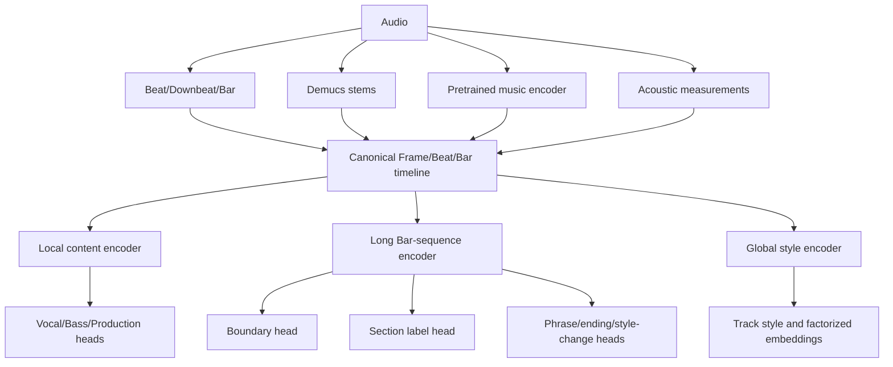

# 段落识别现状与神经网络架构

本文件聚焦段落任务。跨 Vocal、Bass、Groove、Phrase、Section、Style 和相似度的完整系统路线，见 [后续方案目录](../../roadmap/README.md)。

## 1. 当前代码已经能做什么

All-In-One 结构模型已经接入分析链并默认可运行：

- 输出 Beat 和 Downbeat；
- 输出 intro/verse/chorus/bridge/outro 等功能段落；
- 每段在分析函数内保留 start、end、raw label 和 source；
- 模型不可用时，退回能量变化候选；
- 现有单元/集成链曾完成 52 项相关测试。

一次 239.32 秒真实歌曲 CPU 推理记录：

- 约 59.38 秒；
- 415 Beat；
- 104 Downbeat；
- 13 个段落；
- 能返回完整 start/end/label。

这证明模型链真实可运行，但该样例 13 段中有 8 段标为 chorus，提示目标音乐域可能存在明显标签偏差。

## 2. 当前不能承诺什么

- 没有 30 首人工段落真值；
- 没有 Boundary Precision/Recall/F1；
- 没有按 Bar 的标签 Macro-F1；
- 没有 Segment IoU；
- 没有标签混淆矩阵；
- 没有校准后的边界/标签概率。

因此当前段落状态应写成：

| 能力 | 状态 |
|---|---|
| 功能段落候选 | 可运行基线 |
| 段落边界 | provisional |
| Verse/Chorus 等标签 | candidate_only |
| 固定 8 小节 phrase_map | 规则 fallback |
| 用于自动接歌 | 只能作为软证据 |

## 3. 工程断点

### 3.1 完整结果没有正式持久化

分析函数有 start/end/label/source，但后台 cue_points 只保存起点、展示标签和颜色。end、raw label、source、模型版本、fallback、置信度和复核状态会丢失。

### 3.2 section_analysis 没有成为正式数据合同

离线分析结果比数据库实际保存的内容更完整。应新增正式 sections 或 section_analysis 合同，并进行版本化迁移。

### 3.3 phrase_map 不是语义段落

```text
Downbeat → 每 8 小节强制切窗 → 按能量和位置贴 intro/verse/drop 等名字
```

它能为每首歌提供稳定窗口，但不能代表真实 Section。当前下游同时存在 All-In-One cue_points 和规则 phrase_map，两套结构尚未统一。

### 3.4 段落时间没有安全对齐最终 Downbeat 共识

All-In-One 有自己的 Downbeat；HarBeat 最终 Bar 网格来自多模型共识。两者相位冲突时，不能无条件把段落吸附到错误 Downbeat。

## 4. 第一阶段：先建立可评价基线

先冻结标签：

```text
intro, verse, chorus_hook, bridge, break,
instrumental, solo, outro, unknown
```

扩展标签：

```text
pre_chorus, post_chorus, buildup, drop
```

从现有歌曲中选 30 首，先标边界、再标名称。建议真值结构：

```json
{
  "song_id": "song_001",
  "sections": [{
    "start_bar": 17,
    "end_bar": 32,
    "primary_label": "chorus_hook",
    "tags": ["vocal", "high_energy"],
    "occurrence": 1,
    "uncertain": false
  }]
}
```

评价至少包括：

- 边界 ±1 Downbeat 的 Precision/Recall/F1；
- 每 Bar 标签 Macro-F1；
- Segment IoU；
- Verse/Chorus、Bridge/Break、Intro/Instrumental 等混淆矩阵。

## 5. 推荐神经网络架构



关键原则：

- 大模型是预训练音乐主干，小模型是任务 Head；
- 不把整曲先平均成一个向量再做边界任务；
- 每个任务自己选择 MERT/Discogs-EffNet/MAEST 层和时间尺度；
- 专项 MIR/DSP 与预训练表示并行，不用大模型替代 Beat、F0、Downbeat 等成熟测量；
- 分类、边界、事件和相似度使用不同损失；
- 可以共享表示和任务族编码器，但不强行共享所有输出头。

## 6. 两阶段段落模型

### Boundary Head

每 Bar 输入：

- 预训练音乐 Bar embedding；
- All-In-One 候选边界；
- Vocal activity/change；
- Drum density/fill；
- Bass activity；
- Energy/Chroma/Spectral change；
- 前后 Bar 差分。

首版可比较 TCN 与 BiGRU，输出 `P(boundary at bar i)`。

### Label Head

Boundary Head 形成段落后，做 Segment Attention Pooling，并加入：

- 段落在全曲中的位置；
- 与其他段的重复相似度；
- Vocal/Drum/Bass/Energy 状态；
- 前后段关系。

再输出段落标签。段落名称依赖全曲关系，不适合把独立 5 秒片段直接分类为 Verse/Chorus。

## 7. 推荐实施顺序

1. 完整持久化 All-In-One sections；
2. 冻结 section taxonomy 和标注格式；
3. 建立预测导出器、人工标注工具和评价程序；
4. 完成 30 首人工验证；
5. 决定只训练 Label Head、只做边界修正，还是训练完整 Bar sequence 模型；
6. 通过独立盲测后才接入自动接歌硬决策。
