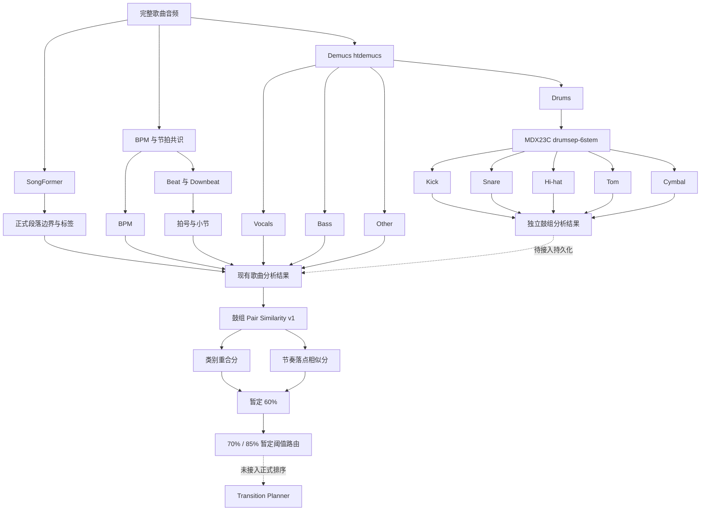

# SongFormer 与 MDX23C 音乐分析架构及接歌方案覆盖情况

## 结论

当前代码已经具备同风格歌曲接歌所需的主要分析底座：BPM、Beat、Downbeat、小节、Demucs 四轨分离、SongFormer 段落识别，以及基于 Demucs 鼓轨的 MDX23C 五类鼓组细分。

输入歌曲由调用方保证属于同一风格，当前链路不再包含风格判定。鼓组重合率、分项得分、阈值路由和 pair cache 的独立框架已经具备；目标比较组是 Kick、Snare/Clap、Closed/Open Hi-hat、808/Bass 和 Percussion。MDX23C/Demucs 到五组完整落点的自动提取、真实听审校准和正式候选排序接入仍未闭环。

## 当前正式分析链路

SongFormer 是正式段落来源；All-In-One 继续参与 BPM、Beat 和 Downbeat，仅在 SongFormer 失败时提供明确标记的段落回退。小节从 SongFormer 前奏结束后的第一个可靠 Downbeat 开始，再按真实 Beat 序列和拍号计数。

MDX23C 不读取完整原曲。它读取同一首歌曲经 Demucs 分离得到的 `drums.wav`，输出 `kick.wav`、`snare.wav`、`hihat.wav`、`tom.wav` 和 `cymbal.wav`。ADTOF 代码保留为独立的实验性鼓事件支路，不参与当前正式五轨输出。

目前 MDX23C 是可独立运行和测试的模块，尚未接入 `app/modules/library/analysis.py` 的正式歌曲分析调度与数据库持久化。合作者可以单独评审和运行它，但正式产品要消费五轨结果，还需要完成这一层集成。

## 输入输出契约

### SongFormer 段落识别

- 输入：原始歌曲音频文件。
- 输出：按时间排序的段落边界、段落标签、来源、回退状态和版本信息。
- 正式结果版本：`songformer_sections_v1`。
- 运行说明：`docs/songformer_sections_runtime.md`。

### MDX23C 鼓组细分

- 输入：Demucs 为同一首歌曲生成的 `drums.wav`。
- 输入规范：可接受常见采样率和单/双声道，进入模型前统一为 44.1 kHz 双声道浮点音频。
- 输出：`kick`、`snare`、`hihat`、`tom`、`cymbal` 五个 WAV。
- 输出规范：44.1 kHz、双声道、PCM 16-bit；即使某个声部很弱也保留文件。
- 设备：支持 `auto`、`cpu`、`cuda`、`cuda:N`、`mps`；CUDA OOM 时回退 CPU。
- 复用：同一设备上的模型在进程内缓存，多首歌连续处理时不重复加载。

## 与接歌方案的对应关系

| 方案要求 | 当前状态 | 说明 |
| --- | --- | --- |
| 同风格候选歌曲 | 调用前提，不在本模块判定 | 调用方只传同风格歌曲；Pair Score 不接收或计算风格特征 |
| BPM 差值与变速判断 | 已有分析数据 | 已有 BPM 共识；具体 `≤5`、`≤10` 和倍速关系仍由接歌规则执行 |
| Beat、Downbeat、小节首拍 | 已完成分析 | 可支持首拍对齐和 4/8/16 小节窗口 |
| 段落与第二段副歌 | 已完成基础识别 | SongFormer 提供边界和标签；第二段副歌出歌规则仍需端到端验收 |
| Demucs 人声、鼓、Bass、Other | 已完成基础分轨 | 可供人声冲突、低频冲突和音轨分离接法使用 |
| Kick、Snare、Hi-hat、Tom、Cymbal | 已完成音频细分 | MDX23C 输出五类鼓声音频 |
| MDX23C 结果进入歌曲分析和数据库 | 尚未接入 | 当前是独立模块与文件输出，避免未评审模型直接改变生产分析 |
| Snare/Clap、Closed/Open Hi-hat、808/Bass、Percussion | 组合框架完成，特征部分缺失 | 当前 Snare 与 Hi-hat 可映射；Tom/Cymbal 映射为 Percussion 类别；808/Bass 和 subtype 仍需补充 |
| 主要节奏落点 | 三组可比较，五组未闭环 | 现有 16 步主鼓型覆盖 Kick、Snare/Clap、Hi-hat；808/Bass 与 Percussion 完整落点还需提取 |
| 鼓组重合率 70%/85% | 评分框架已完成，未校准启用 | 已定义类别分、落点分、40%/60% 合并、质量门控、阈值路由和对称缓存；真实听审独立测试集仍缺失 |
| 调式与五度圈判断 | 已有基础能力 | 已有 Camelot 调式分析和兼容度逻辑，仍需按方案阈值验收 |
| 固定 6 首 mini set 排序 | 有候选排序基础，未按本文档完整验收 | 需要增加固定规模、BPM 上升和换风格规则的验收用例 |
| 混音、音轨分离、音效三种接法 | 已有规划与渲染基础 | 需要用本文档规则做端到端输出及听感验收 |

## 下一步最小闭环

1. 在每个 MDX23C 鼓轨上提取 onset，并将 onset 对齐到现有 Beat 和小节位置，补齐 Percussion 主鼓型。
2. 从 Demucs Bass 补充 808/Bass 的存在性、subtype 和落点；为五组补充每拍命中强度、切分位置和重复稳定性。
3. 用同风格人工配对样本联合校准 40%/60% 权重及 70%/85% 阈值，不直接把文档中的百分比当作已验证模型阈值。
4. 测试集按歌曲隔离后，再决定是否把鼓组分数接入正式候选排序和 Transition Planner。
5. 为固定 6 首 mini set、第二段副歌前出歌、4/8/16 小节边界、最长等待 8 小节和三种接法增加端到端验收用例。

## 验证与风险

- SongFormer 正式段落流程已作为提交 `15c3c20` 发布。
- MDX23C 已在五首真实歌曲的 Demucs 鼓轨片段上完成运行验证，输入来源和歌曲对应关系已做采样级核对。
- 五轨相加对输入鼓轨的相对重建误差在四首歌上约为 2.34% 至 3.63%；`In the Name of Love` 约为 10.20%，应作为重点听审样本。
- 重建误差只能验证输出覆盖程度，不能代替每个鼓类是否分对的人工评审。
- `mdxnet-infer` 代码为 MIT，但 DrumSep checkpoint 的正式商用授权仍不清晰。商业发布前必须完成权重许可审查。
