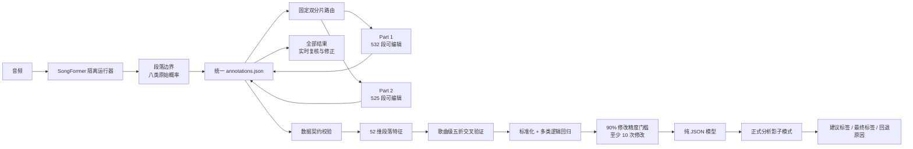

# SongFormer 段落标签纠正器：设计架构与评审说明

## 1. 目标与边界

本系统只纠正 SongFormer 的段落名称，不修改 SongFormer 已检测出的 `start/end` 边界。
节拍、Downbeat、小节和拍号仍由现有节奏分析链路负责，不进入本分类器。

正式标签固定为八类：

`intro`、`verse`、`chorus`、`bridge`、`instrumental`、`outro`、`silence`、`pre-chorus`。

SongFormer 来源概率、标注页面、人工真值、训练目标和分类器输出使用同一套规范化标签。

## 2. 总体架构

## 3. 各层输入输出

| 层 | 输入 | 输出 | 关键约束 |
|---|---|---|---|
| SongFormer | 单首音频 | `start/end`、候选标签、八类概率 | 只负责段落边界和原始语义 |
| 标注数据集 | SongFormer 段落 | `annotations.json` | 数据版本 `harbeat_section_label_dataset_v1` |
| 双人分片 | 73 首完整歌曲 | 两个互斥的可编辑视图 | 按整首歌分配，绝不拆散同一首歌 |
| 人工标注 | 当前歌曲音频和上下文 | 标签、信心、边界状态、不确定状态、备注 | 点击只写浏览器草稿；每首歌整批校验和原子提交 |
| 特征层 | 单首歌的全部段落 | 每段 52 维 `float64` 向量 | 标注页和训练器调用同一个特征函数 |
| 训练层 | 65 首开发集 | 标准化参数、逻辑回归权重、阈值 | 五折按歌曲分组，防止同曲泄漏 |
| 锁定评估 | 8 首测试歌 | Accuracy、Macro F1、净收益、混淆矩阵 | 特征、模型和阈值锁定后评估 |
| 正式推理 | SongFormer 结果 + JSON 模型 | 建议标签或保留原标签 | 默认影子模式，失败时无条件回退 |

## 4. 52 维特征结构

特征不依赖额外的乐器分轨模型，全部来自 SongFormer 段落序列和段落位置：

- 当前段八类原始概率：8 维。
- 当前段八类对数概率：8 维。
- 前一段八类概率：8 维。
- 后一段八类概率：8 维。
- SongFormer 候选标签的 one-hot 表示：8 维。
- 时长、对数时长、相对时长、起止和中点位置、相对段落序号：7 维。
- SongFormer 置信度、第一与第二候选的 margin、归一化熵：3 维。
- 是否为第一段、是否为最后一段：2 维。

完整特征名称由
`app/modules/library/section_relabeler.py::feature_names()` 唯一生成。数据校验器会实际调用
`build_track_feature_matrix()`，确认结果严格为 `段落数 × 52` 且全部为有限数值。

## 5. 双人标注与实时汇总

### 数据如何分成两份

系统按 `split + style` 分组，在每组中按段落数量做贪心均衡。分配单位是完整歌曲，因此同一首歌的
上下文不会被拆开。当前结果为：

- Part 1：37 首、524 段，其中锁定测试歌 4 首。
- Part 2：36 首、533 段，其中锁定测试歌 4 首。

歌曲数只相差 1 首，实际标注工作量只相差 9 个段落。

### 为什么不会重复

主数据只保存一份，并持久化 `track_id -> part-id` 的唯一映射。两个编辑链接使用不同的随机访问密钥；
前端只显示本分片，后端每次写入还会校验访问密钥和歌曲归属。跨分片请求会被拒绝，不能靠修改页面
绕过。

### 如何共享和汇总

两个标注页面都写入同一个 `annotations.json`，服务端用互斥锁串行化写入，并采用临时文件替换完成
原子保存。每次保存前，旧版本自动备份为 `annotations.backup.json`。第三个随机密钥对应“全部结果
复核”页面，显示 73 首的实时进度和人工标签，每 5 秒刷新。后台刷新只更新歌曲列表和进度，
不会重建当前内容、改变滚动位置或中断播放器。复核者只能修改已经完成初标的段落，
不能替两位标注者填写空白段落，因此初标工作仍然不会重复。

每个段落都有独立修订号。保存时浏览器必须提交它读到的版本；若其他人已经更新，后端返回冲突并
要求重新加载，避免后写入静默覆盖先写入。所有实际变化都会在主 JSON 的 `annotation_review.audit_log`
中记录时间、操作来源、修改前内容和修改后内容。

标注者在当前歌曲内的选择先保存在浏览器草稿，不会自动切段或滚动。点击“提交本首歌曲”时，未改
段落自动使用来源标签，改过的段落使用新选择；后端要求
初标提交完整覆盖整首歌，并在写入前一次性校验全部段落和修订号。原始候选字段不被覆盖，人工标签
独立保存在 `annotation.human_label`。

结构极度混乱、无法可靠命名的歌曲可以按整曲排除。排除采用可恢复标记而非删除源数据，并记录原因、
操作者、时间、修订号和审计事件。进度统计、数据完整度门、训练和锁定评估统一调用同一排除状态，
避免页面显示已排除但训练器仍误读。恢复后原音频、候选结果和历史人工标签继续可用。

因此不存在后期手工合并步骤：主 JSON 始终就是汇总结果，训练器直接读取它。

## 6. 训练与风险控制

1. `U`、`B` 和默认的低信心段只计入已审核，不进入训练。
2. 交叉验证按歌曲分组，同一首歌不会同时出现在训练折和验证折。
3. 分类器使用 scikit-learn 的 `StandardScaler + LogisticRegression`；正式推理只读取导出的 JSON，
   只依赖 NumPy。
4. 自动改名必须同时满足交叉验证修改精度至少 90%，并有至少 10 个修改样本。
5. 模型默认运行在影子模式，只记录建议，不改变产品正式标签。
6. 模型缺失、损坏、特征版本不一致或置信度不足时，保留 SongFormer 原标签。
7. 锁定测试集只在方案冻结后评估，报告同时保留 baseline、修正数、引入错误数和净收益。

## 7. 评审入口

建议评审者重点检查：

- `app/modules/library/section_relabeler.py`：52 维特征和纯 NumPy 推理。
- `app/modules/library/section_relabel_dataset.py`：标注与训练共用的数据契约。
- `app/modules/library/section_annotation_partitions.py`：固定分片、访问控制和进度汇总。
- `scripts/section_label_workbench.py`：实时标注服务、写保护、复核修正与并发版本检查。
- `scripts/train_section_relabeler.py`：歌曲级交叉验证、阈值选择、模型导出和锁定评估。
- `tests/test_section_annotation_partitions.py`：分片互斥、越权拒绝和实时汇总测试。
- `tests/test_section_relabeler_training.py`：从数据集到模型回读的端到端测试。

## 8. 非目标与后续启用条件

当前不重新训练 SongFormer，不修改段落边界，不引入未经 HarBeat 数据验证的新节拍模型，也不自动上线
纠正结果。只有开发集交叉验证、锁定测试集和真实新歌影子抽检均显示正净收益后，才考虑关闭影子模式。
