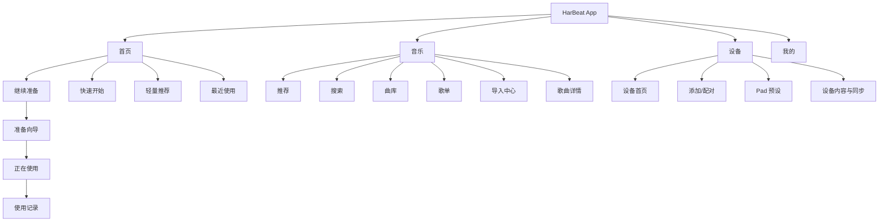
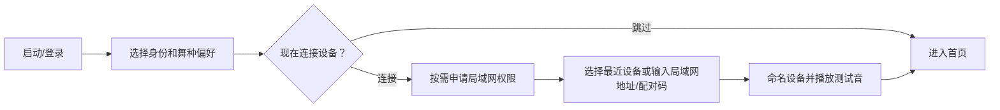
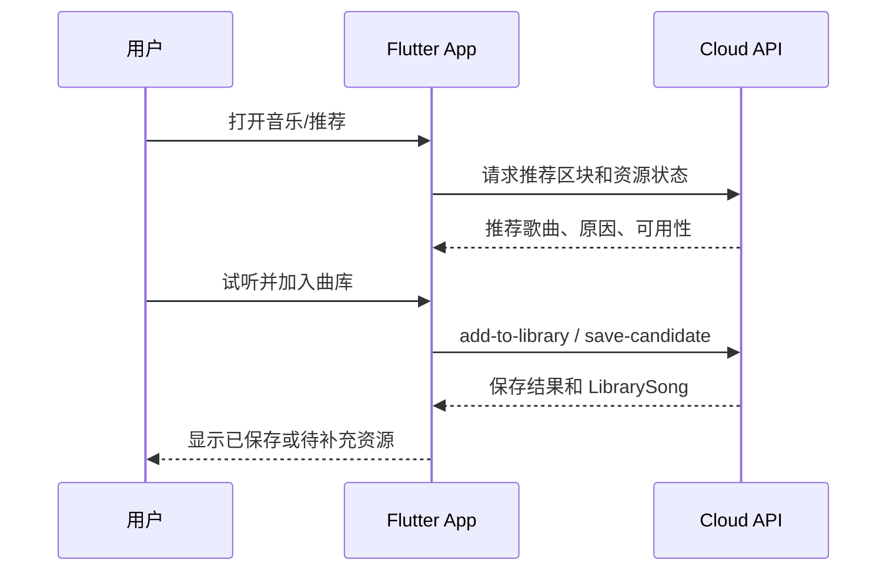
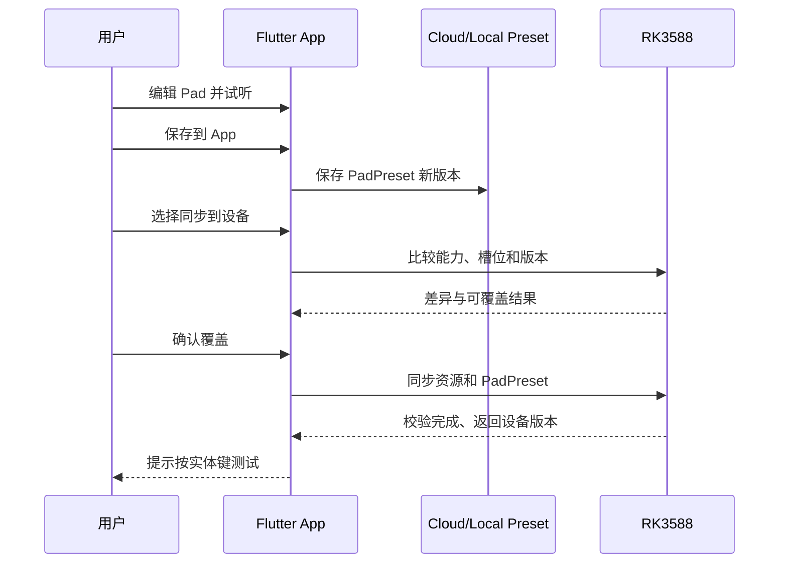

# HarBeat 手机 App 产品与前端设计规格

- 版本：1.0
- 日期：2026-08-18
- 状态：设计已确认，等待书面规格审核
- 读者：产品经理、Flutter 前端、后端、RK3588/Jetson 工程师、测试人员
- 可交互成品：[打开 HarBeat 移动端产品手册](./harbeat-mobile-product-handbook.html)

## 1. 文档用途

这份文档把 HarBeat 手机 App 的职责、信息架构、核心页面、用户流程、状态、推荐逻辑和前后端契约整理成一套前端可执行的规格。

前端开发时应以四类材料为准：

1. 本文档中的页面编号和验收标准。
2. 设计稿中的视觉样式和尺寸。
3. OpenAPI、WebSocket 事件和 Mock JSON 中的数据契约。
4. 产品与前后端共同维护的状态枚举。

设计稿负责“长什么样”，本文档负责“为什么存在、何时出现、怎么变化、异常时怎么办”。

## 2. 已确认的核心决策

### 2.1 产品定位

HarBeat App 是音乐内容管理器、个人练习播放器、设备配置器和现场状态解释层。

正式活动中，RK3588 负责稳定出声和执行实时音频动作；App 负责准备音乐、配置音效 Pad、同步资源、显示状态和提供备用控制。实体硬件是现场主要操作入口。

### 2.2 两种使用模式

| 模式 | App 能做什么 | App 不承诺什么 |
|---|---|---|
| 手机独立模式 | 搜索、试听、上传、管理曲库、歌单、推荐、完整歌曲播放和个人练习 | 专业自动 DJ、Stems 实时处理、低延迟现场音效 |
| 连接设备模式 | 准备内容、配置 Pad、同步 RK、查看播放事实和使用备用控制 | 代替 RK 成为正式现场音频主机 |

### 2.3 首版成功标准

首版最重要的结果是跑通完整闭环：

> 登录 → 找到或导入音乐 → 建立歌单 → 配置 Pad 预设 → 连接并同步 RK → 手机断开后仍可使用实体硬件播放和触发音效。

### 2.4 导航决策

底部只保留四个常驻 Tab：

1. 首页
2. 音乐
3. 设备
4. 我的

“正在使用”是连接设备后进入的全屏任务页面，不是第五个 Tab。

“推荐”位于“音乐”内部，并作为音乐页的默认分区。首页仅保留轻量推荐入口。

## 3. 目标用户

### 3.1 主要用户：街舞活动组织者或 MC

他们为 cypher、练习局、小型 party 或 battle warm-up 准备音乐。现场能判断氛围，但不应被要求理解 EQ、gain、pitch、stem mixer 或双 Deck 管理。

核心任务：

- 选好活动音乐。
- 为现场准备一套音效 Pad。
- 确认设备和资源已经就绪。
- 活动中快速判断“换歌、升能量、降能量、延长、Talk、撤销”。

### 3.2 次要用户：个人舞者

他们在没有设备时也会使用 App 找歌、试听、收藏、整理歌单和练习。

核心任务：

- 找到适合自己舞种和习惯的新音乐。
- 理解歌曲是否适合练习。
- 保存到个人曲库或歌单。
- 以后把个人内容加入一次设备准备。

这两类用户共用音乐资产，但个人推荐画像和活动播放行为必须分开。

## 4. 产品职责边界

### 4.1 App P0 负责

- 注册、登录和个人偏好。
- 统一音乐搜索。
- 本地文件上传。
- 外部歌单链接解析、元数据导入和资源匹配。
- 曲库、收藏、歌单和歌曲详情。
- BPM、调性、段落、能量、Groove、舞种匹配等结果展示。
- 个性化音乐推荐、试听和保存到曲库。
- 手机独立播放和播放队列。
- RK 配对、连接、设备状态和能力显示。
- Pad 预设创建、编辑、试听、保存和同步。
- 一次使用的准备向导、同步和就绪检查。
- 正在使用页面、备用意图控制和结束记录。

### 4.2 App P0 不负责

- 手机端专业实时混音和 Stems 主引擎。
- 暴露 Crossfader、EQ、Gain、Pitch 和复杂转场参数。
- 允许重新映射“下一首、Talk、撤销”等固定安全控制。
- 把未经授权的第三方完整音乐下载当作正式产品能力。
- 在 UI 中自行推断 RK 已经执行成功。

## 5. 市场参考与设计启示

| 产品 | 已验证做法 | HarBeat 借鉴 | 不照搬 |
|---|---|---|---|
| LiberLive | 硬件可脱离 App 使用；App 提供歌曲资源、节奏、和弦和风格配置 | App 增强和配置硬件，现场核心能力保留在硬件 | 不扩张成内容社区和复杂创作平台的首版 |
| Positive Grid Spark | 预设先保存到 App，再明确写入硬件预设槽位 | Pad 配置与写入设备分开；显示目标槽位和覆盖关系 | 不加入复杂效果链编辑器 |
| Roland SP-404MKII App | 用图形化 Pad 矩阵管理样本、试听、移动和导入 | Pad 矩阵、试听、替换、清空和版本状态 | 不复制专业采样器参数密度 |
| Sonos | 统一搜索、持续存在的正在播放状态、清晰的输出设备选择 | 统一音乐入口、设备状态条、迷你播放器和输出事实 | 不做多房间音响系统 |
| Apple Music / Spotify / YouTube Music | 显式偏好、听歌历史控制、喜欢/不感兴趣和画像排除 | 可解释推荐、个人画像可控、活动播放不污染个人画像 | 不以增加浏览时长为推荐目标 |

官方参考：

- [LiberLive App 与硬件能力](https://liberlive.com/pages/faqs)
- [Positive Grid 保存 App/硬件预设](https://help.positivegrid.com/hc/en-us/articles/8141176035725-Save-Presets)
- [Roland SP-404MKII App](https://www.roland.com/us/products/rc_sp-404mkii_app/)
- [Sonos App 指南](https://www.sonos.com/en-us/guides/sonosapp)
- [Apple Music 个性化推荐](https://support.apple.com/en-mide/guide/iphone/-iph2b1748696/ios)
- [Spotify Taste Profile](https://support.spotify.com/ee-en/article/your-taste-profile/)
- [YouTube Music 个性化](https://support.google.com/youtubemusic/answer/6313542)

## 6. 整体信息架构

### 6.1 全局结构



### 6.2 三个全局组件

| 组件 | 出现条件 | 作用 |
|---|---|---|
| 设备状态条 | 用户有已配对设备 | 显示未连接、连接中、在线、忙碌或异常；点击进入设备页 |
| 迷你播放器 | 手机正在播放 | 从任何主 Tab 控制播放、进入完整播放页 |
| 同步任务入口 | 存在同步任务或失败 | 显示待同步、进度、暂停、失败和重试 |

## 7. 页面树与优先级

| 一级页面 | P0 子页面/模块 | P1 子页面/模块 |
|---|---|---|
| 首页 | 继续准备、快速开始、设备提醒、轻量推荐、最近使用 | 智能准备模板、团队协作 |
| 音乐 | 推荐、统一搜索、导入中心、曲库、歌单、歌曲详情、手机播放器 | 内容社区、公开歌单、自然语言推荐调节 |
| 设备 | 设备首页、最近设备、手工地址/配对码、Pad 预设、设备内容、同步任务 | mDNS/二维码发现、固件升级、完整诊断、控制器电量 |
| 我的 | 账号、个人偏好、历史记录、下载与缓存、设置、帮助、反馈 | 公开主页、预设分享、社交功能 |

## 8. 关键页面规格

### H01：首页

| 项目 | 规格 |
|---|---|
| 页面目标 | 告诉用户当前状态和下一步任务，而不是罗列所有功能 |
| 主要入口 | 登录完成、结束播放、退出准备向导、点击底部首页 |
| 首屏顺序 | 设备状态条 → 当前准备草稿 → 快速开始 → 推荐入口 → 最近使用 |
| 主操作 | 继续准备、手机播放、连接设备、新建准备、查看推荐 |
| 必备状态 | 无草稿、有草稿、无设备、设备在线、资源待同步、同步失败、完全离线 |
| 数据依赖 | 用户摘要、设备摘要、准备草稿、同步任务、推荐摘要、最近使用 |
| 退出路径 | 进入准备、音乐推荐、设备页或最近内容详情 |

首页推荐只显示一个主题和少量歌曲，不承载完整探索。点击后进入 M01。

### M01：音乐/推荐

| 项目 | 规格 |
|---|---|
| 页面目标 | 让舞者快速找到愿意试听并保存的新音乐 |
| 顶部分区 | 推荐、搜索、曲库、歌单；默认推荐 |
| 首屏顺序 | 可编辑偏好标签 → 今日推荐 Mix → 个性化推荐区 → 探索区 |
| 歌曲卡片 | 封面、标题、艺人、BPM、能量/Groove、推荐原因、来源状态、试听、保存 |
| 主操作 | 播放推荐 Mix、试听、加入曲库、加入歌单、换一批、不感兴趣 |
| 必备状态 | 冷启动、推荐加载、无推荐、部分资源不可用、保存中、已保存、保存失败、离线缓存 |
| 数据依赖 | 用户画像、推荐区块、歌曲可用状态、曲库状态、播放状态 |

推荐卡不能只显示一个不可解释的“AI 92%”。至少给出一条自然语言理由，例如：

- 因为你常跳 Hiphop。
- 类似你收藏的 Funk Groove。
- 适合 88–102 BPM 的 Breaking 练习。
- 探索推荐，不会改变你的主偏好。

### P01：准备向导

准备向导固定为四步：

1. 选择音乐或歌单。
2. 选择或编辑 Pad 预设。
3. 检查设备、资源和兼容性。
4. 同步并确认就绪。

| 项目 | 规格 |
|---|---|
| 页面目标 | 把分散的音乐、Pad 和设备能力收束成一次可执行准备 |
| 交互形式 | 单路径分步向导；支持上一步、退出和继续 |
| 保存规则 | 每次选择自动保存草稿；关闭 App 后可恢复 |
| 校验规则 | 阻塞问题必须定位到具体歌曲、Pad 或设备，不显示笼统失败 |
| 完成条件 | 目标设备在线；P0 必需资源已同步；至少测试一首歌和一个 Pad |
| 退出路径 | 返回首页草稿，或进入 L01 正在使用 |

### D01：设备首页

| 项目 | 规格 |
|---|---|
| 页面目标 | 先回答“设备能否使用”，再提供配置入口 |
| 首屏顺序 | 当前设备状态 → 输出与模式 → 存储 → 待同步内容 → Pad 预设 → 健康摘要 |
| 主操作 | 添加/切换设备、输入局域网地址和配对码、播放测试音、同步资源、编辑 Pad、查看异常 |
| 必备状态 | 无设备、查找中、配对中、在线、忙碌、断开、不兼容、空间不足 |
| 数据依赖 | DeviceSummary、DeviceCapabilities、StorageSummary、SyncJob、PadPresetSummary |

高级温度、日志和固件信息默认收起，避免设备首页变成运维面板。

### D02：Pad 编辑器

| 项目 | 规格 |
|---|---|
| 页面目标 | 用固定 8 格矩阵完成音效选择、试听和设备写入 |
| 固定结构 | Pad 矩阵 → 当前槽位详情 → 音效来源 → App/设备版本状态 → 保存/同步 |
| 音效来源 | 系统音效库、个人上传、组合音效模板 |
| P0 音效类型 | 单音、组合音、节奏加花 |
| P0 播放方式 | 一次播放、按住播放、循环；支持槽位音量和防连击时间 |
| 主操作 | 试听、替换、清空、复制、保存到 App、同步到设备 |
| 必备状态 | 空槽、仅 App 已配置、待同步、已同步、版本冲突、音效缺失、不支持 |

保存与同步必须分开：

- “保存到 App”先持久化到手机缓存，并在联网时同步到用户云端账号，生成新的预设版本；这个动作不覆盖设备。
- “同步到设备”必须显示目标设备、目标槽位和将被覆盖的内容。

核心控制“下一首、能量、延长、Talk、撤销、总音量”不出现在 Pad 编辑器中，也不能被重新映射。

### L01：正在使用

| 项目 | 规格 |
|---|---|
| 页面目标 | 显示现场事实、异常和少量备用意图，不代替实体硬件 |
| 首屏顺序 | RK/输出状态 → 当前歌 → 下一首和预计动作 → 备用控制 → 硬件连接状态 |
| 备用控制 | 下一首、炸一点、稳一下、延长、Talk、撤销 |
| 主操作 | 查看当前事实、发送意图、锁定屏幕、结束使用 |
| 必备状态 | 命令已发送、已排队、执行中、完成、拒绝、超时未知、设备断开、降级模式 |
| 真源 | 当前歌曲、播放位置、下一动作、执行结果和 playback tier 都以 RK 快照为准 |

## 9. 四条 P0 用户流程

### 9.1 首次使用与可选配对



没有硬件的用户必须能跳过配对并正常使用音乐功能。

### 9.2 组织者准备并使用硬件


### 9.3 个人舞者找歌与播放


### 9.4 Pad 配置与同步


## 10. 个性化推荐设计

### 10.1 用户问题

个人舞者知道自己跳什么舞种，但缺少稳定、低成本的方式从大量音乐中找到真正适合练习的新歌。普通流媒体的音乐相似度不等于街舞场景中的可跳性。

### 10.2 产品与业务结果

- 产品结果：减少舞者找到并保存一首可用于练习的新歌所需时间。
- 业务结果：提高无硬件场景下的 App 周活跃、曲库积累和未来设备准备转化。

### 10.3 方案假设

如果 HarBeat 结合舞者主动选择的舞种、个人试听和保存行为，以及歌曲的 BPM、能量、Groove、可跳性和舞种匹配分，那么舞者会比使用通用音乐分类更快找到愿意保存和练习的新歌。

### 10.4 P0 推荐信号

| 信号 | 示例 | 是否影响个人画像 |
|---|---|---|
| 显式偏好 | 常跳舞种、水平、能量/Groove 偏好 | 是 |
| 个人试听 | 手机试听时长、完整播放 | 是 |
| 主动行为 | 保存到曲库、加入歌单、喜欢、不感兴趣 | 是 |
| 搜索行为 | 搜索舞种、艺人、BPM、Vibe | 是，权重较低 |
| 歌曲事实 | 舞种匹配、BPM、能量、Groove、分析可信度 | 用于排序 |
| 组织者 Session | 设备活动中播放、跳过、测试 | 默认否，进入活动画像 |
| Pad 试听 | 音效试听和测试 | 否 |

快速跳过只能作为弱负向信号，可能是用户正在试听或切换场景。只有主动“不感兴趣”才是明确负向信号。

### 10.5 推荐页面区块

P0 推荐页面最多保留五类区块：

1. 今日练舞 Mix。
2. 因为你常跳某舞种。
3. 类似你收藏的某首歌或 Groove。
4. 适合你常用 BPM/能量区间的新歌。
5. 探索新 Groove。

每次返回不需要完全随机刷新。应保证熟悉内容、可解释的新内容和少量探索内容之间的稳定比例。

### 10.6 冷启动

新用户使用以下信息生成第一版推荐：

- 注册时选择的 1–3 个常跳舞种。
- 用户水平和常见场景。
- 用户主动选出的少量喜欢歌曲或 Groove；如果未选择，则使用人工审核的舞种入门曲目。

当用户没有任何历史时，页面明确显示“根据你选择的 Hiphop 和 Breaking 推荐”，不能伪装成已经理解用户习惯。

### 10.7 保存到曲库

推荐歌曲必须区分四种状态：

| 状态 | 按钮 | 结果 |
|---|---|---|
| 已在曲库 | 已保存 | 进入歌曲详情或歌单选择 |
| HarBeat 有可用资源 | 加入曲库 | 创建个人曲库记录并可播放 |
| 只有合法预览 | 保存候选 | 保留元数据，提示补充或匹配资源 |
| 不可用 | 暂不可用 | 允许隐藏，不提供假下载 |

### 10.8 P0 验证标准

用 10 名内部测试舞者运行两周：

- 至少 7 人各保存 3 首以上真正愿意练习的推荐歌曲。
- 从打开推荐页到首次保存歌曲的中位时间少于 5 分钟。
- 至少 8 人能说清推荐依据，并知道如何调整舞种或标记不感兴趣。

这些指标用于验证推荐是否有用，不用于证明排序算法已经成熟。

## 11. 统一状态设计

### 11.1 页面通用状态

每个数据页面必须实现：

- 首次加载
- 加载中
- 有内容
- 空内容
- 请求失败
- 离线缓存
- 权限不足

空内容和失败必须给出可执行下一步，例如“上传音乐”“重新连接”“只重试失败项”，不能只显示插图和一句提示。

### 11.2 音乐资源状态

```text
metadata_only
→ importing
→ analyzing
→ ready_on_phone
→ sync_pending
→ ready_on_device
```

任何阶段都可能进入 `failed`，失败记录必须包含可读原因、是否可重试和失败步骤。

### 11.3 设备状态

```text
no_device → resolving → pairing → online
online → busy | disconnected | incompatible
disconnected → reconnecting → online
```

查找、配对和重连必须有明确超时，不允许无限旋转。

### 11.4 同步任务状态

```text
pending → queued → syncing → completed
                     ↘ paused
                     ↘ partial_failed
                     ↘ failed
completed → stale（App 预设或资源发生变化）
```

同步任务需要显示文件数、总大小、当前项目、总体进度、失败项和完成时间。App 重启后可恢复任务状态。

### 11.5 现场命令状态

```text
idle → sent → queued → executing → completed
                    ↘ rejected
                    ↘ timeout_unknown
```

`timeout_unknown` 不能立即重复发送命令。App 先读取 RK 当前快照，再决定是否允许重试。

## 12. 系统边界与数据真源

| 系统 | 负责 | 主要真源 |
|---|---|---|
| Flutter App | UI、交互、个人缓存、准备草稿、命令意图 | 本地未同步草稿和临时 UI 状态 |
| 云端/FastAPI | 账号、曲库元数据、歌单、推荐、任务和历史 | 用户资产、推荐结果、云端任务 |
| Jetson | 重量级分析、Stems、资源生产 | TrackAnalysis 和分析版本 |
| RK3588 | 正式播放、Pad 执行、本地缓存、现场状态 | playback_state、设备槽位和现场执行结果 |

App 不得把本地按钮动画当成现场事实。重连后必须读取 RK 完整快照。

### 12.1 推荐与曲库数据流



### 12.2 Pad 同步数据流



## 13. 前后端契约要求

前端可以先使用 Mock 开发，但以下契约应在大规模开发前由前后端共同确认。

### 13.1 核心对象

| 对象 | 必须包含 |
|---|---|
| UserProfile | 用户 ID、舞种偏好、水平、个人/活动画像设置 |
| SongSummary | 歌曲 ID、标题、艺人、封面、BPM、能量、Groove、舞种匹配、来源、可用状态 |
| RecommendationItem | SongSummary、推荐原因、推荐上下文、是否探索项、反馈状态 |
| LibrarySong | 个人曲库 ID、资源状态、分析状态、手机/设备可用性 |
| Playlist | ID、名称、歌曲数、顺序、设备可用摘要 |
| DeviceSummary | 设备 ID、名称、连接状态、能力版本、输出、存储、最后在线时间 |
| PadPreset | 预设 ID、版本、槽位列表、更新时间、设备同步版本 |
| SyncJob | 任务 ID、目标设备、状态、进度、文件数、失败项、可重试性 |
| PlaybackState | Session ID、序号、当前歌、位置、下一动作、playback tier、设备告警 |
| CommandResult | command_id、accepted/rejected、排队和执行状态、拒绝原因 |

### 13.2 推荐歌曲 Mock 示例

```json
{
  "song_id": "song_123",
  "title": "Track One",
  "artist": "Artist",
  "bpm": 94,
  "energy": "medium",
  "groove": "groovy",
  "dance_style_scores": {"hiphop": 0.92, "breaking": 0.76},
  "reason": "适合你常听的 Hiphop Groove",
  "recommendation_context": "personal",
  "is_exploration": false,
  "availability": "ready_to_add",
  "in_library": false,
  "preview_url": "https://example.invalid/preview/song_123"
}
```

### 13.3 PadPreset Mock 示例

```json
{
  "preset_id": "pad_cypher_fun",
  "name": "Cypher Fun",
  "version": 4,
  "slots": [
    {
      "slot": 1,
      "name": "Airhorn",
      "sound_id": "sfx_airhorn_01",
      "sound_type": "one_shot",
      "play_mode": "once",
      "volume": 0.85,
      "retrigger_guard_ms": 300
    }
  ],
  "device_sync": {
    "device_id": "rk_001",
    "device_version": 3,
    "status": "stale"
  }
}
```

### 13.4 统一错误格式

错误响应至少包含：

```json
{
  "error": {
    "code": "DEVICE_STORAGE_INSUFFICIENT",
    "message": "设备空间不足",
    "retryable": false,
    "action": "remove_device_content",
    "details": {"required_mb": 512, "available_mb": 180}
  }
}
```

前端根据稳定错误码决定页面动作，不能解析后端自然语言字符串来判断流程。

## 14. 前端交付包应如何整理

产品经理交给前端的材料建议固定为以下目录结构：

```text
mobile-product/
├── 01-product-overview.md
├── 02-information-architecture.md
├── 03-user-flows.md
├── 04-screen-specs/
│   ├── H01-home.md
│   ├── M01-music-recommendation.md
│   ├── P01-prepare-wizard.md
│   ├── D01-device-home.md
│   ├── D02-pad-editor.md
│   └── L01-live-status.md
├── 05-state-matrix.md
├── 06-copy-and-errors.md
├── 07-analytics-events.md
├── 08-acceptance-tests.md
├── contracts/
│   ├── openapi.yaml
│   ├── websocket-events.md
│   └── mock-data/
└── designs/
    └── figma-link.md
```

每个页面说明使用同一模板：

1. 页面 ID 和目标。
2. 用户从哪里进入、完成后去哪里。
3. 信息层级和组件清单。
4. 主操作和次操作。
5. 页面状态和业务对象状态。
6. 字段、枚举和 Mock 数据。
7. 埋点。
8. Given/When/Then 验收标准。

## 15. 前端组件边界建议

建议前端按职责拆分，不让页面直接访问 HTTP：

```text
Screen / Widget
    ↓
ViewModel / Controller
    ↓
Use Case / Repository Interface
    ↓
Mock Repository | Cloud API | RK API | Local Cache
```

建议优先抽出以下可复用组件：

- `DeviceStatusBar`
- `MiniPlayer`
- `SyncTaskBanner`
- `SongCard`
- `RecommendationReason`
- `AvailabilityBadge`
- `PadGrid`
- `PadSlotEditor`
- `PrepareProgress`
- `PlaybackStateCard`
- `AsyncStateView`
- `ActionableError`

同一 `SongCard` 可以在推荐、搜索、曲库和歌单中使用，但不同上下文传入不同主操作。

## 16. P0 开发切片

不要按“先写完所有 UI，再统一接 API”的顺序开发。按完整纵向链路推进。

### Slice 1：账号与手机音乐闭环

- 登录。
- 推荐/搜索。
- 试听。
- 加入曲库。
- 手机播放。

### Slice 2：设备连接闭环

- 配对。
- 能力和状态。
- 播放测试音。
- 断线重连。

### Slice 3：Pad 配置闭环

- Pad 矩阵。
- 音效选择与试听。
- 保存 App 预设。
- 同步设备并实体按键验证。

### Slice 4：准备与现场闭环

- 选择歌单。
- 资源检查。
- 同步任务。
- 正在使用状态。
- 备用意图和结束记录。

每个 Slice 都先用 Mock 完成所有 UI 状态，再接最简真实接口，不能把联调推迟到全部页面完成之后。

## 17. 分析与埋点

### 17.1 推荐

- `recommendation_impression`
- `recommendation_play`
- `recommendation_save`
- `recommendation_not_interested`
- `recommendation_reason_opened`
- `recommendation_profile_edited`

事件需携带 `recommendation_context=personal|session`，避免混淆个人与活动行为。

### 17.2 设备与 Pad

- `device_pair_started/completed/failed`
- `pad_previewed`
- `pad_preset_saved`
- `pad_sync_started/completed/failed`
- `physical_pad_test_confirmed`

### 17.3 准备与现场

- `prepare_started/resumed/completed`
- `resource_check_failed`
- `sync_retry`
- `live_started/ended`
- `live_command_sent/completed/rejected/timeout`
- `app_disconnected_during_live`

## 18. 验收测试

前端使用 Mock 时至少覆盖以下场景：

- 新用户没有历史推荐。
- 用户有两个常跳舞种和 1000 首曲库。
- 超长歌曲名、缺封面、BPM 未知。
- 推荐歌曲可直接加入、仅有元数据、已经在库和不可用。
- 导入或同步到 47% 时失败并恢复。
- App 关闭后恢复准备草稿和同步任务。
- 设备同步中断电。
- Pad 音效被设备端修改，产生版本冲突。
- 手机离线但缓存歌曲仍可播放。
- App 断开但 RK 和实体控制器继续工作。
- 现场命令超时，但 RK 实际已经执行。
- 设备空间不足、能力缺失或协议版本不兼容。

核心 Given/When/Then 示例：

```gherkin
Given 用户已经在 App 中修改 Pad 预设
And 设备仍保存旧版本
When 用户点击“同步到设备”
Then App 显示目标设备和冲突槽位
And 用户必须选择保留 App 版本或读取设备版本
And 未确认前不得覆盖设备
```

```gherkin
Given 用户点击推荐歌曲的“加入曲库”
When HarBeat 只有歌曲元数据而没有可用资源
Then App 把歌曲保存为候选
And 显示“需要补充资源才能完整播放”
And 不得显示“已可播放”
```

```gherkin
Given App 向 RK 发送“下一首”意图
When 请求超时且执行结果未知
Then App 显示“正在确认设备状态”
And 先读取 RK 完整快照
And 不允许用户立即重复发送同一个命令
```

## 19. 非功能要求

- iOS 和 Android 采用相同业务状态和验收标准。
- 设备状态、现场命令和同步任务使用明确超时。
- 手机播放支持后台播放和系统音频中断恢复。
- App 退出和系统杀进程后可恢复草稿和任务状态。
- 本地保存的设备令牌进入系统安全存储。
- 日志不记录访问令牌、用户密码或完整私有音乐路径。
- 无障碍状态不能只靠颜色表达；同步、连接和错误同时使用文字或图标。
- 在低网速和 1000 首曲库下仍保持列表滚动和导航响应。

## 20. 法务与内容风险

内部测试不等于拥有第三方音乐的下载和再分发权。

P0 正式产品契约只承诺：

- 用户主动上传自己有权使用的文件。
- 解析外部歌单元数据并匹配已有合法资源。
- 使用获得明确授权的来源。
- 对只有元数据的歌曲保存为候选，而不是伪装成完整入库。

未来公开上架前，需要逐一确认第三方服务条款和音乐授权。Apple 明确要求第三方音视频下载获得来源授权；Google Play 同样禁止鼓励未经授权的版权内容下载。

- [Apple App Review Guidelines 5.2.3](https://developer.apple.com/app-store/review/guidelines/)
- [Google Play Intellectual Property Policy](https://support.google.com/googleplay/android-developer/answer/9888072)

## 21. P0 与 P1 边界

### P0

- 四个一级 Tab。
- 手机音乐闭环。
- 规则驱动、可解释的舞者推荐。
- RK 配对和状态。
- 固定 8 个独立音效 Pad。
- 准备、同步、设备使用和恢复。
- 完整状态矩阵和事件记录。

### P1

- 相似舞者协同推荐。
- 自然语言推荐调节。
- 公开歌单、公开 Pad 预设和社区。
- mDNS 或二维码设备发现。
- 固件升级和高级诊断。
- BLE 控制器电量与升级。
- 手机端更强的降级混音能力。

## 22. 最终验收定义

P0 通过需要同时满足：

1. 没有硬件的舞者可以完成推荐、试听、保存、歌单和手机播放。
2. 组织者可以完成音乐、Pad、设备检查和同步。
3. App 断开后，RK 和实体控制器继续工作。
4. App 重连后显示 RK 当前真实状态。
5. 所有关键对象都有加载、空、失败、离线、冲突和恢复状态。
6. 前端可以仅依赖本文档、设计稿和 Mock 契约理解每个页面的目标和行为。
